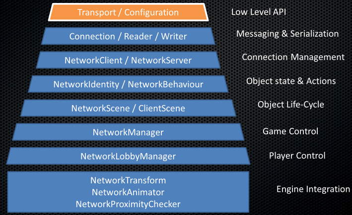

多玩家高级 API
=============================

Unity 的多玩家高级 API (HLAPI) 是用于为 Unity 游戏构建多玩家功能的系统。该系统基于低级[传输](UNetUsingTransport.html)实时通信层，可处理多人游戏所需要的大部分常见任务。尽管传输层支持任何类型的网络拓扑，但 HLAPI 是一种服务器授权系统；虽然 HLAPI 允许其中一个参与者同时是客户端和服务器，因此不需要任何专用服务器进程。通过与[互联网服务](UnityMultiplayerSettingUp.html)结合使用，开发者只需要进行很少的工作即可实现基于互联网的多人游戏。

HLAPI 是 Unity 中内置的新网络命令集合，位于以下新命名空间中：**UnityEngine.Networking**。该系统专注于易用性和迭代式开发，并提供可用于多人游戏的服务，比如：

* 消息处理程序
* 通用高性能序列化
* 分布式对象管理
* 状态同步
* Network 类：Server、Client、Connection 等

HLAPI 基于一系列不同的层而构建，这些层可增加功能：

 

本手册的这一部分将说明如何使用多玩家 HLAPI。
