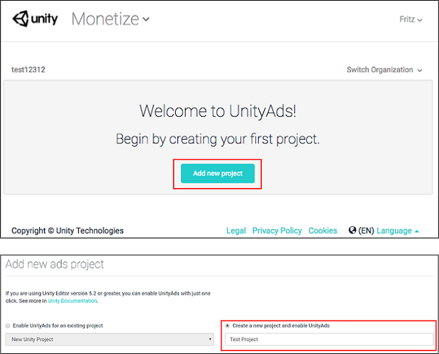
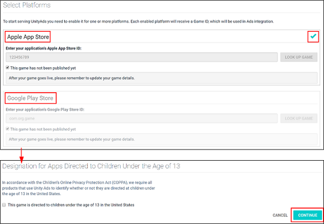
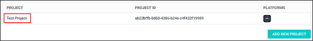
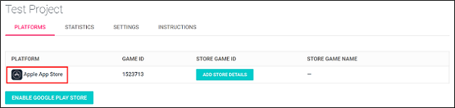
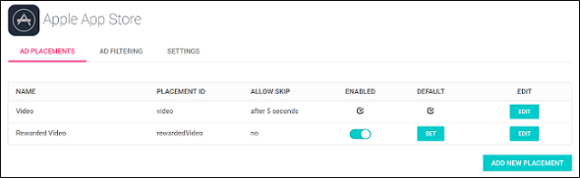

# Unity Editor 集成

本指南介绍在 Unity 引擎中集成 Unity Ads 的两种方法：

* Services 窗口集成
* 资源包集成

## 设置编译目标

使用 [Build Settings 窗口](BuildSettings.html)配置您的项目以便发布到受支持的平台。

将平台设置为 __iOS__ 或 __Android__，然后单击 __Switch Platform__。


## 启用 Unity Ads 服务

根据您的集成偏好（选用 Services 窗口方法还是资源包方法），此过程略有不同。

### Services 窗口方法
要启用 Ads，您需要配置项目以便使用 Unity 服务。因此必须设置 __Organization__（组织）和 __Project Name__（项目名称）。请参阅有关[设置服务](SettingUpProjectServices.html)的文档。

设置好 Unity 服务后即可启用 Unity Ads：

1.在 Unity Editor 中，选择 __Window__ > __Services__ 以打开 Services 窗口。
2.从 Services 窗口菜单中选择 __Ads__。
3.单击右侧的切换开关以启用 Ads 服务（参阅下图）。
4.通过单击复选框指定您的商品是否面向 13 岁以下的儿童，然后单击 __Continue__。


### 资源包方法
在将 Ads 集成到资源包之前，您需要按如下所述方式创建 Unity Ads 游戏 ID (Unity Ads Game ID)。

**创建 Unity Ads Game ID**

1.在 Web 浏览器中，使用您的 Unity Developer Network [UDN](https://id.unity.com/account/new) 帐户导航至 [Unity Ads Dashboard](https://dashboard.unityads.unity3d.com/)，然后选择 __Add new project__。<br/>

2.选择适用平台（iOS 和/或 Android）。<br/>

3.找到特定于平台的 `Game ID`，并复制该 ID 供稍后使用。<br/>

**将 Ads 集成到资源包**

1.在脚本的头部声明 Unity Ads 命名空间 `UnityEngine.Advertisements`（请参阅 [UnityEngine.Advertisements](../ScriptReference/Advertisements.Advertisement.html) 文档）：<br/><br/>
      
    ```
        using UnityEngine.Advertisements;
    ```

2. Inititalize Unity Ads early in the game’s runtime lifecycle, preferably at launch, using the copied Game ID string, `gameId`: <br/><br/>

	```
	    Advertisement.Initialize(string gameId)
	```
	
## 显示广告

启用服务后，您可以在任何脚本中实现代码来显示广告。

1.在脚本的头部声明 Unity Ads 命名空间 `UnityEngine.Advertisement`（请参阅 [UnityEngine.Advertisements](../ScriptReference/Advertisements.Advertisement.html) 文档）：<br/><br/>
      
      ```
         using UnityEngine.Advertisements;
   
          ```

2.调用 `Show()` 函数以显示广告：<br/>

    ```
    Advertisement.Show()
    
    ```

## 对观看广告的玩家进行奖励

对观看广告的玩家进行奖励可以增加用户参与度，从而带来更高收入。例如，游戏可以用游戏币、消耗品、额外生命数量或经验倍增法宝来奖励玩家。

要对看完视频广告的玩家进行奖励，请使用以下示例中的 `HandleShowResult` 回调方法。务必确保 `result` 等于 `ShowResult.Finished` 来确认用户未跳过广告。

1.在脚本中添加一个回调方法。
2.调用 `Show()` 时，将此方法作为参数传递。
3.调用具有 `"rewardedVideo"` 广告位的 `Show()` 函数，使该视频无法跳过。

**注意**：请参阅 [Unity Ads 文档](https://unityads.unity3d.com/help/monetization/placements)以了解有关 `placements` 的更多详细信息。

```
void ShowRewardedVideo ()
{
	var options = new ShowOptions();
	options.resultCallback = HandleShowResult;
	
	Advertisement.Show("rewardedVideo", options);
}

void HandleShowResult (ShowResult result)
{
	if(result == ShowResult.Finished) {
		Debug.Log("Video completed - Offer a reward to the player");
		// 在此处奖励您的玩家。
		
	}else if(result == ShowResult.Skipped) {
		Debug.LogWarning("Video was skipped - Do NOT reward the player");
		
	}else if(result == ShowResult.Failed) {
		Debug.LogError("Video failed to show");
	}
}
```

### 奖励广告按钮代码示例

使用以下代码来创建奖励广告按钮。只要有广告，就会在按下广告按钮时展示广告。

1.选择 __Game Object__ > __UI__ > __Button__，将按钮添加到您的[场景](UsingTheSceneView.html)。
2.选择添加到场景中的按钮，然后使用 [Inspector](UsingTheInspector.html) 为其添加脚本组件。（在 Inspector 中，选择 __Add Component__ > __New Script__。）
3.[打开脚本](CreatingAndUsingScripts.html)，然后添加以下代码：<br/><br/>**注意**：特定于资源包集成的两段代码已通过注释标注出来。<br/><br/> 

    ```
         using UnityEngine;
              using UnityEngine.UI;
              using UnityEngine.Advertisements;

              //---------- 以下代码仅用于资源包集成：----------//
     
              #if UNITY_IOS
              private string gameId = "1486551";
              #elif UNITY_ANDROID
              private string gameId = "1486550";
              #endif

              //-------------------------------------------------------------------//

         	     ColorBlock newColorBlock = new ColorBlock();
         	     public Color green = new Color(0.1F, 0.8F, 0.1F, 1.0F);

              [RequireComponent(typeof(Button))]
              public class UnityAdsButton : MonoBehaviour
              {
          	     Button m_Button;
	
         	     public string placementId = "rewardedVideo";

         	     void Start ()
         	     {	
         	 	     m_Button = GetComponent<Button>();
         		     if (m_Button) m_Button.onClick.AddListener(ShowAd);
		
         		     if (Advertisement.isSupported) {
         			     Advertisement.Initialize (gameId, true);
         		     }
		
         		     //---------- 以下代码仅用于资源包集成：----------//
		
         		     if (Advertisement.isSupported) {
         			     Advertisement.Initialize (gameId, true);
         		     }
		
         		     //-------------------------------------------------------------------//
	    
         	     }

         	     void Update ()
         	     {
         		     if (m_Button) m_Button.interactable = Advertisement.IsReady(placementId);
         	     }

         	     void ShowAd ()
         	     {
         		     var options = new ShowOptions();
         		     options.resultCallback = HandleShowResult;

         		     Advertisement.Show(placementId, options);
         	     }

         	     void HandleShowResult (ShowResult result)
         	     {
         		     if(result == ShowResult.Finished) {
         			     Debug.Log("Video completed - Offer a reward to the player");

         		     }else if(result == ShowResult.Skipped) {
         			     Debug.LogWarning("Video was skipped - Do NOT reward the player");

         		     }else if(result == ShowResult.Failed) {
         			     Debug.LogError("Video failed to show");
         		     }
         	     }
              }
         }
     
      ```

4.按下 Unity Editor 中的 __Play__ 以测试广告按钮集成是否成功。

如需进一步的帮助，请参阅 [Unity Ads 论坛](http://forum.unity3d.com/forums/unity-ads.67)。

-------------------------------------------------------------------------

## 在 Ads Dashboard 中管理设置

使用设置来修改项目中的广告位和其他特定于游戏的设置。（请参阅 [Unity Ads 文档](http://unityads.unity3d.com/help/monetization/placements)以了解有关广告位的更多信息。）

1.在 Web 浏览器中，使用您的 Unity Developer Network [UDN](https://id.unity.com/account/new) 帐户导航至 [Unity Ads Dashboard](https://dashboard.unityads.unity3d.com/)，然后找到您的游戏项目。<br/> <br/> 

    

2.选择适用平台（iOS 或 Android）。<br/><br/> 

    

3.选择广告位。（请参阅 [Unity Ads 文档](http://unityads.unity3d.com/help/monetization/placements)。）<br/><br/> 

    


<br/>
<br/>

-----
* <span class="page-edit">2017-08-25  Page published with [editorial review](DocumentationEditorialReview.html)
</span>

