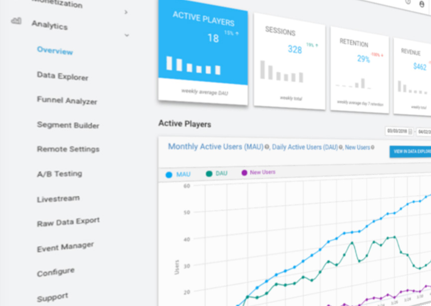

#Unity Analytics

Unity Analytics 是一个简单却很强大的数据平台，可为 Unity 游戏提供分析功能。通过此系统可以查看游戏玩家的身份及其在游戏中的行为。

**重要信息：**有关欧盟一般数据保护条例 (GDPR) 合规性的信息，请参阅 [Unity Analytics 和欧盟一般数据保护条例](UnityAnalyticsDataPrivacy.html)。

支持的平台：

* iOS
* Android
* Tizen
* 通用 Windows 平台
* Mac、PC、Linux 单机
* WebGL - 在 5.3 及后续版本中集成

如果您的问题在本文档中未得到解答，请在 [Unity Forums](http://forum.unity3d.com/forums/unity-analytics-beta.81/ ) 上提问。

 

**旧版本注意事项：**

* 有关将 Analytics 集成到早期项目（5.2 之前）的说明，请参阅[旧版本 Analytics 集成](UnityAnalyticsSDK.html)指南。
* 要将使用旧版本 Analytics SDK 的早期项目升级到较新的内置 Analytics，请参阅 [Analytics 升级指南](UnityAnalyticsUpgrading.html)。

---

• 2017-05-16  Page amended with no [editorial review](DocumentationEditorialReview.html)
 
