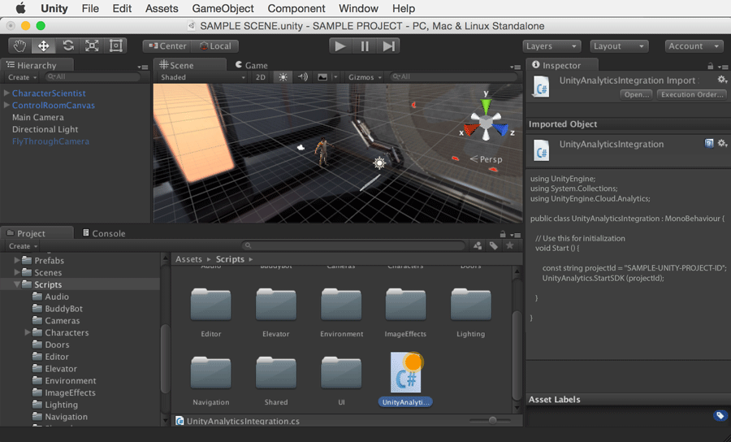

附加游戏脚本
============================

__UnityAnalyticsIntegration__ 脚本可以附加到游戏中任何[场景](CreatingScenes.html)的任何[游戏对象](GameObjects.html)以便初始化 Unity Analytics SDK。建议将脚本附加到游戏的第一个__场景__中的__游戏对象__，从而确保开始捕获尽可能多的用户参与度数据。

在本示例中，我们将脚本附加到 __MainCamera__。
首先在 Editor 左侧的 __Hierarchy__ 选项卡中找到并选择 "Main Camera"。

 

从 Projects 选项卡中将脚本拖放到 Main Camera __游戏对象__上。在 __Inspector__ 窗口中选择 Main Camera 后，应该会发现已将该脚本作为组件分配给 Main Camera。

注意：将脚本添加到__游戏对象__的另一种方法是在 __Hierarchy__ 中选择该__游戏对象__，然后在 __Inspector__ 中将所需的脚本组件添加到该游戏对象。
