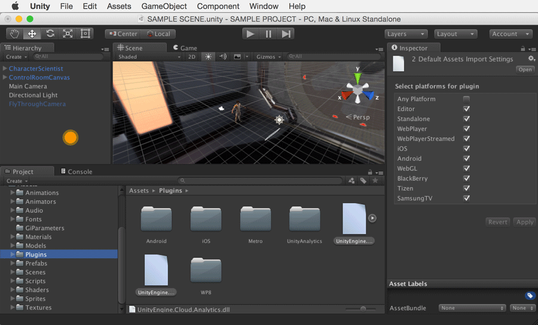

创建游戏脚本
==================

通过创建脚本启动玩家会话
---------------------------------------

在 Unity Editor 中，通过转至 
__Assets &gt; Create &gt; C# Script__ 来新建 C# 脚本 
将新建脚本命名为：__UnityAnalyticsIntegration__（命名必须准确才能使脚本正常运行）

 

打开脚本并复制代码
-------------------------

双击该脚本在外部脚本编辑器中打开脚本。将默认生成的代码完全替换为以下代码，并在脚本编辑器中保存该文件。以下示例代码中所示的 Unity Project ID 对游戏而言是唯一的。该 ID 用于将 Editor 项目链接到 Analytics Dashboard。

[转至 Analytics Dashboard 查看唯一的功能性项目 ID](http://analytics.unity3d.com)

````
using UnityEngine;
using System.Collections;
using UnityEngine.Cloud.Analytics;

public class UnityAnalyticsIntegration : MonoBehaviour {

    // 此函数用于初始化
    void Start () {

        const string projectId = "SAMPLE-UNITY-PROJECT-ID";
        UnityAnalytics.StartSDK (projectId);

    }

}
````
---
* <span class="page-edit">2018-03-19  Page amended with limited [editorial review](DocumentationEditorialReview.html)
</span>

* <span class="page-history">从 2018.1 开始，MonoDevelop 由 Visual Studio 取代</span>

