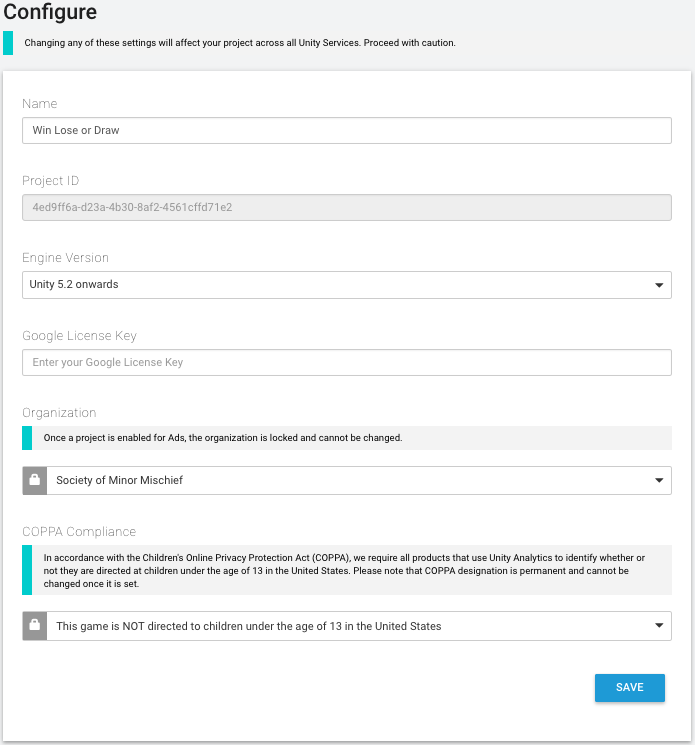
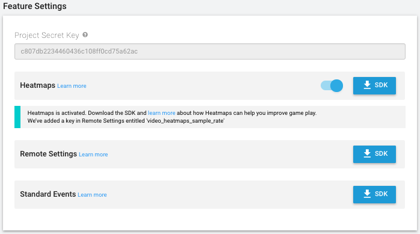

# 配置 (Configure) 选项卡

在 Configure 页面上可查看和编辑各个 Unity Analytics 项目的设置。Configure 选项卡包含以下部分：

* Project Service Settings
* Feature Settings
* Admin Settings

## Project Service Settings
Project Service Settings 可控制项目关于 Analytics 服务的各个方面。如下表所示，有些设置也会影响 Ads 和 IAP 服务。

|:---|:---|
|__Name__| The name of the project. Displayed in the Unity Services Dashboards and the Unity Editor Services windows. |
|__Project ID__ | A unique identifier for the project. Used to identify the project between Unity Services and the Editor. |
|__Engine Version__ | Specifies the Unity Editor and Engine version in use. The value set here changes the information shown on the Integration pages. |
|__Google License Key__| Enter your Google license key if you want to validate in-app purchases (IAP) made through the Google Play store. |
|__Organization__ | The name of your Unity Organization.|
|__COPPA Compliance__ | Specifies whether your project is directed at children and falls under the domain of the U.S. Children’s Online Privacy Protection Act (COPPA).  |

当您指出自己的应用程序受制于 COPPA 时，Unity Ads 服务会改变向用户投放广告的方式以遵守该规则。Analytics 服务收集的数据保持不变。

您需要完全自行负责确保自己的应用程序和对 Analytics 数据的使用符合适用法律（Unity 无法就此问题提供法律建议）。请参阅 [COPPA 合规性](UnityAnalyticsCOPPA.html)以了解更多信息。

## Feature Settings
Feature Settings 部分提供特定 Analytics 相关功能的信息和设置。

|:---|:---|
|__Project Secret Key__| The project secret key authorizes access to your Analytics data. Use the project secret key with the Raw Data Export REST API, as well as for Remote Settings and Heatmaps support in the Unity Editor.  Note that you should keep the __Project Secret Key__ secret. Anyone possessing this value can potentially access your Analytics data.  Also note that the __Project Secret Key__ was formerly known as the __Raw Data Export API Key__. The key value is the same; use the __Project Secret Key__ in any place where you previously used the __Raw Data Export API Key__. |
|__Heatmaps __(Pro-only)| Heatmaps visualize your Analytics data in two and three dimensions by displaying graphical markers of events directly in your Editor scene.  To use Heatmaps, enable the feature on the Configure page, then click the __SDK__ button to download the Heatmaps asset package. |
|__Remote Settings__ | Click the **SDK** button to download the Remote Settings asset package. |
|__Standard Events__ | Click the **SDK** button to download the Standard Events asset package. |

## Admin Settings
Admin Settings 部分包含了可以删除现有 Analytics 数据或全面禁用 Analytics 的控件。

####重置 Analytics 数据
重置 Analytics 数据会永久删除所有现有的处理数据，使这些数据不再显示在任何控制面板报告、细分段或漏斗图中。但是不会删除原始数据，仍然可以使用 [Raw Data Export](UnityAnalyticsRawDataExport.html) 下载这些数据。

处理数据将按照 Configure 页面上指定的时间予以删除，此后将重新开始 Analytics 数据的收集、处理和聚合。

单击 **Begin Process** 按钮并按照提示完成数据重置。

####关闭 Analytics

单击 **disable this project for Analytics** 链接即可对该项目关闭 Unity Analytics。（随时可以从 Unity Editor 或 Services Dashboard 为该项目重新启用 Analytics。）

---
* 2017-08-29  Page published with [editorial review](DocumentationEditorialReview.html)

* Unity 2017.1 中的新功能
