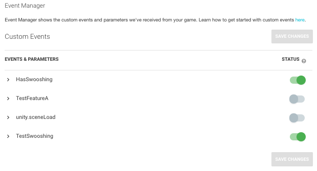
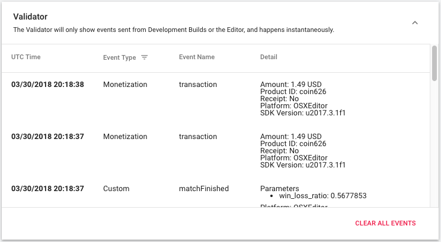
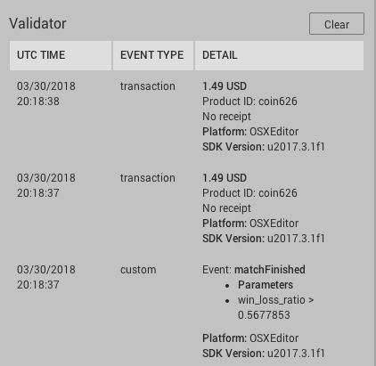

# 事件管理器 (Event Manager)
查看从项目分发的所有标准事件和自定义事件以及参数的列表。关闭未使用的旧事件可防止其显示在新报告中。

禁用某个事件时，Unity Analytics 系统会在处理数据时忽略该事件。因为数据处理过程中禁用的事件被忽略，所以它们不会计入帐户事件限制中。如果重新启用某个事件，Unity Analytics 会在随后的报告中包含该事件新分发的实例，但在禁用事件期间分发的任何事件实例将保持未处理状态。
请注意，您可以通过 [Raw Data Export](UnityAnalyticsRawDataExport.html) 下载禁用的事件。Event Manager 只会控制事件是否与其余 Analytics 数据汇总在一起。

## 验证器 (Validator)

Validator 显示 Unity Analytics 服务从游戏开发版本（以及从 Unity Editor 中的 Play 模式）中收到的事件。

在开发过程中使用 Validator 窗口可以验证您发送的 Analytics 事件是否被服务接收到。Analytics Dashboard 上的 Validator 显示的事件应与 Unity Editor Services 窗口中 Analytics 部分的 Validator 所显示的事件相匹配。

---
* 2018-03-30  Page published with [editorial review](DocumentationEditorialReview.html)

* Unity 2017.1 中的新功能
* Validator 显示内容已移到 Event Manager 页面。
