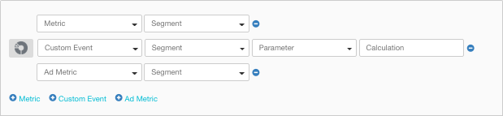
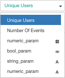

# 数据透视图 (Data Explorer)

使用 Data Explorer 可以构建 Unity Analytics 指标和事件的相关报告。Data Explorer 报告可显示所选的指标和自定义事件如何随时间变化。

## 新建报告
要创建 Data Explorer 报告：

1.导航至项目的 Analytics Dashboard。
2.单击 **Data Explorer** 选项卡。
3.单击所需数据类型旁边的 + 按钮，将 **Metrics**、**Custom Events** 和 **Ad Metrics** 添加到报告。（对于未使用 Unity Ads 的项目，Ad Metrics 选项是禁用状态。）

4.根据需要设置日期范围和图表类型。请参阅[报告选项](#ReportOptions)以了解更多信息。

**注意**：默认报告包含单个指标。您可以更改此项的指标类型和细分段。（要删除此项，必须先添加第二项：不能删除报告中的最后一个数据项。）

要保存报告供将来查看：

1.单击 **New Report** 按钮。

2.在打开的对话框中，输入报告的名称，然后单击 **OK**。

稍后若要查看保存的报告，请单击 **Saved Reports** 下拉列表并在列表中选择报告名称。您可以调整日期范围以查看包含最新数据的同一报告。

## 复制报告
要复制现有的 Data Explorer 报告：

1.导航至项目的 Analytics Dashboard。
2.单击 **Data Explorer** 选项卡。
3.单击 **Saved Reports** 下拉列表并在列表中选择报告名称。

4.根据需要调整日期范围、图表类型或其他选项。请参阅[报告选项](#ReportOptions)以了解更多信息。
5.单击 **New Report** 按钮。
6.在打开的对话框中，输入报告副本的名称，然后单击 **Ok**。

## 下载报告数据
要下载包含报告数据的逗号分隔值文件 (CSV)：

1.导航至项目的 Analytics Dashboard。
2.单击 **Data Explorer** 选项卡。
3.加载保存的报告或新建报告。
4.根据需要调整日期范围或其他选项。请参阅[报告选项](#ReportOptions)以了解更多信息。
单击 **CSV** 按钮可下载当前所示报告的数据。

**注意：**下载 CSV 可以精确地导出您在图表/表格中看到的内容。如果已订阅 Unity Pro，还可以从 [Raw Data Export](UnityAnalyticsRawDataExport.html) 选项卡或者通过 Raw Data Export REST API 以原始形式下载所有 Analytics 数据。

 
## 报告选项

可将以下类型的数据添加到报告中：

* **Metric**（指标）-- 只要有人玩您的游戏，就会自动发送核心 Analytics 事件，从而通过这些事件来计算 Analytics 指标。这些指标包括诸如玩过该游戏的玩家数量、玩游戏的时长以及他们在应用内购 (IAP) 方面花费的金额等。
* **Custom Event**（自定义事件）-- 自定义事件是您从游戏中分发的事件，用于衡量游戏特有的行为或其他因素。请参阅[自定义事件](UnityAnalyticsCustomEvents.html)以了解有关定义和使用自定义事件的更多信息。
* **Ad Metric**（广告指标）-- 来自 Unity Ads 服务的广告指标报告数据（仅在使用 Unity Ads 时可用）。

 

最多可以将 20 个数据项添加到单个报告中。只要使用不同计量单位的数据项不超过两个，图表就会以垂直刻度显示适当单位。

您可以设置报告的日期范围并选择不同的图表类型。

### Metric 和 Ad Metric 选项

将 __Metric__ 或 __Ad Metric__ 添加到图表时，必须设置名称并可以选择数据__细分段__ (Segment)：

* A -- 指标名称
* B -- 要显示的数据细分段
* C -- 从报告中删除该指标

对于每个数据项，可指定要显示的数据的__细分段__。__细分段__是该项的数据子集（根据一组规则选出）。例如，__Android Users__（Android 用户）细分段仅包含 Android 平台玩家的数据，而 __iOS Users__（iOS 用户）细分段仅包含 iOS 平台玩家的数据。

Analytics 服务包括一组标准细分段。您也可以创建自己的自定义__细分段__。使用 [Segment Builder](UnityAnalyticsSegmentBuilder.html) 可以查看标准细分段的定义并构建您自己的自定义__细分段__。请注意，创建自定义__细分段__时，它仅适用于新收集的指标和事件。旧数据不会被重新处理来包含在新的__细分段__中。

### 自定义事件选项

将 __Custom Event__（自定义事件）添加到报告时，可以根据事件参数设置其他选项。

* A -- 显示饼图（仅适用于可分类的数据项）
* B -- __自定义事件__的名称
* C -- 要显示的数据的__细分段__
* D -- 自定义事件__参数__名称和显示选项
* E -- 如何聚合参数值
* F -- 从报告中删除该自定义事件

__自定义事件__有参数时，可选择该事件的数据在图表上显示的方式。您可以显示接收的每个不同值的计数，对于数字属性，还可以显示接收的所有事件值的总和或平均值：

__参数__名称后面显示的符号表示如何显示__参数__。字符串 (A) 和布尔值（文氏图）符号表示__参数__值会分类到不同组中。数字符号 (#) 表示__参数__值是除了可计数以外还可以平均或求和的数字。请注意，数字__参数__在列表中出现两次，一次带有字符串符号，另一次带有数字符号，可让您选择将数字__参数__视为可分类值还是可聚合值。

显示可分类的__参数__值时，仅会将十个最常见的值分到单个组中。剩下的值集中在 __Other__（其他）组中。因此，要将数字__参数__视为可分类字符串，通常要求__参数__的不同值的数量有限。

您可以在图表底部查看这一组不同的值。此外也可以通过单击数据项前面的饼图按钮来查看这些值的饼图。一次只能显示一张饼图。

**注意：**要下载可分类数据饼图中的数据，请单击自定义事件旁边的饼图按钮，然后单击 **CSV** 按钮。

### 图表类型
您可以为报告选择以下图表类型：

 

* **Spline**（样条图）-- 平滑的折线图
* **Column**（柱状图）-- 条形图
* **Stacked**（堆积图）-- 堆积面积图
* **Table**（表）-- 值表格
* **Pie**（饼图）-- 饼图（仅可用于单独且可分类的自定义事件参数）

#### 图表缩放
您可以放大**样条图**、**柱状图**和**堆积图**，方法是单击图表并拖动想要更详细查看的部分。

放大后，图表会显示 __Reset Zoom__ 按钮，该按钮可恢复图表以显示整个日期范围。

## 注释
You can use annotations to mark the dates of important external factors that might affect your game’s analytics data, such as game updates, marketing campaigns, and promotions. Add date-based annotations to the Data Explorer reports using the Annotations section below the report chart. 

注释适用于整个项目范围，而非个别报告。每当打开 Annotations 部分时，注释都会显示在所有报告图表上。

**要添加注释：**

1.在任何 Data Explorer 报告上，单击 **+ Annotations** 按钮以打开 __Annotations__ 部分（如果尚未打开）。
2.单击日期框并设置注释的日期。在一个给定日期只能添加一条注释记录。
3.输入注释的名称或描述性文字。
4.单击 __Save__。

---
* 2017-08-29  Page published with [editorial review](DocumentationEditorialReview.html)

* Unity 2017.1 中的新功能

