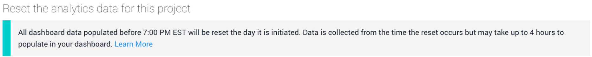
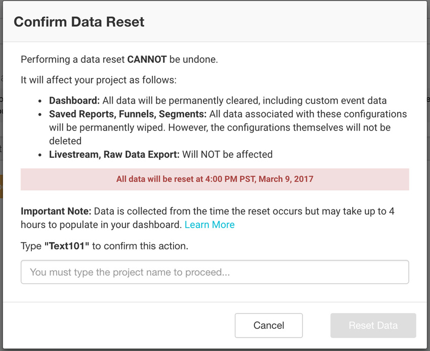

# 数据重置

Unity Analytics 允许通过执行数据重置来永久清除 Analytics Dashboard 中的所有数据。此操作**无法撤销**，因此在执行此操作之前，请仔细阅读本文档和 Analytics Dashboard 中的确认消息。

本页面介绍数据重置功能何时可能有用，以及此功能对 Analytics 项目中的数据产生的影响。

## 何时执行数据重置

需要重置 Analytics 项目数据的主要情况是在游戏上市（或重新发布游戏）之前从控制面板中清除数据。这种做法可以确保重置后收集的数据是干净的，而不会与以前收集的数据混淆（混淆在一起可能会导致分析出现偏差）。

其他常见情况：

* 在游戏上市之前擦除在开发和测试期间收集的数据。

* 擦除预发布版或测试版的数据。

* 在商店中推出游戏之前擦除数据。

* 在商品重新上市之前擦除数据。

请注意，执行数据重置是可选操作，可能永远无需使用此功能。

## 此功能对数据的影响

根据 Unity Technologies 的数据处理周期，所有数据重置操作都会在第二天的 00:00（UTC 时间）进行。请参阅 Configure 页面以了解即将重置数据的准确时间（按您的时区）。

 

发生数据重置时即收集数据，但可能需要长达 4 小时才能填充到控制面板中。无法指定其他日期来重置数据。

重置数据会影响如下这些 Analytics 元素：

* **Dashboard**（控制面板）：永久擦除控制面板中的所有可见数据，包括图表中的数据。

* **Custom event data**（自定义事件数据）：从控制面板中永久擦除此数据。请注意，无需重新验证您已经在项目中设置的自定义事件。

* **Reports, Funnels, Segments**（报告、漏斗图、细分段）：从控制面板中永久擦除与这些配置（在项目中已创建的配置）相关的所有数据。但是，不会删除这些配置本身。例如，如果创建包含三步的漏斗图，为其填充数据，然后执行数据重置，则此三步式漏斗图仍然会存在于控制面板中，但不再包含数据。

* **Livestream**：执行数据重置时，此元素不受影响。

* **Raw Data Export**：执行数据重置时，此元素不受影响。仍然可以执行导出以访问历史数据，并且先前运行的所有导出仍然存在于 Raw Data Export 页面上的 Activity 表中。

## 如何执行数据重置

要执行数据重置，请打开要重置的 Analytics 项目的 Unity Services Dashboard，转至 __Configure__，然后单击 __Reset Data__。务必仔细阅读确认消息。将项目名称输入文本框并单击 __Reset__。随后会立即进行数据重置。

 

重置数据后，__Configure__ 页面中会提供有关上次重置的详细信息：

* 发生重置的日期和时间。

* 执行重置的用户。

**注意：**只有项目所有者 (Project Owner) 和管理员 (Manager) 才能执行此操作。项目用户 (Project User) 没有权限执行重置。

