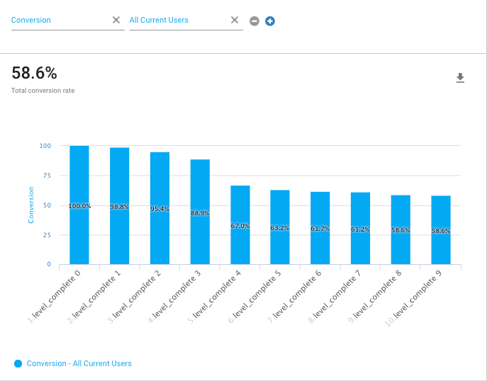
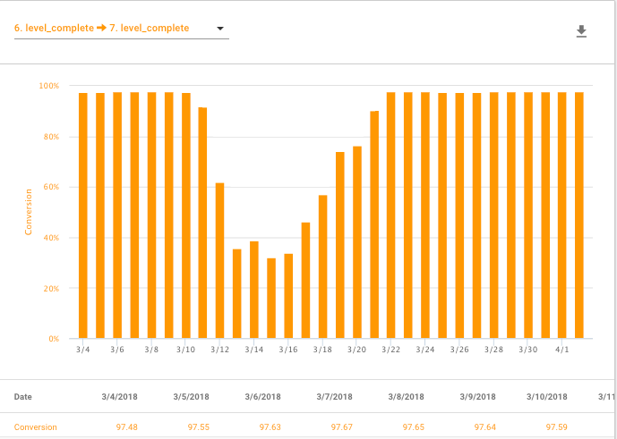

# 漏斗图

漏斗图有助于跟踪玩家是否在游戏内完成线性活动序列。漏斗图可显示玩家完成该序列的每一步以及完成整个序列的百分比。用漏斗图跟踪的常见序列包括：

* 首次用户体验 — 跟踪新玩家完成游戏入门序列的情况
* 游戏进度 — 跟踪玩家通过游戏内重要步骤（例如完成关卡）的情况
* 购买 UI — 暴露进行购买时面临的障碍

漏斗图基于[标准]()和[自定义]()事件。Unity Analytics 根据是否已使用正确参数值分发所定义的标准事件或自定义事件来评估漏斗图中的每个步骤。为了让用户进入漏斗图并在其中取得进展，他们必须按照漏斗图步骤出现在漏斗图中的准确顺序完成这些步骤。

在 Analytics Dashboard 上创建漏斗图。

**重要信息*：Unity Analytics 在处理传入数据时会评估漏斗图中定义的规则。新建漏斗图时，不会重新评估现有数据。只有在创建漏斗图后收到的数据才会显示在 Funnel Analyzer 报告中。

## 新建漏斗图
在创建漏斗图之前，应该首先：

1.在游戏中添加必要的__标准事件__或__自定义事件__。
2.运行游戏，以便将每个事件的至少一个实例分发到 Unity Analytics 系统。您可以在运行游戏时在 Unity Editor 中执行此步骤。
3.等待 Unity Analytics 处理事件（大约 8-16 小时）。

在分发要包含在漏斗图中的标准事件和自定义事件的至少一个实例并等待处理这些事件之后，请按照以下步骤在 Analytics Dashboard 上创建漏斗图规则：

1.在 Unity Analytics Dashboard 上，单击 **Funnel Analyzer** 选项卡。
2.单击 **Create Funnel**。
   

3.输入漏斗图的 __Name__（名称）或 __Description__（描述，这是可选字段）。
4.对于要跟踪和分析的事件的线性序列中的每一步：
    1.单击 __+ Funnel Step__。（前两步是自动创建的，因为漏斗图始终需要比较至少两个进展阶段。）
    2.选择 __Standard Event__（标准事件）或 __Custom Event__（自定义事件）名称。此处仅列出游戏实例已分发并处理的事件。
    3.设置 **Parameters**（参数）规则（可选）。 随事件分发的参数必须满足您定义的规则，以便玩家成功完成漏斗图中的该步骤。如果不定义参数规则，只需分发事件即可完成该步骤。
5.单击 **Save**。
 
 在创建漏斗图步骤时，可使用每个步骤上方的 **Delete**、**Duplicate** 和 **Rearrange** 图标来进行更改。

**注意**：在单击 **Save** 之后，无法修改漏斗图步骤。但是，可创建漏斗图副本并修改副本的步骤。此限制的原因是，更改现有漏斗图的规则会使该漏斗图中包含的任何现有数据无效。

## 阅读 Funnel Analyzer 报告
Analytics Dashboard 的 __Funnel Analyzer__ 选项卡会列出已创建的漏斗图。

 

检查 **Members** 列可以查看有多少玩家已进入该漏斗图。
__Funnel Analyzer__ 报告有两个部分：__Funnel__ 图表和 __Drilldown__ 部分，其中会提供有关漏斗图数据的更多详细信息。

### 漏斗图转化图表
__漏斗图__转化图表可直观地概要显示玩家在漏斗图追踪的步骤序列中的完成进度。步骤之间出现意外的玩家流失表明在此处非常适合研究阻止玩家继续下一步的游戏玩法、用户界面或其他问题。

以上示例显示了基于 level_complete 事件的漏斗图。此示例表现出在早期关卡中玩家人数大幅下降。该图表无法确切告知具体问题（关卡可能太难，也可能太容易），但可以告知您从何处着手寻找游戏问题。

### 漏斗图指标

通过向图表中添加指标和细分段可以了解有关漏斗图中发生情况的更多详情。可用的指标包括漏斗图使用的任何标准事件或自定义事件随附的参数。

### 按日期划分的漏斗图步骤 (Funnel Steps By Date) 图表

“按日期划分的漏斗图步骤”图表可显示一段时间内的转化率变化。您可以显示进入和完成漏斗图的玩家的整体转化率，也可以显示各个步骤之间的转化率。

以上示例显示在接近报告期中间位置发生了转化率下降。转化率在几天后恢复。原因也许是更新中包含的错误使玩家更难完成该步骤，而该错误在后续更新中得到修复。

---
* 2017-08-29  Page published with [editorial review](DocumentationEditorialReview.html)

* Unity 2017.1 中的新功能
* 2017-09-19 更改了漏斗图控制面板 UI

