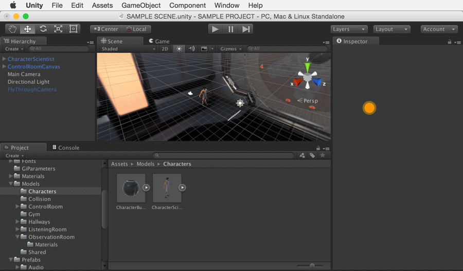

导入 SDK
==========

下载 Unity Analytics SDK
----------------------------
 
从 [Unity Asset Store](https://www.assetstore.unity3d.com/en/#!/content/28120) 以 Unity 包的形式下载最新版本的 Unity Analytics SDK，或者在此处下载：

[从 Analytics Dashboard 下载](http://analytics.unity3d.com)

导入 SDK
-----------------------------

要导入下载的包，请转至 Unity Editor 并选择：
__Assets &gt; Import Package &gt; Custom Package__  
找到下载的 SDK 包。选择 SDK 包后，单击 "Open"。将所有文件保持选中状态并单击 __Import__。

 

如果导入成功，应该会在 Project 视图面板中看到 Unity Analytics 资源。

