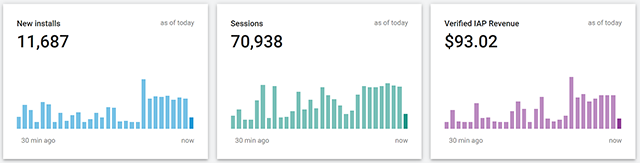
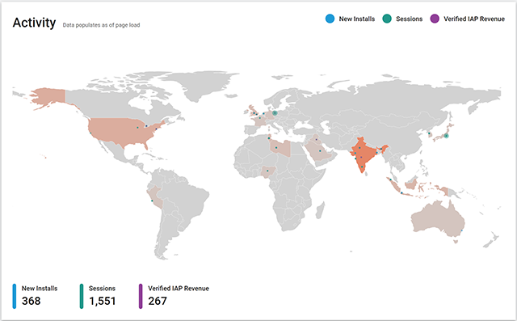
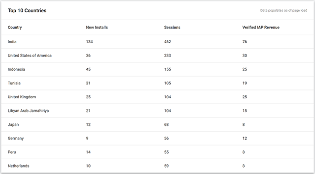
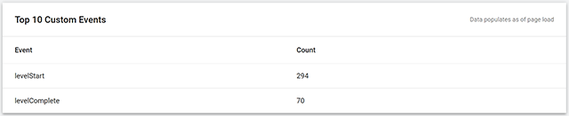

# 实时数据 (Livestream) 页面
在关键时刻（如游戏启动时和推荐期间）实时显示数据。

Livestream 页面按原样对 Analytics 数据进行采样，而不进行任何其他数据处理。请注意，Analytics Dashboard 的其他区域需要在数据处理完成后才会显示数据，因此会延迟几个小时。要使用 Livestream 功能，必须订阅 Unity Plus 或 Pro。

Livestream 页面包含以下部分：

* 实时指标 (Live Metrics)
* 活动地图 (Activity Map)
* 主要国家/地区指标 (Top Country Metrics)
* 主要自定义事件 (Top Custom Events)

## 实时指标

__Live Metrics__（实时指标）部分显示传入指标数据的图表。显示的数字表示当天的累计总数（在格林威治标准时间 (GMT) 的午夜重置）。图表部分显示最近 5 分钟的活动（从加载 Livestream 页面开始算起）。

|:---|:---|
|__User Logins__| The number of players who have started a new session.|
|__New Users__ | The number of new players. |
|__Verified IAP Revenue__ | Reported IAP revenue (after [receipt verification](UnityAnalyticsReceiptVerification.html) is performed). |

## 活动地图

__Activity Map__（活动地图）标记传入 Analytics 指标事件的地理位置。

## 主要国家/地区指标

__Top Country Metrics__（主要国家/地区指标）部分显示来自大部分活跃国家/地区的指标。

## 主要自定义事件

__Top Custom Events__（主要自定义事件）部分显示玩家玩游戏时分发的最常见__标准事件__和__自定义事件__。事件计数是自从加载 Livestream 页面以来的累计数量。

请注意，Livestream 页面上显示的事件都是高效采样的结果。这意味着并非每个事件都会单独计数，因此如果在两个不同页面中打开 Livestream，显示的数字和事件可能会稍有不同。

---
* 2018-03-30  Page published with limited [editorial review](DocumentationEditorialReview.html)

* Unity 2017.1 中的新功能
* 添加了主要国家/地区指标。
