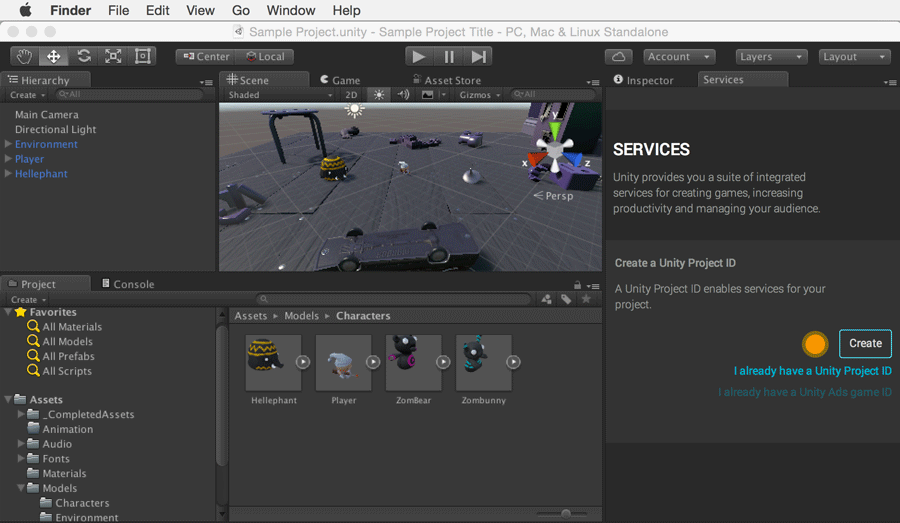

项目 ID 不匹配的情况下如何应对
=====================================

如果在 Services 窗口的 Settings 中找不到项目 ID，或者如果发现项目 ID 不匹配，这可能是因为使用了较早版本的 Unity 来升级项目，或在脱机时创建了新项目。您可以通过将 Analytics 项目链接到 Editor 中的项目来解决此问题。

 

* 导航至 Services 窗口 > Settings > Unlink project
* 选择您的组织，然后单击 "I already have a Unity Project ID"
* 在下拉列表中找到您的项目，然后单击 "Link" 以链接该项目。

 
