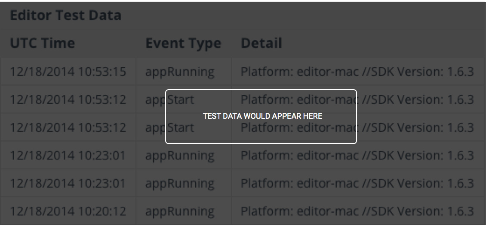

变现
============

Unity Analytics 允许您监控游戏内的收入。通过实施收据验证，很快就能发现合法或欺诈交易。

Unity Analytics 提供一种灵活方法来跟踪通过应用内购 (IAP) 发生的变现事件。每次玩家触发变现事件时都应调用此方法。Transaction 方法需要价格参数、货币和可选的 Apple iTunes/Google Play 收据字符串。

Unity Analytics 提供 __UnityAnalytics.Transaction__ 方法来跟踪通过应用内购 (IAP) 发生的变现事件。每次玩家触发变现事件时都应调用此方法。__UnityAnalytics.Transaction__ 方法需要价格参数、货币和可选的 Apple iTunes/Google Play 收据字符串。

````
  // 引用 Unity Analytics SDK 包
    using UnityEngine.Cloud.Analytics;

    // 对玩家触发变现事件的每个位置使用此调用
    UnityAnalytics.Transaction(string productId, decimal price,
    string currency, string receipt,
    string signature);
````

|**_UnityAnalytics.Transaction Input Parameters_**|||
|**_Name_** |**_Type_** |**_Description_** |
|:---|:---|
|__productId__ |string |The id of the purchased item. |
|__price__ |decimal |The price of the item. |
|__currency__ |string |Abbreviation of the currency used for the transaction. For example "USD" (United States Dollars). See [here](http://en.wikipedia.org/wiki/ISO_4217) for a standardized list of currency abbreviations. |
|__receipt__ |string |Receipt data (iOS) or receipt ID (Android) for in-app purchases to verify purchases with Apple iTunes or Google play.  Use __null__ in the absence of receipts. For more details see [Receipt Verification](UnityAnalyticsReceiptVerificationSDK.html). |
|__signature__ |string | Android receipt signature.  If using native Android use the __INAPP_DATA_SIGNATURE__ string containing the signature of the purchase data that was signed with the private key of the developer.  The data signature uses the RSASSA-PKCS1-v1_5 scheme. Pass in __null__ in the absence of a signature. |

以下示例是不含收据验证的 0.99 美元交易。

````
UnityAnalytics.Transaction("12345abcde", 0.99m, "USD", null, null);
````

按 Play
----------
要将测试变现数据发送到服务器并验证您的集成情况，请在 Editor Play 模式下触发购买。如果集成成功，您的测试数据将显示在下表中。

 

验证
--------
 
