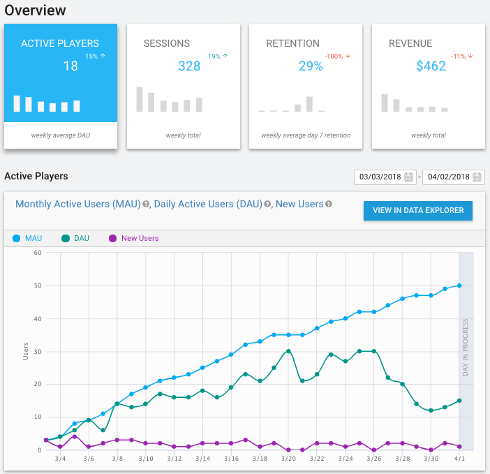
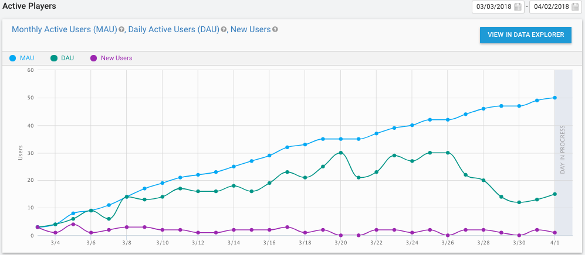
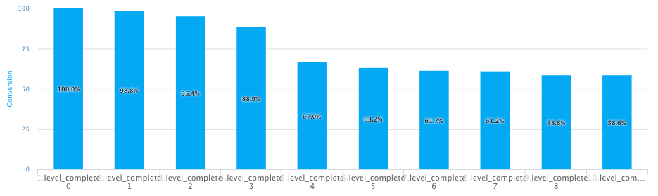
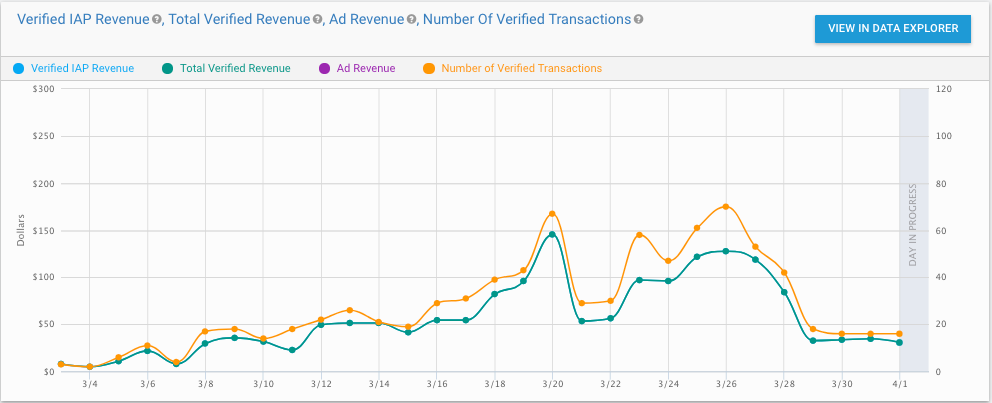
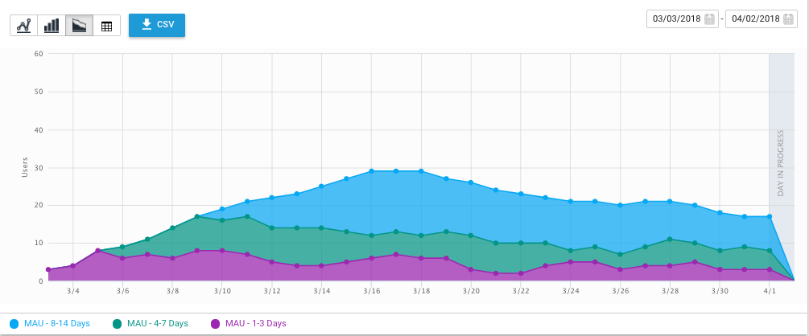
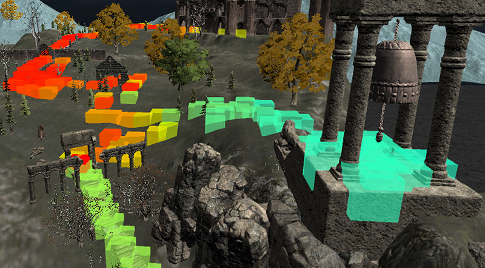

# Unity Analytics 概述

Unity Analytics 可提供所需的数据来管理您与玩家的关系。

了解您的玩家，了解他们为什么要玩您的游戏，了解他们为什么不再玩您的游戏。应根据数据而不是猜测来做决定。

只需在项目中启用 Unity Analytics，即可获取首次开始玩游戏的人数、每天玩游戏的人数、在指定月份玩游戏的人数以及其他基于会话的使用数据。如果您还使用 Unity Ads 和 IAP 服务，则 Analytics 数据会自动包含这些来源的收入。此类会话数据提供了游戏运营情况的重要信息。通过这些数据可以解答如下问题：“我是否在不断迎来新玩家？”、“他们玩游戏的频度和时长如何？”、“他们第二天还会玩吗？下周呢？下个月呢？”、“我具体一天从每名玩家获得的收入是多少？”

您通过玩家在游戏中执行关键操作时分发标准 Analytics 事件，即可扩展可用的 Analytics 数据，从而通过这些数据了解玩家在玩游戏时的实际行为。他们是否通过入门教程取得了成效？他们是否访问您的 IAP 商店？他们是否像您期望的那样通过游戏关卡？

Analytics 数据可以帮助您专注于最有成效的领域来改进应用程序，从而更好地为玩家提供服务。您可以通过发布更新来应用这些更改，但是也可以创建 __Remote Settings__ 以便在不发布更新的情况下直接调整和优化游戏。

了解您的玩家以及他们如何玩游戏，您就可以改进游戏。而当数据显示您的玩家正在改变时，您可以做出反应并进行调整。

请参阅 [Analytics 指标、细分段和术语](UnityAnalyticsTerminology.html)以了解整个 Analytics 文档中使用的特定术语的定义。

## 核心使用数据
启用 Analytics 时，Unity 便会跟踪[受支持平台](#SupportedPlatforms)上的核心使用指标，而无需您投入任何精力或进行任何操作。这些[核心指标](UnityAnalyticsTerminology.html)包括：

* 新安装 [New installs]
* 每日活跃用户 (DAU) [Daily active users (DAU)]
* 每月活跃用户 (MAU) [Monthly active users (MAU)]
* 会话总数 [Total sessions]
* 每个用户的会话数 [Sessions per user]
* 在应用程序中花费的时间 [Time spent in app]
* 按国家/地区和平台划分的用户细分段 [User Segments for Country and Platform]

这些都是用来监控游戏运营情况的良好指标。这些指标会告诉您，有多少人安装您的游戏、他们玩游戏的频度以及他们会坚持多久。许多外部因素也会影响这些数字，但您应该观察这些因素以找出可能的问题征兆，从而及时纠正。

[Analytics Dashboard](UnityAnalyticsDashboard.html) 的 Overview 选项卡中显示的以下图表有三条数据曲线：__New Users__（新用户）、__DAU__（Daily Active Users，即每日活跃用户）和 __MAU__（Monthly Active Users，即每月活跃用户）：

__New Users__ 曲线显示在某一天有多少人第一次玩您的游戏。因为新玩家对您的游戏接触不多（即使有一些），所以该图表通常反映了外部因素。如果您启动营销活动或其他推荐活动来吸引新玩家，您会希望在 __New Users__ 曲线中发现人数激增的情况。

__DAU__ 曲线显示您的玩家中有多少人在指定日期玩游戏。与 __DAU__ 曲线相似，__MAU__ 曲线显示您的玩家中有多少人在指定的 30 天内玩游戏。

__Sticky Factor__（粘性系数）图显示了在指定日期的玩家占每月玩家的百分比 (DAU/MAU)。该指标的主要目的是揭示玩家反复玩该游戏的频度。（换言之，就是游戏的玩家“粘性”如何。）

活跃玩家数量大可能表明游戏很受欢迎，但孤立解读这一数据可能会有偏差。特别要注意是，这些指标没有将新用户与回头用户的影响分开。例如，新玩家的涌入可能掩盖更多老牌玩家流失的问题。（在常见的分析术语中，损失玩家称为“流失”。）__DAU__、__MAU__ 和__粘性系数__指标常常用于游戏行业，因为 DAU 和 MAU 是历来用于比较不同游戏的最普遍公用数据。

请参阅 [Analytics Dashboard](UnityAnalyticsDashboard.html) 以了解有关如何查看 Analytics 数据的信息。

## 玩家行为数据
要了解游戏特有的玩家行为，您可以在游戏中的适当时间发送 Analytics 事件。Unity 提供方便易用的 API 来发送标准化事件和完全自定义的事件。您可以使用这些事件来测试游戏，从而观察玩家行为，特别是在以下方面：

* 入门 — 玩家是否通过入门机制（例如教程或起始关卡）成功入门？
* 进度 — 玩家是否能通过关卡？
* 经济性 — 游戏经济效益是否符合预期？
* 设计验证 — 游戏设计选项是否符合预期？
* 应用程序验证 — 应用程序的所有区域是否按照预期得到利用？是否存在玩家忽略或未注意的部分？
* 变现 — 变现策略是否为最佳？玩家进行购买是否有障碍？

请参阅 [Analytics 事件](UnityAnalyticsCustomEvents.html)以了解有关收集玩家行为数据的信息。

Analytics Dashboard 提供了漏斗图构建器 (Funnel Builder) 来帮助您分析玩家行为。漏斗图可显示玩家在一系列线性步骤中取得的进度。例如，您可以为教程创建漏斗图，由此显示用户完成教程步骤的百分比。漏斗图可用于了解您的应用程序中玩家流失的位置。

此漏斗图示例显示了玩家在游戏中的完成进度。漏斗图中的每一步代表完成一个游戏关卡。虽然通常情况下能预想到在关卡之间会损失一些玩家，但是在指定的关卡之后玩家减少过多可能表明该关卡存在问题。虽然漏斗图不能显示这一问题的具体原因（这可能是游戏玩法问题、错误或该关卡可能太难），但漏斗图能指出值得调查的问题区域。

请参阅[漏斗图](UnityAnalyticsFunnels.html)以了解有关实现漏斗图的信息。

## 收入数据
您可以分析应用内购 (IAP) 收入以及其他数据。如果使用 Unity IAP 服务，则会自动提供收入数据。否则，您可以在玩家每次进行购买时向 Analytics 服务发送事件。如果使用了 Unity Ads 服务，您还可以在 Analytics Dashboard 上分析广告收入。（但是，无法通过任何方式向 Analytics 服务报告外部广告收入。）

Analytics Dashboard 的 Overview 选项卡中显示的以下图表会显示项目的每日收入金额：

第一个图表显示已验证的 IAP 收入和交易以及来自 Unity Ads 服务的广告收入。__Overview__ 选项卡上的图表仅显示已验证的 IAP 收入，但您可以在 __Data Explorer__ 中查看所有上报的收入。未经验证的收入来源包括测试交易、欺诈交易、来自不支持收据验证的平台（如 Amazon 和 Windows 应用商店）的交易以及使用缺失或不正确信息或者未配置必要应用商店 API 密钥而上报的交易。如果使用 Unity IAP 服务，则会自动上报并验证 IAP 交易。如果使用外部 IAP API，则可通过 [Unity Analytics API](UnityAnalyticsReceiptVerification.html) 来上报并验证 IAP 收入。

第二个图表显示按付费用户和活跃用户分类的每日收入平均值：

__Average Revenue Per Paying User__（付费用户的平均收入，简称 ARPPU）显示在指定日期进行 IAP 交易的玩家花费的平均金额。__Average Revenue Per Daily Active User__（每日活跃用户的平均收入，简称 ARPDAU）显示所有用户的平均收入，包含指定日期的 IAP 收入和广告收入。

概览图表显示所有用户的收入。为了更好地了解不同玩家群体的货币消费情况，请使用 [Data Explorer](UnityAnalyticsDataExplorer.html) 通过细分段查看收入。标准细分段包括生命周期群组、地理位置、变现类别、受众特征（上报时）以及平台。您也可以定义自己的细分段。

控制面板的 Data Explorer 页面提供了额外的若干变现指标和细分段：

**变现指标**：

* ARPDAU（每日活跃用户的平均收入）[ARPDAU (Average Revenue Per Daily Active User)]
* ARPPU（付费用户的平均收入）[ARPPU (Average revenue Per Paying User)]
* 未验证交易的数量 [Number of Unverified Transactions]
* 已验证交易的数量 [Number of Verified Transactions]
* IAP 总收入 [Total IAP Revenue]
* 已验证的总收入 [Total Verified Revenue]
* 未验证的 IAP 收入 [Unverified IAP Revenue]
* 已验证的 IAP 收入 [Verified IAP Revenue]
* 已验证的付费用户 [Verified Paying Users]

**广告指标**：

* 广告 ARPU（用户的平均收入）[Ad ARPU (Average Revenue Per User)]
* 广告收入 [Ad Revenue]
* 广告启动次数 [Ad Starts]
* 每个 DAU 的广告数 [Ads per DAU]
* eCPM（估计的每千次展示费用）[eCPM (estimated Cost Per Thousand Impressions)]

**变现细分段**：

* 鲸鱼 [Whales]
* 海豚 [Dolphins]
* 小鱼 [Minnows]
* 从未变现 [Never Monetized]
* 所有付费者 [All Spenders]
 
请参阅[变现](UnityAnalyticsMonetization.html)以了解有关收入分析的更多信息。

## 数据细分
细分段有助于更好地了解玩家行为。标准的预定义细分段按以下类别将玩家分组：

* **Lifecycle**（生命周期）-- 按安装以来的天数将玩家分组。生命周期群组可用于分析玩家的行为如何随其在应用程序中的经验增多而变化。
* **Geography**（地理位置）-- 按国家/地区将玩家分组。
* **Monetization**（变现）-- 按消费类别将玩家分组。变现类别有助于通过玩家产生的收入金额来了解玩家的行为。
* **Platform**（平台）-- 按玩家的计算机操作系统或设备类型分组。

 
您可以使用 __Segment Builder__ 来定义自己的类别。但是，任何新的类别都只能运用于在创建这些类别之后收集的数据。例如，如果为直布罗陀的玩家添加细分段，则该细分段最初为空；只有直布罗陀的玩家新发生的活动才会显示在该细分段中。

您可以在 [Data Explorer](UnityAnalyticsDataExplorer.html) 和[漏斗图](UnityAnalyticsFunnels.html)报告中使用这些细分段。

有关自行创建细分段的更多信息，请参阅 [Segment Builder](UnityAnalyticsSegmentBuilder.html)。

## Remote Settings
__Remote Settings__ 功能允许从 Analytics Dashboard 更改游戏中的变量的值。您可以在开发游戏时创建任意数量的 __Remote Settings__，然后在 Editor 中将它们分配给游戏对象 (GameObject) 变量。启动游戏后，您可以随时更改这些变量的值，因此可以在不发布更新的情况下调整游戏行为。

使用 __Remote Settings__ 可以执行如下任务：

* 调整游戏优化变量
* 启用或禁用功能
* 更改图形主题

请参阅 [Remote Settings](UnityAnalyticsDashboardRemoteSettings.html) 以了解更多信息。
## 热图
热图 (Heatmaps) 在游戏中以空间方式显示 Analytics 事件。

在试玩游戏时使用热图可发现性能和游戏玩法的瓶颈。因为热图需要大量 Analytics 事件，所以在游戏发布后以及生产环境不支持使用热图。

请参阅有关[热图 (Heatmaps)](https://bitbucket.org/Unity-Technologies/heatmaps/wiki/v2.md) 的 BitBucket 文档以了解更多信息。

热图需要 __Raw Data Export__ 功能；只有在订阅 Unity Pro 后才能使用该功能。

## 访问原始数据
Analytics Dashboard 上提供的报告不支持您要执行的分析类型时，可使用 __Raw Data Export__ 来导出 Analytics 事件。您可以从 Analytics Dashboard 或使用 Raw Data Export REST API 以 JSON 或制表符分隔值格式导出数据。随后可以将数据导入数据库或分析工具。

要使用 __Raw Data Export__，必须订阅 Unity-Pro。请参阅 [Raw Data Export](UnityAnalyticsRawDataExport.html) 以了解更多信息。

 
## 支持的平台

Unity Analytics 服务支持以下平台：

* iOS
* Android
* Tizen
* Windows Phone 8.1
* Windows 应用商店 8.1（桌面版）
* Windows 应用商店 10.0（桌面版）
* Mac、PC、Linux 单机
* WebGL - 在 5.3 及后续版本中集成

---

* 2018-06-22  Page published with [editorial review](DocumentationEditorialReview.html)

* Unity 2017.1 中的新功能

* Removed Demographics section.
