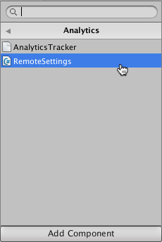
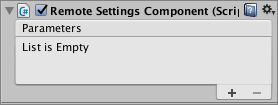
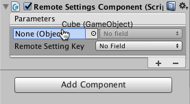
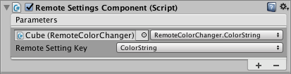

# 远程设置 (Remote Settings) 组件

使用 Remote Settings [组件](Components.html)可以控制场景中其他组件的属性而无需编写任何代码。Remote Settings 组件是 Remote Settings 插件的一部分；可从 [Unity Asset Store](https://www.assetstore.unity3d.com/#!/content/89317) 下载该插件。

使用 Remote Settings 组件之前，必须在项目中[启用 Remote Settings](UnityAnalyticsRemoteSettingsEnabling.html)，还应该使用 Unity Analytics Dashboard [创建 Remote Settings 键/值对](UnityAnalyticsRemoteSettingsCreating.html)。

您可以将 Remote Settings 组件与想要控制的另一组件放在同一游戏对象上，或将其放在其他游戏对象上。唯一的要求是 Remote Settings 组件和所有受控组件都在同一场景中处于有效状态。

## 使用 Remote Settings 组件

要将一个远程设置连接到组件属性或字段：

1.转至 __Window__ > __Unity Analytics__ > __Remote Settings__ 以打开 Remote Settings 窗口。

2.选择包含了待连接设置的配置（__Release__ 或 __Development__）。

3.转至要添加 Remote Settings 组件的游戏对象的 Inspector 窗口。

4.单击 __Add Component__ 按钮。

5.在列表中查找 __Analytics__ > __RemoteSettings__ 脚本。

     
    

6.单击 __Add Component__ 以将 Remote Settings 组件添加到游戏对象。

     

7.要添加新的参数映射，请单击 Remote Setting 组件的 __Parameters__ 列表底部的 __+__ 图标。

8.将需要远程控制的游戏对象或组件拖入参数的 __Object__ 字段。

     

9.在参数的 __Field__ 下拉列表中选择要控制的属性或字段。

10.选择要用于控制此组件属性或字段的 __Remote Setting Key__。

     

11.单击 __+__ 图标以添加其他参数。

如果没有任何 __Remote Settings Key__ 名称显示在列表中，请打开 __Remote Settings__ 窗口（菜单：__Window__ > __Unity Analytics__ > __Remote Settings__），然后单击 __Refresh__。如果 Remote Settings 仍未显示在此窗口中，请确认互联网连接正常并且项目已正确设置（请参阅[启用 Remote Settings](UnityAnalyticsRemoteSettingsEnabling.html)）。

如果键名称列表中出现错误键，请打开 Remote Settings 窗口（菜单：__Window__ > __Unity Analytics__ > __Remote Settings__），然后将 __Active Configuration__ 设置为包含正确键集合的配置。

Remote Settings 组件无法设置 Unity 后续在场景中加载的[预制件](Prefabs.html)（除组件本身外）的变量。同样，后续在场景中加载的 Remote Settings 组件只能设置属于同一预制件的对象的变量。使用多个 Remote Settings 组件可以应对这些类型的情况。

## 设置非原始属性

使用 Remote Settings 组件可以直接设置对象的原始字段和属性。但是，要设置对象的非原始成员的变量，必须编写一些额外代码。最简单的方法是将原始类型属性添加到某个可使用 Remote Settings 组件来设置的对象。然后，实现这些属性的资源库 (setter) 函数来更新非原始对象的目标变量。

**代码示例**

以下示例中的类将会设置分配给渲染游戏对象的材质的基础颜色。为此，该类定义了一个原始字符串类型属性来接受 HTML 样式的颜色字符串。此属性的资源库 (setter) 会解析字符串并相应地设置材质颜色。

```
using UnityEngine;

public class RemoteColorChanger : MonoBehaviour
{
    private string _colorString = "";
    public string ColorString {

        get { 
            return _colorString; 
        }

        set { 
            Color colorObject;
            if (ColorUtility.TryParseHtmlString (value, out colorObject)) {
                _colorString = value;
                Renderer renderer = GetComponent<Renderer> ();

                if (renderer != null) {
                    MaterialPropertyBlock materialProperties = new MaterialPropertyBlock ();
                    renderer.GetPropertyBlock (materialProperties);
                    materialProperties.SetColor ("_Color", colorObject);
                    renderer.SetPropertyBlock (materialProperties);
                } 
            } else {
                Debug.LogWarning ("Invalid color string: " + value);
            }
        }
    }
}
```

**使用代码示例**

您可以将此 `RemoteColorChanger` 脚本添加到具有 `Renderer` 组件的任何 `GameObject`。随后可以使用 Remote Settings 组件将设置键映射到 `ColorString` 属性。在本示例中，此脚本是 `Cube` 对象的组件。


Analytics Dashboard 的 Remote Settings 页面上匹配的键/值对如下所示：


使用同样的方法可以设置任意非原始值。

<br/>
<br/>
---

* <span class="page-edit">2017-05-30 Page published with [editorial review](DocumentationEditorialReview.html)
</span>

* <span class="page-edit">截至 2017-05-30，服务与 Unity 5.5 之后的版本兼容，但是版本兼容性可能会发生变化。</span>
 
* <span class="page-history">Unity 2017.1 中的新功能</span>
