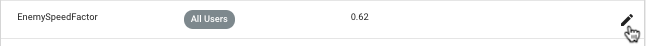
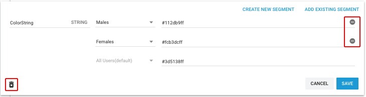
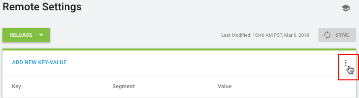
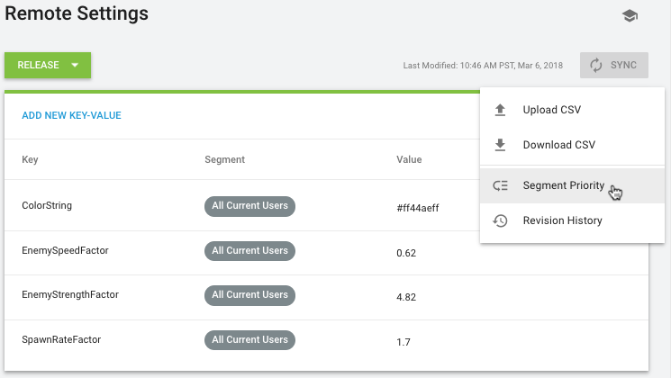
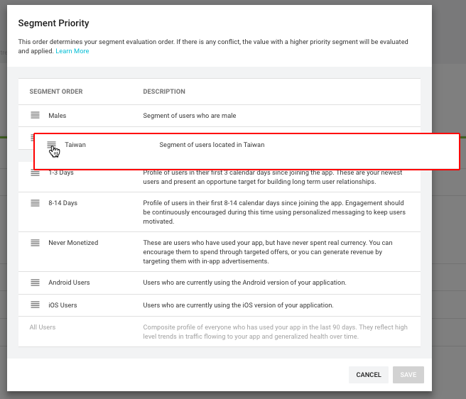
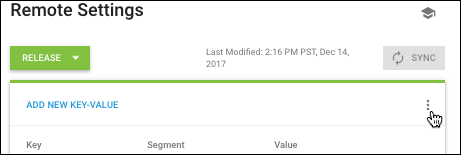

# 创建和更改 Remote Settings

在使用 Remote Settings 之前，必须首先为 Unity 项目启用 [Unity 服务](SettingUpProjectServices.html) 和 [Unity Analytics 服务](UnityAnalyticsOverview.html)。启用 Analytics 后，请打开 Analytics Dashboard 并转至 __Remote Settings__ 选项卡以创建和更改 Remote Settings 值。请参阅[在 Unity 项目中使用 Remote Settings](UnityAnalyticsRemoteSettingsUsing.html) 了解如何在游戏或应用程序中访问这些 Remote Settings 值。

Analytics 服务提供两种 Remote Settings 配置：

1.Analytics 服务将 Release 配置设置发送到运行常规非开发版应用程序的计算机和设备。

2.Analytics 服务将 Development 配置设置发送到运行开发版（即在 [Build Settings 窗口](BuildSettings.html)内选中 Development Build 标志而创建的版本）的计算机和设备。Unity Editor 中的 Play 模式被视为开发版。


每个 Remote Setting 由一个键、一个默认值和可选的细分值组成。设置包含细分值时，当前玩家所在的细分段将确定哪些值包含在配置中。如果多个细分适用，则该配置包含来自最高优先级细分段的值。

每个配置可以创建 200 个值。有一个细分段的设置使用一个值；有两个细分段的设置使用两个值；以此类推。

## 设置名称和值规则

单独的远程设置是键/值对。键名称的规则是：

* 键名称在同一配置内必须唯一。

* 键名称必须以字母开头。

* 键名称只能包含字母、数字和字符："."、"_" 和 "-"。

一个设置值可以是以下任何原始类型：__Int__、__Float__、__String__ 或 __Bool__。设置值的规则是：

* Int 值是 32 位整数（-2147483648 到 2147483647）。

* Float 值是单精度的 32 位浮点数（大约 -3.4x10^38 到 3.4x10^38）。

* String 值限制为 1024 个字符。

* You must specify boolean values with the strings "true" or “false”.

## 添加 Remote Settings

要添加 Remote Setting：

1.在 [Analytics Dashboard](https://analytics.cloud.unity3d.com/) 中，打开 __Remote Settings__ 选项卡。

2.将设置的 __Configuration__ 设为 __Release__ 或 __Development__。

3.单击 __ADD NEW KEY-VALUE__（位于设置列表的顶部）。

4.输入键的名称。

5.设置值的类型。

6.输入默认值。

7.单击 __Save__ 按钮。

8.单击 __Sync__ 按钮以发布所做的更改。（无需在创建每个单独设置后单击 __Sync__ 按钮，可以等到完成对当前配置的所有更改后再同步设置。）

__注意：__要添加针对不同细分段的值，请保存默认的键/值设置，然后对其进行编辑。细分段选项仅在编辑某项设置时显示，而不会在第一次创建设置时显示。

## 编辑 Remote Settings

要编辑 Remote Setting：

1.在 Analytics Dashboard 中打开 __Remote Settings__ 选项卡。

2.在 __Configuration__ 中选择 __Release__ 或 __Development__。

3.单击要更改的设置旁的编辑图标。

     

4.执行所需的更改。请注意，更改键名称等同于删除旧键并创建新键。

5.单击 __Save__ 按钮。

6.单击 __Sync__ 按钮以发布所做的更改。下次玩家启动会话时，Unity 会读取更新后的设置。


## 解决同时编辑冲突

如果团队中的两个人同时编辑项目的 Remote Settings，您在尝试将修改的设置与服务同步时可能会遭遇冲突。


发生冲突时，可选择以下选项：

__OVERWRITE__

放弃上次同步以来服务上的所有更改并将您的设置推送到服务。选择覆盖 (overwrite) 时，服务上的设置将与您当前的设置完全匹配。

__MERGE__

将您的当前设置与服务上已修改的设置合并，使您有机会在完成同步操作之前进行更改。

如果您编辑了同一个设置值，您的更改会覆盖服务上的版本。另外，还会恢复服务上已删除的值和设置（因为它们仍然存在于您的版本中）。自您上次同步以来服务上的其他更改将保留下来。

合并后，Remote Settings 页面将更新以反映此合并，但合并的设置不会推送到服务器。您可以查看更新后的更改，并在准备就绪后再次单击 __Sync__ 按钮。

__CANCEL__

取消同步操作并关闭冲突对话框而不进行任何更改。您的设置不会保存到服务。


## 为不同细分段添加不同值

您可以将多个细分值分配给单个 Remote Settings 键。玩家属于特定值所在的某个细分段时，Unity 会将该值发送给玩家，而不是默认的 __All Users__ 值。（如果玩家符合若干细分值的条件，则 Unity 会发送最高优先级细分段的值。）

要设置特定于给定细分段的值：

1.在 Analytics Dashboard 中打开 __Remote Settings__ 选项卡。

2.在 Configuration 中选择 __Release__ 或 __Development__。

3.添加 Remote Setting（如果尚未存在）。

4.单击该设置最右侧的编辑图标。

5.单击 __ADD EXISTING SEGMENT__。

6.在新行中，从下拉列表选择相应细分段，然后输入值。

7.单击 __Save__ 按钮。

## 删除 Remote Settings

要删除 Remote Setting，首先打开该设置的编辑视图：

1.在 Analytics Dashboard 中打开 __Remote Settings__ 选项卡。

2.将设置的 __Configuration__ 设为 __Release__ 或 __Development__。

3.单击要删除的设置旁的编辑图标以打开编辑视图：

     
    
4.要删除特定细分段的值，请单击编辑视图右侧的__减号__按钮，然后单击 __Save__。（无法删除默认的 __All Users__ 值。）

5.要删除整个设置，请单击编辑视图底部的删除图标，然后确认是否要删除该设置。

6.单击 __Sync__ 按钮以发布所做的更改。


## 设置细分段优先级

When a player is a member of more than one segment, Unity sends the value assigned for highest priority segment. (If a setting doesn’t have any segmented values, or the player isn’t a member of the segments that do have different values for a key, then Unity sends the All Users value.) You can set the order of your segments to specify which segmented values should take precedence when there is an overlap. 

要设置细分段优先级：

1.在 Analytics Dashboard 中打开 __Remote Settings__ 选项卡。

2.在 Configuration 中选择 __Release__ 或 __Development__。

3.单击设置列表右上角的菜单图标：

     

4.单击细分段优先级图标。
    
     


5.__Segment Priority__ 窗口将打开并显示当前顺序。窗口中只显示已为任意 Remote Settings 分配了值的细分段。

6.单击并拖放各项对细分段重新排序。


     

7.顺序正确时，单击 __Save__。

8.单击 __Sync__ 按钮以发布所做的更改。

细分段优先级将应用于配置中的所有设置，但是 Development 和 Release 配置可以有不同的优先级。

## 导入和导出设置

您可以使用逗号分隔值 (CSV) 格式文件来导入和导出设置。

__要导出当前设置：__

1.导航至 Unity Analytics Dashboard 上的 Remote Settings 页面。
2.选择要导出的配置（__Release__ 或 __Development__）。
3.单击列表标题右侧的菜单图标：
 
     

4.选择 __Download CSV__ 以将当前设置导出到计算机。

   Analytics 服务会将当前的设置下载为 CSV 文件。
   
请注意，如果在创建任何设置之前下载 CSV 文件，该文件完全是空的。上传的有效文件必须包含标题行。请参阅 [Remote Settings CSV 格式](#csvformat)。
   
__要将设置导入项目中：__

1.导航至 Unity Analytics Dashboard 上的 Remote Settings 页面。
2.选择要用导入的设置来覆盖的配置（__Release__ 或 __Development__）。
3.单击列表标题右侧的菜单图标。
4.选择 __Upload CSV__ 以将新设置文件导入项目中。
5.选择包含新设置的 CSV 文件。
6.单击 __Open__。

    Analytics 服务会上传该设置文件并替换所选配置中的所有当前设置，但是还不会提交值。
    
    如果文件中存在格式或值错误，该服务允许您下载包含错误详情的 CSV 文件。发生错误时不会更改任何设置。
   
7.单击 __Sync__ 以提交设置更改并使更改生效。（刷新页面或在未同步的情况下离开页面将会放弃任何上传的设置。）

导入设置时，**所有**键和值都会被更改以匹配上传的文件。如果文件中没有显示某个现有设置或细分段值，则表示已删除该设置。

### 在导入过程中创建和删除设置

除了编辑设置值外，还可以在将 CSV 文件上传到某个配置时创建和删除设置。

首先，下载该配置的当前设置 CSV 文件。然后，可编辑此文件以进行所需的更改。（如果使用电子表格应用程序来编辑文件，请参阅[使用电子表格](#spreadsheets)。）

__要新建设置：__

1.在文件中添加新行。
2.指定唯一的键名称。
3.定义数据类型（int、float、string 或 bool）。
4.输入 "All Current Users" 作为细分段。
5.将最后一个字段留空（用于默认细分段）。

新设置将如下所示：

```
a_bool_value,bool,TRUE,All Current Users,
```

__要为设置添加新的细分值：__

1.在文件中添加一行。
2.重复该设置的键名称和数据类型。
3.输入细分段的值。
4.输入细分段名称。在导入设置之前，必须事先为项目定义细分段名称。请使用 [Segment Builder](UnityAnalyticsSegmentBuilder.html) 页面查看现有细分段以及定义新细分段。
5.设置细分段优先级。
    
    文件中所有细分段的优先级必须是从 1 开始的连续整数。例如，如果在 CSV 文件中使用五个细分段，则允许的优先级只有数字 1-5。在文件中使用细分段的任何地方都必须分配相同的优先级。例如，如果将 Japan 细分段用于 CSV 文件中的若干值，在每一行中必须使用相同的优先级值。

具有细分值的设置将如下所示：

```
a_bool_value,bool,false,All Current Users,
a_bool_value,bool,true,1-3 Days,1
a_bool_value,bool,false,4-7 Days,2
```

__要删除设置：__

直接从文件中删除定义该设置的行。如果删除包含默认的 "All Current Users" 细分段的行，还必须删除定义细分值的任何行。请注意，如果删除细分值，可能还需要对细分段优先级重新编号以维持连续的整数序列。

最后，上传修改后的 CSV 文件并按 Remote Settings 页面上的 __Sync__ 按钮以保存更改并发布更改。

<a name="csvformat"></a> 
### Remote Settings CSV 文件格式

Remote Settings CSV 格式遵守 [ISO rfc4180](https://tools.ietf.org/html/rfc4180)。导出的文件采用 UTF-8 编码。

设置文件有五个字段。必须将标题行作为文件中的第一行：

```
key,type,value,segment,priority
```

该文件中的字段为：

* __key__ -- Remote Settings 键的名称。
* __type__ -- 设置数据类型：int、float、string 或 bool。
* __value__ -- 设置值。
* __segment__ -- 设置值的细分段名称。
* __priority__ -- 设置值的细分段优先级。

**CSV 文件中的条目规则：**

* 每行必须包含唯一的键和细分段组合。
* CSV 文件中的所有细分段必须已经存在。必须使用 Analytics Dashboard 的 [Segment Builder](UnityAnalyticsSegmentBuilder.html) 页面来创建新的细分段。
* 对默认细分段使用字符串 "All Current Users"。
* 默认的 "All Current Users" 细分段必须与文件中的每个键准确关联一次。
* 请勿向 "All Current Users" 细分段分配优先级（将字段留空）。
* 必须为其他所有细分段分配优先级。
* 对于使用该细分段的所有键，细分段优先级必须相同。
* 所有细分段之间分配的细分段优先级必须是连续整数（从 1 开始）。
* 对布尔值使用 TRUE 和 FALSE。
* 包含逗号、双引号和换行符的字符串必须用双引号引起来。
* 字符串中的双引号字符必须通过重复双引号来转义。例如：

    ```
    "Hello World!"            -> """Hello World!"""
    He said, "How do you do?" -> "He said, ""How do you do?"""
    ```
    
* 文件最多可以包含 201 行（包括标题行）。

**提示：**在控制面板上创建 Remote Settings 示例值并将其下载以生成示例文件。

<a name="spreadsheets"></a> 
### 使用电子表格

CSV 文件格式没有严格标准化，因此在不同的电子表格应用程序中打开或保存 CSV 文件时可能会发现有变化。Remote Settings 文件在 Remote Settings 页面与您的编辑应用程序之间往返后，务必确认文件中的字段正确无误。尤其要确认 Unicode 字符（不在基本 ASCII 范围内的 Emoji、符号和字符等）未经修改且浮点数未被截断。

通常在导入 CSV 文件时，电子表格应用程序会将 `&apos;`、`+`、`-` 或 `=` 字符开头的字符串解读为表达式而非普通字符串。可尝试用双引号将此类字符串引起来，并调整所用的电子表格的导入选项。例如，在 Google Sheets 中，可关闭 "Convert strings to numbers and dates" 选项；而在 LibreOffice 中，可启用 "Quoted Strings As Text"。

对于浮点类型的设置，确保设置值的所有有效数字都显示在电子表格单元格中。否则，电子表格应用程序将截断该值，并会在您将电子表格导出到 CSV 文件时损失精度。

---

* <span class="page-edit">2017-12-12 Page amended with no [editorial review](DocumentationEditorialReview.html)
</span>

* <span class="page-edit">截至 2017-08-28，服务与 Unity 5.5 之后的版本兼容，但是版本兼容性可能会发生变化。</span>

* <span class="page-edit">2017-06-30 - 添加：在键名称中允许使用字符 "."、"_" 和 "-"。</span>

* <span class="page-edit">2017-06-30 - 添加：CSV 导入和导出。</span>

* <span class="page-history">2017.1 中的新功能</span>

* <span class="page-history">2017-08-28 - 2017.1 中添加了细分的 Remote Settings：为不同细分段设置不同值</span>
