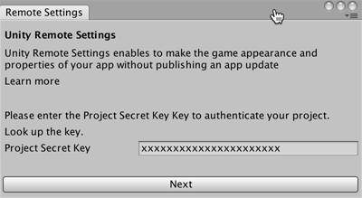

# 启用 Remote Settings

要在项目中启用 Remote Settings：

1.为项目[启用 Unity Analytics](UnityAnalyticsOverview.html)（如果尚未启用）。

2.如果需要，从 [Unity Asset Store](https://www.assetstore.unity3d.com/#!/content/89317) 导入 Remote Settings 包。

3.通过 __Window__ > __Unity Analytics__ > __Remote Settings__ 打开 Remote Settings 窗口：

     

4.输入 Analytics 项目的 __Project Secret Key__，然后单击 __Next__。
    您可以在 Unity Analytics Dashboard 的 __Configure__ 选项卡下找到自己的 __Project Secret Key__

5.在 Remote Settings 窗口上，单击 __Refresh__ 按钮。该窗口将显示已创建的所有设置的键/值对。

如果尚未创建 Remote Settings，请参阅[创建和更改 Remote Settings](UnityAnalyticsRemoteSettingsCreating.html) 开始进行操作。

**注意：**__Project Secret Key__ 应保密。任何拥有此值的人都可以访问您的 Analytics 数据。项目的密钥存储在 Editor 偏好设置文件中，而不是存储在项目文件中。__Project Secret Key__ 以前称为 __Raw Data Export API Key__。密钥值是相同的；以前使用 __Raw Data Export API Key__ 的任何地方现在都要使用 __Project Secret Key__。

---

* 2017-06-30 Page published with [editorial review](DocumentationEditorialReview.html)

* 截至 2017-05-30，服务与 Unity 5.5 之后的版本兼容，但是版本兼容性可能会发生变化。
 
* 2017.1 中的新功能
