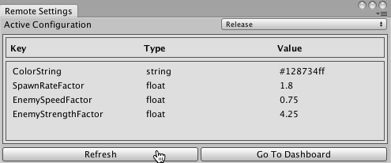

# 在 Unity Editor 中管理 Remote Settings

Remote Settings 窗口可帮助您在 Editor 中开发项目时管理 Remote Settings。（使用 Unity Analytics Dashboard 可以[创建和编辑设置](UnityAnalyticsRemoteSettingsCreating.html)。）

Remote Settings 窗口没有包含在标准的 Unity 下载和安装中。它是 Remote Settings 资源包（一个 Unity 插件）的一部分。请从 [Unity Asset Store](https://www.assetstore.unity3d.com/#!/content/89317) 下载 Remote Settings 资源包，然后将其导入您的项目。

要打开 Remote Settings 窗口，请在 Unity Editor 中转至 __Window__ > __Unity Analytics__ > __Remote Settings__。为了使 Editor 从 Analytics 服务获取您的 Remote Settings，您必须先提供 Project Secret Key（如[启用 Remote Settings](UnityAnalyticsRemoteSettingsEnabling.html) 中所述）。

Remote Settings 窗口（[Remote Settings 插件](https://www.assetstore.unity3d.com/#!/content/89317)的一部分）显示 Analytics Dashboard 上定义的设置的键/值对。

单击 __Refresh__ 以获取最新的 Remote Settings。当您进入 Play 模式时，Editor 也会获取最近同步的设置。

将 __Active Configuration__ 设置为 __Release__ 或 __Development__ 以选择要在 Editor 中使用哪组键/值对。请注意在 Editor 中的 Play 模式下始终要使用 __Development__ 配置。要测试 __Release__ 配置，请使用 __File__ > __Build and Run__，并确保在 [Build Settings 窗口](BuildSettings.html)中取消选中 __Development Build__ 复选框。

---

* 2017-05-30 Page published with [editorial review](DocumentationEditorialReview.html)

* 截至 2017-05-30，服务与 Unity 5.5 之后的版本兼容，但是版本兼容性可能会发生变化。
 
* 2017.1 中的新功能
