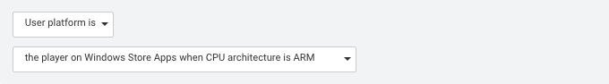

# Segment Builder 选项卡
细分段是指玩家群体的子集，按照主要差异因素（如国家/地区、平台、经验级别或消费模式）进行划分。在 __Segment Builder__ 页面上可以查看现有细分段和创建新的细分段。

在 __Data Explorer__ 和 __Funnel Analyzer__ 中可使用细分段来比较不同细分段之间的指标。例如，如果同时将游戏发布到 Android 和 iOS 平台，可以使用细分段来按平台比较玩家行为。

Unity Analytics 定义了以下细分段类别：

|:---|:---|
|__Life Cycle__| Segments based on the number of calendar days since a player first used your app. These segments are automatically populated based on core analytics events. |
|__Geography__ | Segments based on where the player is located in the world. These segments are automatically populated based on analysis of the player’s IP address and other geolocation techniques. |
|__Monetization__ | Segments based on a player’s verified in-app purchases (IAP). These segments are automatically populated if you use Unity’s IAP service. Otherwise, you can report verified IAP purchases using the [Analytics.Transaction function](../ScriptReference/Analytics.Analytics.Transaction.html).    Note that IAP verification is only supported by the Apple App store and Google Play store.|
|__Platform__ | Segments based on the player’s platform. These segments are populated automatically based on the Unity build. |
|__Custom__ | Any segments you define. |

__Segment Builder__ 选项卡会列出所有现有细分段并显示当前细分段群体的人数。

您可以更改名称或删除现有细分段，但是不能更改规定细分段定义的规则。（要使用不同规则，请新建细分段。）

## 新建细分段
在 Analytics Dashboard 的 __Segment Builder__ 选项卡上可以创建您自己的细分段。

**重要信息：**Unity Analytics 在处理传入数据时会评估细分段中定义的规则。
新建细分段时，不会重新评估现有数据。只有在创建细分段后收到的数据才会显示在 __Data Explorer__ 和 __Funnel Analyzer__ 报告中的该细分段内。

要创建细分段：

1.在 Analytics Dashboard 上，单击 **Segment Builder** 选项卡。
2.单击 **+ New Segment** 按钮。

3.定义一个或多个规则（传入事件必须满足这些规则，才能将用户包含在此细分段中）。
4.单击 **Save** 按钮。

#### 细分段规则
对于每个自定义细分段，请定义一个或多个规则来确定玩家是否包含在细分段中。一旦将玩家纳入某个自定义细分段，即使没有收到更多合格事件，也会将玩家包含在该细分段中长达 90 天。在设计细分段时，应考虑到玩家无法离开细分段。例如，应避免创建类似“玩过不到 5 个关卡的玩家”这样的细分段。因为玩家不会离开该细分段，所以他们在玩过超过 5 关时仍会被包含在这个细分段内。更好的方法可能是创建类似“玩过 1、2、...、n 个关卡的玩家”这样的一组细分段（采用任何您认为有用的关卡数）。

您可以为一个细分段定义多个规则。您可以合并规则，使玩家加入某个细分段的条件为**所有** (ALL) 规则必须适用、**任意** (ANY) 规则必须适用或者**无** (NONE) 任何规则适用。

规则本身可以源自基于会话的核心 Analytics 事件（类似于标准细分段），也可以基于标准事件和自定义事件。

####核心 Analytics 细分段规则

标准细分段使用基于核心 Analytics 事件的规则。您可以使用这些相同条件来创建细分段规则，方法是将 __Rule__（规则）类型设置为 __Event__（事件）之外的任何选项。例如，如果需要标准 Android 和 iOS 细分段之外的基于平台的细分段，可以选择规则类型 __User platform is__，然后选择可用平台之一：

每种规则类型都有自己的一组选项。

####标准事件和自定义事件细分段规则

要创建基于__标准事件__和__自定义事件__的细分段，请将 __Rule__ 类型保留为__Event__，然后从 __Event name__ 列表中选择事件名称。只有已经从游戏收到的事件才会显示在列表中。因此，在创建基于事件的细分段之前，应分发至少一个事件实例（可在 Unity Editor 中运行游戏时执行此操作）。切记，游戏分发的事件需要在几个小时后才会显示在控制面板中。

除了事件名称，还可以对允许的参数值设置一项或多项限制。如果不指定任何参数限制，则分发事件时使用任何参数值或完全不使用参数也能满足该规则。

---
* 2017-08-29  Page published with [editorial review](DocumentationEditorialReview.html)

* 2018-06-04 - Removed Demographics Segments, which are no longer supported.

* Unity 2017.1 中的新功能

