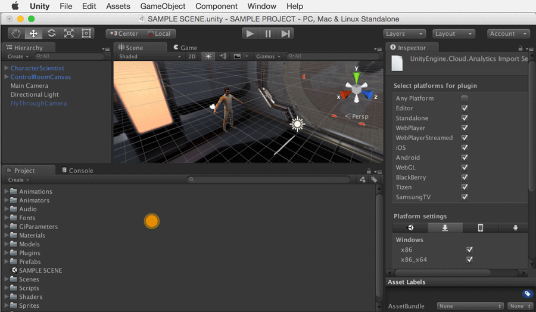

将 Unity Analytics SDK 重新集成到 5.1
=================================

**注意：适用于 2015 年 9 月 8 日之前集成了 Analytics 的 5.1 项目**
Unity Analytics SDK 现在将支持 4.x-5.1 版本。先前的 5.1 集成 "PlayerSettings" 复制粘贴 ProjectID 方法仍然有效，但我们不再支持这种方法。请参阅 [Analytics 论坛](http://forum.unity3d.com/threads/unity-analytics-sdk-extended-support-for-4-x-5-1-versions.352198/)以了解更多信息。

该过程分为三个一般步骤：

1.删除现有的 Unity Analytics 项目 ID
2.重新集成 Unity Analytics
3.更新高级集成 (Advanced Integration) 事件

1.删除现有的 Unity Analytics 项目 ID
------------------------------------------
打开 Unity Editor 5.1 并选择现有 Analytics 项目。在 Player Settings 中找到 Cloud Project ID。
选择 Edit-&gt;Project Settings-&gt;Player，随后将打开 Player Settings。
删除 Cloud Project ID

 

2.集成 Unity Analytics SDK
-------------------------------
遵循 [Unity Analytics 4.x-5.1 (SDK) 说明](UnityAnalyticsSDK.html)

3.更新高级集成 (Advanced Integration) 事件
------------------------------------
如果以前执行过任何现有的高级集成 (Advanced Integration) ，还需要更新命名空间和调用才能使用更新后的 4.x-5.1 SDK 语法。

遵循 [4.x-5.1 (SDK) 高级集成 (Advanced Integration) 说明
](UnityAnalyticsAdvancedSDK.html)进行更新。
