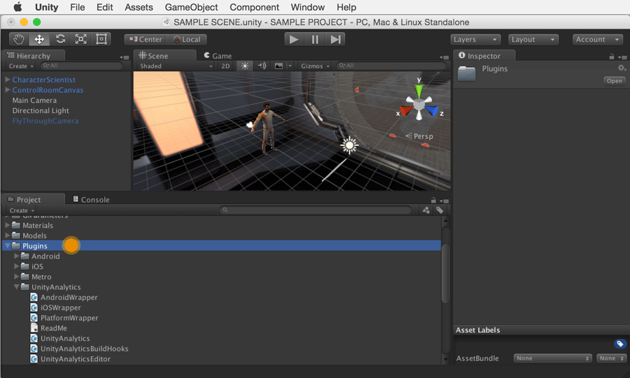
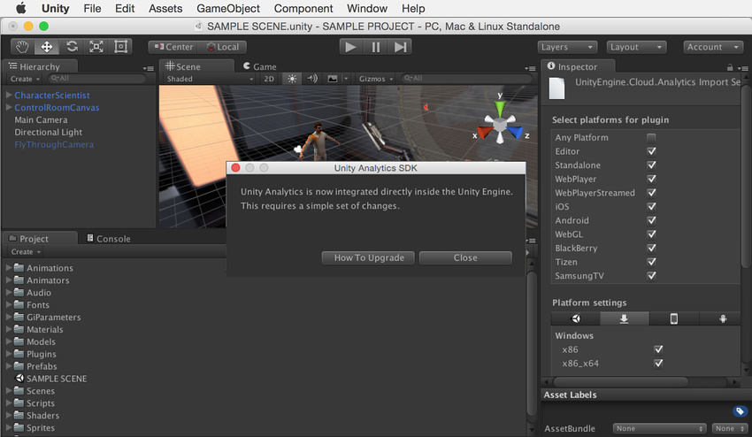

将 Unity Analytics 4.x-5.1 (SDK) 升级到 5.2 以上版本
==================================

该过程分为三个一般步骤：

1.删除现有的 Unity Analytics SDK 组件
2.重新集成 Unity Analytics
3.更新高级集成 (Advanced Integration) 事件

1.删除现有的 Unity Analytics SDK
---------------------------------------
Unity Editor 5.2 以上版本内置了 Unity Analytics。建议删除现有的 Unity Analytics SDK 组件以确保不发生冲突并有助于维护更干净的项目。

在 Project 文件夹中找到现有的 Unity Analytics SDK 组件。它们最有可能保存在 Assets > Plugins。**务必仅选择特定于 Analytics 的资源。**

 

删除所有组件。

 

如果关闭后重新打开项目，然后看不到以下消息提示，即可确认已成功删除 Unity Analytics SDK。如果仍然看到该提示，请确认是否已删除所有的 Unity Analytics SDK 组件。

 

2.重新集成 Unity Analytics
---------------------------------
遵循[设置 Analytics](UnityAnalyticsOverview.html) 中的说明。

通过在“在游戏中验证”步骤中检查 SDK 版本并确认 Validator 中显示了正确的 Editor 版本（即：u5.2 或 u5.3），即可确定成功完成了升级。

 
 

3.更新高级集成 (Advanced Integration) 事件
------------------------------------
如果以前执行过任何现有的高级集成 (Advanced Integration)，还需要更新命名空间和调用才能使用 5.2 以上版本的语法。遵循 [5.2 以上版本的高级集成 (Advanced Integration) 说明](UnityAnalyticsAdvancedSDK.html)进行更新。
