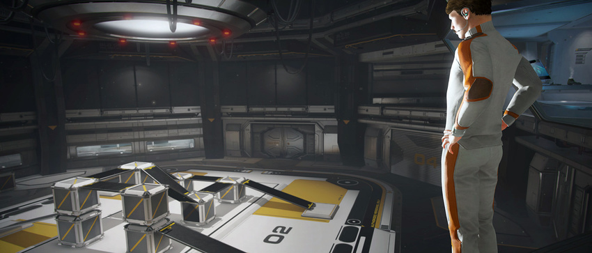

# 准备开始

 

本部分是开始使用 Unity 的关键部分，介绍了 Unity 界面、菜单项、使用资源、创建场景和发布构建。

阅读完本部分后，您将了解 Unity 的工作原理，如何有效使用该程序，以及如何合成基本游戏。

## 安装方法

可以通过以下方式安装 Unity Editor：

* Hub 提供了一个管理 Editor 安装、帐户和许可证以及项目的集中位置。有关使用 Hub 来安装 Editor 的更多信息，请参阅[使用 Hub 来安装 Unity](GettingStartedInstallingHub.html)。
* 可以使用下载助手 (Download Assistant) 安装 Editor。如果以后选择安装 Hub，可以届时将其添加到 Hub。有关更多信息，请参阅[使用下载助手来安装 Unity](InstallingUnity.html)。
* Unity 下载助手支持离线部署。在这种部署方式中，可下载用于安装 Unity 的所有文件，然后生成脚本以便在未接入互联网的计算机上安装 Editor。有关更多信息，请参阅[使用下载助手来离线安装 Unity](DeployingUnityOffline.html)。

------------------------

2018-06-12 Page amended with limited [editorial review](DocumentationEditorialReview.html)

