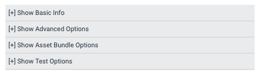
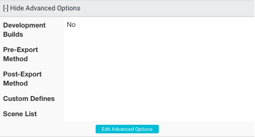

# 高级选项

在 Unity Cloud Build 中配置完项目后，您可以为每个编译目标设置高级编译选项。

这些选项旨在适应 Unity Editor 中支持的更复杂的编译处理选项。

要访问编译目标的高级选项，请转至 [Unity 开发者网站](http://developer.cloud.unity3d.com)。选择您的项目，进入项目的 __Unity Cloud Build__ 部分，然后选择 __Config__ 选项卡（如下所示）。

 

单击 __[+] Show Advanced Options__（如下所示）。随后将显示编译目标的 __Advanced Options__ 下拉列表。

展开 __Advanced Options__ 下拉列表时，标题变为 __[-] Hide Advanced Options__。

 

单击 __Edit Advanced Options__ 调出一个屏幕来配置这些选项。

##每个编译目标的高级选项

所有高级选项都是针对每个编译目标进行设置的。这意味着，例如，单击某个 iOS 目标的 __Advanced Options__ 链接时，这些选项仅适用于该 iOS 目标。单击某个 Android 目标的 __Advanced Options__ 时，这些选项仅适用于该 Android 目标。因此，您可以针对每个编译目标为每个平台使用不同的预处理和后处理方法。

 

##创建开发版

开发版包含调试符号并启用性能分析器 (Profiler)。

请参阅有关[开发版](UnityCloudBuildDevelopmentBuilds.html)的文档以了解更多信息。

##导出前和导出后方法

有时需要在 Unity 中编译项目之前或之后操作项目文件。例如将变量从外部文件复制到项目中、处理资源或使用需要特殊处理的插件。

请参阅有关[导出前和导出后方法](UnityCloudBuildPreAndPostExportMethods.html)的文档以了解更多信息。

##使用 Xcode framework

如果要发布到 iOS，则在 Unity 编译过程完成后但在 Xcode 编译过程开始之前，您可能需要纳入各种框架。

请参阅有关 [Xcode framework](UnityCloudBuildXcodeFrameworks.html) 的文档以了解更多信息。

##自定义脚本 #define 指令

Unity 包括名为**依赖于平台的编译** (Platform Dependent Compilation) 的功能。此功能包括预处理器指令，可让您对脚本进行分区，从而为受支持平台之一专门编译和执行一段代码。您也可以为每个编译目标指定自己的 #define 指令。

请参阅有关[自定义脚本 #define 指令](UnityCloudBuildCustomScriptingDefineDirectives.html)的文档以了解更多信息。

##自定义场景列表

如果需要配置编译目标来编译一组自定义场景（不同于 Unity Editor 中的项目 **Build Settings** 菜单中已经设置的场景），请使用此列表。

请参阅有关[包含特定场景](UnityCloudBuildIncludingSpecificScenes.html)的文档以了解更多信息。
