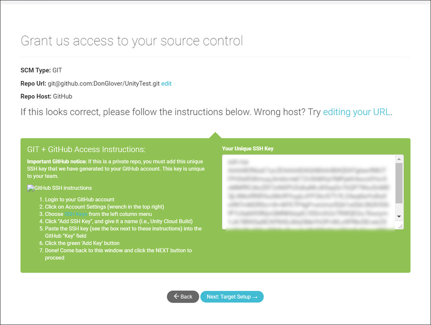

# 使用 Unity 开发者控制面板 (Developer Dashboard) 对 Unity Cloud Build 进行 Git 配置

Unity Cloud Build 支持存储在 Git 代码仓库中的项目。您的代码仓库可以托管在 [GitHub](https://github.com/)、[GitLab](https://about.gitlab.com/)、[Bitbucket](https://bitbucket.org/) 或私有服务器上。

**Note**: This feature requires a subscription to Unity Teams Advanced. For more information, see the [Unity Teams](https://unity3d.com/teams) page.

本主题介绍：

* [在控制面板中配置 GIT](#configure)

* [使用私有代码仓库](#private)

* [设置目标编译平台](#target)

* [使用 Git 子模块](#submodules)

 
## 在控制面板上配置 Git

To configure Cloud Build to build your Project from a GitHub repository:

1. Sign in to the [Unity Developer Dashboard](https://developer.cloud.unity3d.com/).
2. On the __Projects__ page, select your Project.
3. In the dashboard __Overview__ window, on the __Cloud Build__ tile, click __OPEN CLOUD BUILD DASHBOARD__.
4. In the __Build History__ window, click __Set up Cloud Build__.

You can configure access to your repository using the following authorization protocols:

* OAuth (default)
* SSH

To configure Cloud Build to use OAuth to access your repository:

1. In the __Source Control__ window, click the __GitHub__, __Bitbucket__, or __GitLab__ tile.
2. Authorize access to your account as appropriate for the selected source code control service.
3. In the __Select a Repository__ window, choose a repository from which to build the Project and then click the __NEXT: TARGET SETUP__ button.

**Note**: If you are currently signed into the source code management service, Cloud Build uses your current credentials to retrieve the repository list. To configure a Project that retrieves a repository from a different account, sign out of the source code management service first, then configure the Project.

For the next step, see the [Setting up a target build platform](#target) section.

To configure Cloud Build to use SSH to access your repository:

1. In the __Source Control__ window, click the __Manual__ tab.
2. In the __SCM URL__ field, enter the URL of your Git server in either of the following formats:

    * 非 SSL：host:port
    * SSL：ssl:host:port

3. To connect to your repository, you must specify the URL to your Git server. For information on the format of the URL, see the __URL syntax__ section below.
4. From the __SCM Type__ drop-down menu, select __GIT__.
5. Click the __NEXT: ACCESS__ button.

When Unity Cloud Build connects to the hosting site, it automatically detects whether your repository is public or private. If your repository is public, Cloud Build automatically connects to it and you can skip to [Setting up a target build platform](#target). If your repository is private, see the [Using private repositories](#private)section.

Unity Cloud Build 连接到托管站点时，它会自动检测您的仓库是公开还是私有代码仓库。如果仓库是公开代码仓库，Cloud Build 自动与其连接，而您可以跳至[设置目标编译平台](#target)。

### URL 语法

要连接到代码仓库，必须指定 Git 服务器的 URL。您可以指定 URL 使用以下协议：

* HTTPS
* GIT
* SSH

以下是 [GitHub](https://github.com/)、[bitbucket](https://bitbucket.org/) 和 [GitLab](https://about.gitlab.com/) 的 URL 示例：

* https://github.com/youraccount/yourrepo
* git://github.com/youraccount/yourrepo.git
* git@bitbucket.org:youraccount/yourrepo.git
* git@gitlab.com:youracccount/yourrepo.git

**注意**：如果在私有服务器上托管 Git，必须使用 SSH 连接到代码仓库。

请使用最适合您的格式。Unity Cloud Build 会自动将 URL 重写为所需的格式。

 
## 使用私有代码仓库

如果代码仓库为私有仓库，则 Cloud Build 必须使用 SSH 来连接它。Cloud Build 检测到代码仓库为私有仓库时，会显示 __Grant us access to your source control__ 屏幕。

 

### 在 GitHub 上设置 SSH 密钥

要在 GitHub 中将 SSH 密钥添加到项目中：

1.登录 [GitHub](https://github.com/)。

2.在任何 GitHub 页面的右上角，单击您的个人资料照片，然后单击您的个人资料。

3.在您的个人资料页面上，单击 __Repositories__，然后单击代码仓库的名称。

4.在代码仓库中，单击 __Settings__ 选项卡。

5.在边栏中，单击 __Deploy Keys__，然后单击 __Add deploy key__ 按钮。

6.在 __Title__ 文本框中，键入用于识别此密钥的名称。

7.在 __Key__ 字段中，粘贴来自 __Grant us access to your source control__ 窗口的公钥，然后单击 __Add key __按钮。

有关部署密钥的更多信息，请参阅 GitHub 文档中的[管理部署密钥 (Managing Deploy Keys)](https://developer.github.com/v3/guides/managing-deploy-keys/)。

您还可以将 SSH 密钥添加到您的 GitHub 帐户，以便 Cloud Build 可访问帐户中的所有代码仓库。有关更多信息，请参阅 GitHub 文档中的[将新的 SSH 密钥添加到您的 GitHub 帐户 (Adding a new SSH key to your GitHub account)](https://help.github.com/articles/adding-a-new-ssh-key-to-your-github-account/)。

### 在 Bitbucket 上设置 SSH 密钥

要将 SSH 密钥添加到 Bitbucket 帐户：

1.登录 [Bitbucket](https://bitbucket.org/)。

2.在页面左下角单击您的头像。

3.单击 __Bitbucket Settings__。

4.在 __Settings__ 页面上的 __SECURITY__ 部分中，单击 __SSH Keys__。

5.在 __SSH Keys__ 中，单击 __Add key__ 按钮。

6.在 __Label__ 字段中，为密钥输入一个便于识别的名称（例如 __Unity Cloud Build__）。

7.将来自 __Grant us access to your source control__ 窗口的 Unity Cloud Build SSH 密钥粘贴到 __Key__ 字段中。

8.单击 __Add Key__。

在 __Grant us access to your source control__ 窗口上，单击 __Next: Target Setup__。

 
## 设置目标编译平台

在控制面板中的 __NEW BUILD TARGET: BASIC INFO__ 窗口上：

1.在 __Target Label__ 字段中，输入编译名称。

2.如果代码仓库的根文件夹未包含您的资源和项目设置，请在 __Project Subfolder__ 字段中输入包含所需资源和项目设置的文件夹的 URL。

3.从 __Unity Version__ 下拉菜单中，选择用于编译项目的 Unity 版本。

4.如果不希望每次更新代码仓库时便自动编译项目，请单击 __Auto-build__ 切换开关以禁用此功能。

如果要针对 iOS 或 Android 平台进行编译，则下一步是输入编译的凭据。单击 __Next: Credentials__。对于所有其他平台，请单击 __Next: Build__ 以完成配置并开始初始编译。

### Android 凭据

在 IOS __SIGNING CREDS__ 窗口中，提供以下信息：

* __Bundle ID__，用于在设备上和 Google Play 商店中唯一标识您的应用程序。

* 输入您的 Android 密钥库凭据或选择 __Auto Generated Debug Keystore__ 来使用开发密钥库。有关 Android 密钥库的更多信息，请参阅 [Android 密钥库系统 (Android Keystore System)](https://developer.android.com/training/articles/keystore.html)。

### iOS 凭据

在 IOS __SIGNING CREDS__ 窗口中，提供以下信息：

* __Bundle ID__，用于在设备上唯一标识您的应用程序。

* 用于编译应用程序的 Xcode 版本。

* 输入您的 IOS 凭据。有关 iOS 凭据的更多信息，请参阅[发布到 iOS](UnityCloudBuildiOS.html)。

 
## 使用 Git 子模块

如果项目使用私有 Git 子模块，请确保 *.gitmodules* 文件中存在的 URL 使用的是 `git@` 语法而不是 `https://` 或 `git://`。

例如：

* git@github.com:youraccount/yourrepo.git（对于 GitHub）

* git@bitbucket.org:youraccount/yourrepo.git（对于 Bitbucket）

* git@gitlab.com:youracccount/yourrepo.git（对于 GitLab）

---
2018-07-16Page amended with [editorial review](DocumentationEditorialReview.html)

