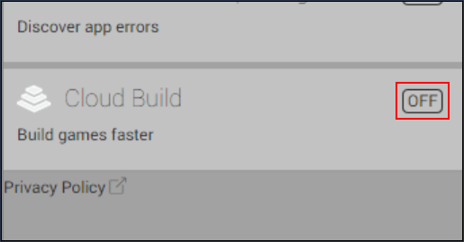
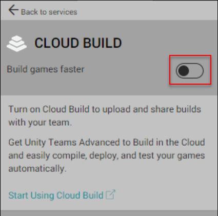
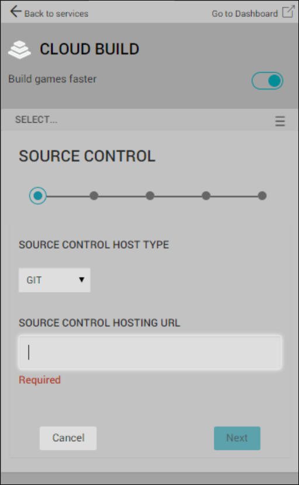
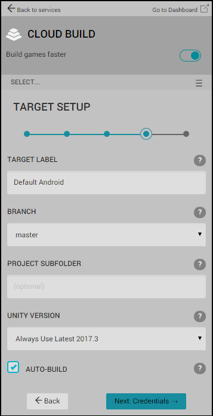

# 使用 Unity Editor 对 Unity Cloud Build 进行 Git 配置

Unity Cloud Build 支持存储在 Git 代码仓库中的项目。您的代码仓库可以托管在 [GitHub](https://github.com/)、[GitLab](https://about.gitlab.com/)、[Bitbucket](https://bitbucket.org/) 或私有服务器上。

__注意__：要使用此功能，必须订阅 Unity Teams Advanced。有关更多信息，请参阅 [Unity Teams](https://unity3d.com/teams) 页面。

## 启用 Cloud Build

在 __Services__ 窗口中的 __Cloud Build__ 旁边，单击 __OFF__ 按钮以将其切换为 __ON__ 状态。

 

在 __CLOUD BUILD__ 窗口中，单击 __Cloud Build__ 开关为项目启用 Cloud Build。

 

## 设置源代码控制托管类型

在 __SOURCE CONTROL__ 服务窗口中：

1.从 __SOURCE CONTROL HOST TYPE__ 下拉菜单中，选择 __GIT__。

2.在 __SOURCE CONTROL HOSTING URL__ 字段中，输入 Git 代码仓库的 URL。有关 URL 格式的信息，请参阅以下的 **URL 语法**部分。

3.单击 __Next__。

 

## URL 语法

要连接到代码仓库，必须指定 Git 服务器的 URL。您可以指定 URL 使用以下协议：

* HTTPS

* GIT

* SSH

以下是 [GitHub](https://github.com/)、[bitbucket](https://bitbucket.org/) 和 [GitLab](https://about.gitlab.com/) 的 URL 示例：

* https://github.com/youraccount/yourrepo

* git://github.com/youraccount/yourrepo.git

* git@bitbucket.org:youraccount/yourrepo.git

* git@gitlab.com:youracccount/yourrepo.git

如果在私有服务器上托管 Git，必须使用 SSH 连接到代码仓库。

请使用最适合您的格式。Unity Cloud Build 会自动将 URL 重写为所需的格式。

Unity Cloud Build 连接到托管站点时，它会自动检测您的仓库是公开还是私有代码仓库。如果仓库是公开代码仓库，Unity Cloud Build 自动与其连接，而您可以跳至下面的[目标设置](#heading=h.yazupq5xp3xo)部分。

### 使用私有代码仓库

如果代码仓库为私有仓库，则 Cloud Build 必须使用 SSH 来连接它。Cloud Build 检测到代码仓库为私有仓库时，会显示 __Grant us access to your source control__ 窗口。

### 在 GitHub 上设置 SSH 密钥

要在 GitHub 中将 SSH 密钥添加到项目中，请执行以下操作：

1.登录 [GitHub](https://github.com/)。

2.在任何 GitHub 页面的右上角，单击您的个人资料照片，然后单击__您的个人资料__。

3.在您的个人资料页面上，单击 __Repositories__，然后单击代码仓库的名称。

4.在代码仓库中，单击 __Settings__ 选项卡。

5.在边栏中，单击 __Deploy keys__，然后单击 __Add deploy key__ 按钮。

6.在 __Title__ 文本框中，键入用于识别此密钥的名称。

7.在 __Key__ 字段中，粘贴来自 __Grant us access to your source control__ 屏幕的公钥，然后单击 __Add key __按钮。

有关部署密钥的更多信息，请参阅 GitHub 文档中的[管理部署密钥 (Managing Deploy Keys)](https://developer.github.com/v3/guides/managing-deploy-keys/)。

您还可以将 SSH 密钥添加到您的 GitHub 帐户，以便 Cloud Build 可访问帐户中的所有代码仓库。有关更多信息，请参阅 GitHub 文档中的[将新的 SSH 密钥添加到您的 GitHub 帐户 (Adding a new SSH key to your GitHub account)](https://help.github.com/articles/adding-a-new-ssh-key-to-your-github-account/)。

### 在 Bitbucket 上设置 SSH 密钥

要将 SSH 密钥添加到 Bitbucket 帐户，请执行以下操作：

1.登录 [Bitbucket](https://bitbucket.org/)。

2.在页面左下角单击您的头像。

3.单击 __Bitbucket Settings__。

4.在 __Settings__ 页面上的 __SECURITY__ 部分中，单击 __SSH keys__。

5.在 __SSH keys__ 中，单击 __Add key__ 按钮。

6.在 __Label__ 字段中，为密钥输入一个便于识别的名称（例如 __Unity Cloud Build__）。

7.将来自 __Grant us access to your source control__ 屏幕的 Unity Cloud Build SSH 密钥粘贴到 __Key__ 字段中。

8.单击 __Add key__。

在 __Grant us access to your source control__ 屏幕上，单击 __Next: Target Setup__。

## 设置目标平台

要在 Unity Editor 中为应用程序配置运行时平台，请转到 __Services__ 窗口并进行以下更改：

1.从 __TARGET LABEL__ 下拉菜单中，选择构建平台。

2.从 __BRANCH__ 下拉菜单中，选择用于构建项目的分支。大多数 Git 代码仓库中的默认分支为“master”。如果要为多个构建目标进行构建，则可为每个构建目标配置不同的分支。

3.在 __PROJECT SUBFOLDER__ 字段中，输入项目中包含 Unity 项目的文件夹；特别是 __Assets__ 和 __ProjectSettings__ 文件夹。该文件夹的路径通常类似于以下结构：

*NewGameProject/Src/UnityProject/*

如果您的 Unity 项目不在代码仓库的根目录中，则必须填写 __PROJECT SUBFOLDER__ 字段。

4.（可选）如果不希望 Cloud Build 在您对项目进行更改时自动构建项目，请取消选中 AUTO-BUILD 复选框。有关更多信息，请参阅 [Automated Build Generation](UnityCloudBuildContinuousIntegration.html)。

 

## Git 子模块

如果项目使用私有 Git 子模块，请确保 *.gitmodules* 文件中存在的 URL 使用的是 `git@` 语法而不是 `https://` 或 `git://`。

例如：

* git@github.com:youraccount/yourrepo.git（对于 GitHub）

* git@bitbucket.org:youraccount/yourrepo.git（对于 Bitbucket）

* git@gitlab.com:youracccount/yourrepo.git（对于 GitLab）

---
2018-04-10  Page published with [editorial review](DocumentationEditorialReview.html)

