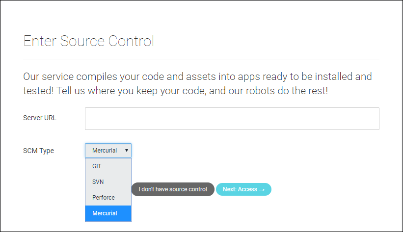

# 使用 Unity 开发者控制面板 (Developer Dashboard) 对 Unity Cloud Build 进行 Mercurial 配置

Unity Cloud Build 支持存储在 [Mercurial](https://www.mercurial-scm.org/) 代码仓库中的项目。您可以将代码仓库托管在 [Bitbucket](https://bitbucket.org/) 或私有服务器上。

要连接到代码仓库（Repository），Unity Cloud Build 需要您提供相应的访问凭据。这一要求适用于 Bitbucket 或其他地方托管的 Mercurial 代码仓库。

## 在控制面板中配置 Mercurial

1.登录 [Unity 开发者控制面板 (Developer Dashboard)](https://developer.cloud.unity3d.com)。

2.从 __Projects__ 页面中，选择您的项目。

3.在左侧导航面板中，单击 __Cloud Build > Config__。

4.如果这是第一次配置 Cloud Build，您会看到 Build History 页面上显示 __Cloud Build has not been set up for this project__。单击 __Set up Cloud Build__ 链接继续。

5.在 __Enter Source Control__ 窗口上的 __Server URL__ 字段中，输入 Mercurial 服务器的 URL。有关 URL 格式的信息，请参阅以下的 **URL 语法**部分。

6.从 __SCM Type__ 下拉菜单中，选择 __Mercurial__。

    

7.单击 __Next Access__ 按钮。

### URL 语法

要连接到代码仓库，必须指定 Mercurial 服务器的 URL。您可以指定 URL 使用以下协议：

   * HTTPS

   * SSH

   以下是 [bitbucket](https://bitbucket.org/) 的 URL 示例：

   * https://github.com/youraccount/yourrepo

   * git@bitbucket.org:youraccount/yourrepo.git

   请使用最适合您的格式。Unity Cloud Build 会自动将 URL 重写为所需的格式。

### 设置您的凭据

在 Mercurial 服务器上，为 Unity Cloud Build 创建用户名并分配安全密码。如果 Mercurial 主机支持只读的用户帐户，请将此帐户设置为只读。

在 __Grant us access to your source control__ 窗口上，输入用户名和密码，然后单击 __Next: Target Setup__。

## 设置目标编译平台

在 Target Setup 窗口中，选择编译平台。

在开发者控制面板 (Developer Dashboard) 上的 __NEW BUILD TARGET: BASIC INFO__ 窗口中：

1.在 __Target Label__ 字段中，输入编译名称。

2.如果代码仓库的根文件夹未包含您的资源和项目设置，请在 __Project Subfolder__ 字段中输入包含所需资源和项目设置的文件夹的 URL。

3.从 __Unity Version__ 下拉菜单中，选择用于编译项目的 Unity 版本。

4.如果不希望每次更新代码仓库时便自动编译项目，请单击 __Auto-build__ 切换开关以禁用此功能。

如果要针对 iOS 或 Android 平台进行编译，则下一步是输入编译的凭据。单击 __Next: Credentials__。对于所有其他平台，请单击 __Next: Build__ 以完成配置并开始初始编译。

### Android 凭据

在 IOS __SIGNING CREDS__ 窗口上，提供以下信息：

* __Bundle ID__，用于在设备上和 Google Play 商店中唯一标识您的应用程序。

* 输入您的 Android 密钥库凭据或选择 __Auto Generated Debug Keystore__ 来使用开发密钥库。有关 Android 密钥库的更多信息，请参阅 [Android 密钥库系统 (Android Keystore System)](https://developer.android.com/training/articles/keystore.html)。

### iOS 凭据

在 IOS __SIGNING CREDS__ 窗口上，提供以下信息：

* Bundle ID，用于在设备上唯一标识您的应用程序。

* 用于编译应用程序的 Xcode 版本。

* 输入您的 IOS 凭据。有关 iOS 凭据的更多信息，请参阅[发布到 iOS](UnityCloudBuildiOS.html)。

---
2018-04-10  Page published with [editorial review](DocumentationEditorialReview.html)

