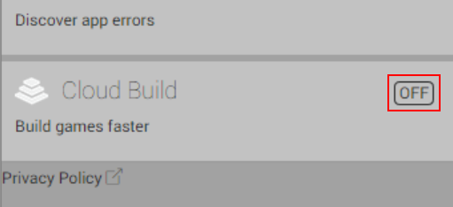
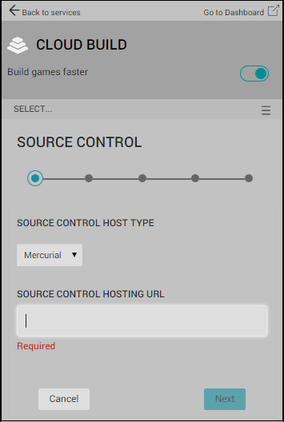

# 使用 Unity Editor 对 Unity Cloud Build 进行 Mercurial 配置

Unity Cloud Build 支持存储在 [Mercurial](https://www.mercurial-scm.org/) 代码仓库中的项目。您可以将代码仓库托管在 [Bitbucket](https://bitbucket.org/) 或私有服务器上。

要连接到代码仓库（Repository），Unity Cloud Build 需要您提供相应的访问凭据。这一要求适用于 Bitbucket 或其他地方托管的 Mercurial 代码仓库。

## 启用 Cloud Build

In the Services window, next to __Cloud Build click the OFF__ button to switch it __ON__:

在 __CLOUD BUILD__ 窗口中，单击 __Cloud Build__ 开关为项目启用 Cloud Build。

## 设置源代码控制托管类型

在 __SOURCE CONTROL__ 服务窗口中：

1.从 __SOURCE CONTROL HOST TYPE__ 下拉菜单中，选择 Mercurial。

2.在 __SOURCE CONTROL HOSTING URL__ 字段中，输入 Mercurial 代码仓库的 URL。有关 URL 格式的信息，请参阅以下的 **URL 语法**部分。

3.单击 __Next__ 按钮。

### URL 语法

要连接到代码仓库，必须指定 Mercurial 服务器的 URL。您可以指定 URL 使用以下协议：

* HTTPS

* SSH

以下是 [bitbucket](https://bitbucket.org/) 的 URL 示例：

* https://github.com/youraccount/yourrepo

* git@bitbucket.org:youraccount/yourrepo.git

请使用最适合您的格式。Unity Cloud Build 会自动将 URL 重写为所需的格式。

## 设置您的凭据

在 Mercurial 服务器上，为 Unity Cloud Build 创建用户名并分配安全密码。如果 Mercurial 主机支持只读的用户帐户，请将此帐户设置为只读。

在 __GRANT ACCESS__ 窗口中，输入用户名和密码。

## 设置运行时目标平台

要在 Unity Editor 中为应用程序配置运行时平台，请转到 __Services__ 窗口并进行以下更改：

1.从 __TARGET LABEL__ 下拉菜单中，选择构建平台。

2.从 __BRANCH__ 下拉菜单中，选择用于构建项目的分支。大多数 Git 代码仓库中的默认分支为“master”。如果要为多个构建目标进行构建，则可为每个构建目标配置不同的分支。

3.在 __PROJECT SUBFOLDER__ 字段中，输入项目中包含 Unity 项目的文件夹；特别是 __Assets__ 和 __ProjectSettings__ 文件夹。该文件夹的路径通常类似于 *NewGameProject/Src/UnityProject/*

    **注意**：如果您的 Unity 项目不在代码仓库的根目录中，则必须填写 __PROJECT SUBFOLDER__ 字段。

（可选）如果不希望 Cloud Build 在您对项目进行更改时自动构建项目，请取消选中 __AUTO-BUILD__ 复选框。有关更多信息，请参阅 [Automated Build Generation](UnityCloudBuildContinuousIntegration.html)。

---
2018-04-10  Page published with [editorial review](DocumentationEditorialReview.html)

