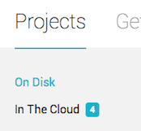
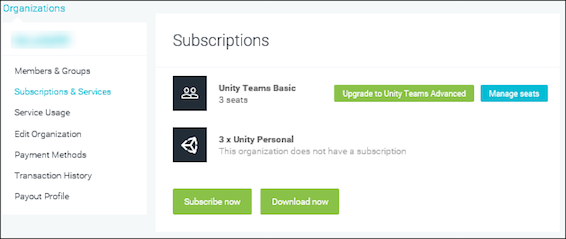

# 为 Unity 项目添加团队成员

[Unity Collaborate](UnityCollaborate.html) 是 Unity Teams 的一部分。对于希望进行项目协作的每个人，都必须在您的组织中为他们分配一个 Unity Teams 席位。

Unity Teams 有两种版本可用：

* __基本版__，提供 3 个免费席位。

* __高级版__，提供 3 个席位，用完之后可以购买额外席位。

想了解更多 Unity Teams 功能的相关信息，请参阅 [Unity Teams 主页](https://unity3d.com/teams)。

本页面介绍如何执行以下操作：

* [为团队成员启用 Collaborate](#EnableCollaborate)
* [允许成员参与组织中的所有项目协作](#AllowCollaborateAll)
* [允许成员参与单个项目协作](#AllowCollaborateIndividual)
* [管理组织中的团队成员](#ManageMembers)
* [管理 Unity Teams 成员访问权限](#Collaborators)

 
## 为团队成员启用 Collaborate

可通过两种方式与团队成员进行协作。您可以：

* 允许成员参与组织中的所有项目协作

* 允许成员参与单个项目协作

要为其中任何一种情况添加团队成员，您必须是项目所属组织的管理员 (Manager) 或所有者 (Owner)。

要了解如何验证您在组织中的角色，请参阅以下的[_管理您的组织_](#ManageMembers)。

 
## 允许成员参与组织中的所有项目协作

要让团队成员访问组织中已启用 Collaborate 的所有项目：

1.将其设为组织的所有者或管理员。要了解如何执行此操作，请参阅以下的[_管理您的组织_](#ManageMembers)。

2.向他们提供 Unity Teams 的访问权限。要了解如何执行此操作，请参阅以下的[_管理组织中的协调员_](#Collaborators)。

想了解更多启用协作的相关信息，请参阅[设置 Unity Collaborate](UnityCollaborateSettingUp.html) 的文档。

 
## 允许成员参与单个项目协作

为团队成员开启特定项目访问权限的步骤如下：

1.在 Unity 工具栏上，单击 __Collab__ 按钮。

2.在 Collaborate 面板中，单击 __Invite Teammate__ 图标。

 

单击 __Invite Teammate__ 图标时，Unity 会在浏览器中启动 Unity 开发者控制面板 (Developer Dashboard) 的 __Users__ 部分。通过 __Users__ 部分可以邀请拥有 Unity ID 的任何人加入您的项目：

 

__注意__：必须勾选 __Also assign a Unity Teams Seat to this user__ 才能让用户在项目中使用 Collaborate。

要将用户添加为组织中的访客，请单击 __ADD__。这样会向用户分配一个 Unity Teams 席位。

团队成员有权访问项目时，他们可以在 Launcher (__Projects__ > __In The Cloud__) 中看到该项目并可下载该项目。

 
## 管理组织中的团队成员

在 Unity ID 网站的 __Organizations__ 页面中管理团队成员。要管理团队成员：

1.登录 [Unity ID](https://id.unity.com)。

2.在页面左侧，单击 __Organizations__。

3.选择组织。

4.在左侧，选择 __Members & Groups__。

从此视图中可以看到组织成员以及每个成员的角色。用户可以具有四种角色之一：所有者 (Owner)、管理员 (Manager)、用户 (User) 或访客 (Guest)。

如果您是组织所有者，则可以更改所有成员的角色。此外，还可以添加和删除所有角色的成员：所有者、管理员、用户或访客。

如果您是组织的管理员，则可以更改管理员、用户和访客成员的角色。此外，还可以添加和删除管理员、用户和访客成员。

想了解更多相关信息，请参阅 Unity 的知识库文章[所有者、管理员和用户可以在 Unity 组织中执行什么操作？(What can Owners, Managers and Users do in my Unity Organization?)](https://support.unity3d.com/hc/en-us/articles/210202863-What-can-Owners-Managers-and-Users-do-in-my-Unity-Organization-)。

 
### 管理 Unity Teams 成员访问权限

To access Collaborate and Cloud Build functionality, your team members must have access to Unity Teams. To check your team members’ access:

1.登录 [Unity ID](https://id.unity.com)。

2.在页面左侧，单击 __Organizations__。

3.选择组织。

4.单击 __Subscriptions & Services__。

选择 Unity Teams 订阅，然后单击 __Manage seats__。

 

随即会打开一个页面，允许您将 Unity Teams 席位分配给组织成员。使用 __Occupied seats__ 选项卡可以查看已分配 Teams 席位的团队成员。在 __Assign seats__ 选项卡中，可使用团队成员在注册 Unity ID 时提供的电子邮件地址来添加已注册 Unity ID 的团队成员。

 

---

* 2017-12-01 Page published with no [editorial review](DocumentationEditorialReview.html)

* 截至 2017-12-01，服务与 Unity 2017.1 之后的版本兼容，但是版本兼容性可能会发生变化。

* 2017.1 中的新功能

