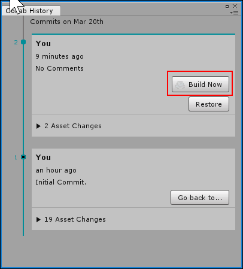
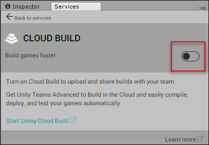
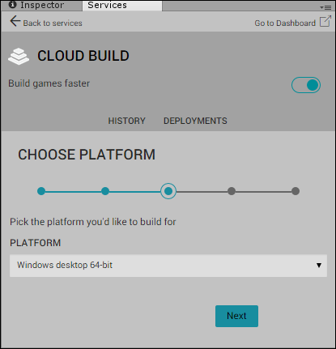
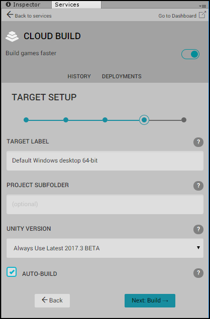

通过 Collaborate 启用 Cloud Build
======================================

Unity Cloud Build 是 Unity 项目的持续集成服务。想了解更多相关信息，请参阅 [Unity Cloud Build](UnityCloudBuild.html)。

Unity 项目必须先启用 Collaborate，然后才能将 Cloud Build 与 Collaborate 结合使用。想了解更多相关信息，请参阅[设置 Unity Collaborate](UnityCollaborateSettingUp.html)。

要通过 Unity Collaborate 启用 Cloud Build：

1.在 Unity Editor 菜单栏上，选择 **Window** > **Services**。
1.在 **Services** 窗口中，单击 **Collaborate** 选项卡。
1.在 **Collaborate** 窗口中，单击 **Open the history panel**。
1.单击 **Build Now** 按钮，打开 **Cloud Build** 窗口。

     

1.单击 **Build games faster** 切换开关，启用 Cloud Build。

     

1.从 **PLATFORM** 下拉菜单中，选择编译平台。

     

1.单击 **Next**。
2.在打开的 **TARGET SETUP** 窗口中：
    1.在 **TARGET LABEL** 文本框中，输入用于标识编译的名称。
    1.从 **UNITY VERSION** 下拉菜单中，选择用于构建的 Unity 版本。
    1.如果根文件夹未包含您的资源和项目设置，请在 **PROJECT SUBFOLDER** 文本框中指定该目录。

     

1.请单击 **Next: Build** 开始构建项目。
 
