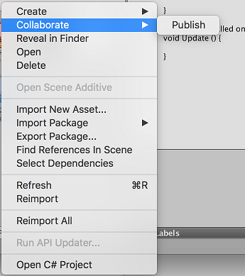
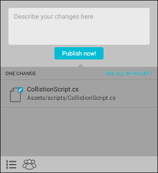

# 将单个文件发布到 Collaborate

Colloborate 允许您部分*发布*项目。通过部分发布这种方式，您可以仅发布准备与团队其他成员共享的文件，或者只是将工作成果上传到云端以便妥善保管。因此，您可以将项目的特定资源发布到 [Collaborate](UnityCollaborate.html) 而不是发布项目中所有已更改的资源。

发布特定资源的步骤如下：

1.在 Unity Editor 中，打开您的项目，右键单击要发布的新的或修改后的[资源](AssetWorkflow.html)、资源集或文件夹。
2.选择 __Collaborate__ > __Publish__。

    

3.在 Publish 窗口中，输入发布说明，然后单击 **Publish now**。

    
