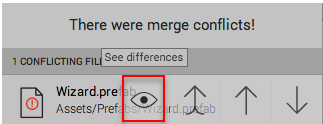
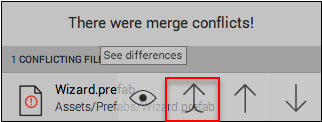
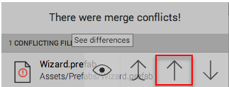
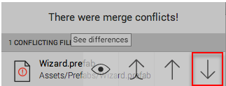

解决文件冲突
==========================

如果另一个团队成员对您已更改的资源进行更改，而您尝试带着这些更改来更新项目，此时便会发生冲突。Collaborate 会自动尝试合并文件，并在由于冲突而合并失败时通知您。对于文本文件，Collaborate 使用当前配置的合并工具来合并文件。对于场景和其他使用 YAML 格式的文件，Collaborate 使用 Unity 的 [Smart Merge](SmartMerge.html) 工具来执行合并。

您可以通过经常发布细小更改并与您的团队成员进行沟通来减少冲突的发生。进行中 (In-Progress) 功能可以帮助您减少场景和预制件的冲突。想了解更多相关信息，请参阅[进行中 (In-Progress) 编辑通知](CollaborateInProgress.html)。

## 配置合并工具

您可以在 Unity Editor 的偏好设置中设置外部合并工具：

1.在 Editor 菜单栏上，选择 **Edit** > **Preferences**。
1.单击 **External Tools**，然后从 **Revision Control Diff/Merge** 下拉菜单中选择一个外部合并工具。

以下合并工具适用于 Collaborate：

* Apple File Merge
* WinMerge
* Beyond Compare 4
* SourceGear DiffMerge
* TkDiff

使用其他外部合并工具可能会遇到问题。

## 处理冲突

合并文件后，如果有任何发生冲突的资源，Unity 会在 Editor 工具栏的 **Collab** 按钮上显示红色警告图标。要查看发生冲突的资源列表，请单击 **Collab** 按钮。

将鼠标悬停在列表中的某个资源上时，冲突对话框会针对有冲突的每个资源显示四项操作。您可以：

* See differences，查看冲突性更改。
* Launch external tool，打开外部合并工具。
* Choose mine，发布您的更改，覆盖当前保存的资源版本。
* Choose theirs，删除您的更改并使用当前云端的资源版本。

要查看冲突，请将鼠标悬停在冲突的文件上并单击眼睛图标。

**注意**：您可以查看预制件、脚本和所有二进制文件的更改，但是无法查看对图像文件（如 .png）的更改。

您可以使用外部合并工具来解决预制件、脚本和其他文本类文件的冲突。要使用外部合并工具来解决冲突，请单击双向上箭头。

要将云端的资源版本替换为您的资源版本，请单击单向上箭头。

要放弃您的资源版本而将云端版本应用于本地项目，请单击向下箭头。

-----------------------------------------------------------------------------------------------------------------------------------------------------------------------------------

• 2017-05-16  Page amended with no [editorial review](DocumentationEditorialReview.html)
 
