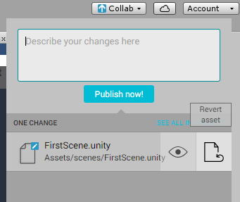

恢复文件
===============

对文件工作副本进行的某些更改可能不适合发布到项目。

如果您不想发布本地更改，请单击已更改的文件旁边的 **Revert asset** 按钮。这样将删除您对该文件所做的任何本地更改。

 

请在文件恢复对话框中单击 **Yes**，确认删除本地文件。

## 另请参阅

[还原项目至以前的版本](UnityCollaborateRollback.html)

