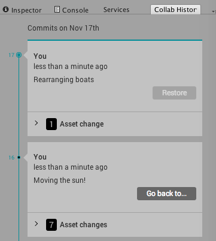
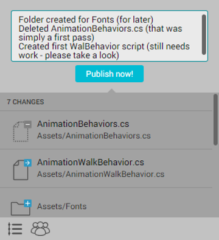

# 还原项目至以前的版本

有时您需要将整个项目还原到以前的版本。发生此情况时，可使用 **Restore** 和 **Go Back** 功能来还原项目以前的版本。然后，可将还原的项目发布为云端的当前版本。Collaborate 会确保项目的所有版本都完整，即使在还原后也是如此，并且您可以在开发周期中随时访问它们。

要打开 **Collab History** 窗口，请在 Unity Editor 菜单栏上选择 **Window** &gt; **Collab History**。

要删除所有本地更改并从云端恢复最新版本，请在更改历史记录的头节点上单击 **Restore** 按钮。

要恢复云端当前版本之前发布的某个版本，请单击 **Go back to** 按钮。

 

恢复操作将使用旧版本文件替换所有本地项目文件。这些文件现在将在 Collaborate 工具栏中列为已修改状态。文件或文件夹上的蓝色**加号 (+)** 表示它已修改。文件或文件夹上的蓝色**箭头 (->)** 意味着它是新文件（请参阅下图）。

要将恢复的版本发布为云端的最新修订版，请单击 **Publish now!** 按钮。

 

## 另请参阅

[还原文件](UnityCollaborateRevertingFiles.html)
