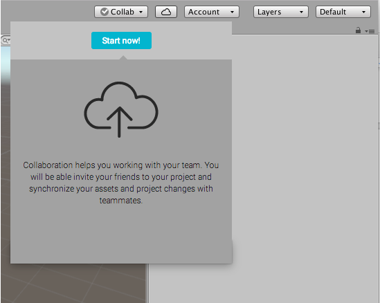
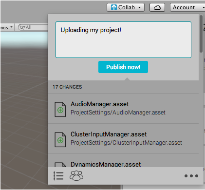

设置 Unity Collaborate
=============================

通常，Unity 服务会默认启用。创建项目时可通过指定设置来禁用 Unity 服务。如果已禁用 Unity 服务，则必须重新启用它们才能使用 Collaborate。想了解更多相关信息，请参阅[设置项目启用 Unity 服务](SettingUpProjectServices.html)。

要在 Unity 项目中启用 Collaboration，请在 Unity Editor 工具栏上单击 **Collab** 按钮，然后单击 **Start Now**。

如果在新建项目中启用 Collaborate，该项目会自动发布到云端。

如果将 Collaborate 添加到现有项目，则可能需要手动发布项目。

要发布您的更改并与团队成员分享这些更改，请单击 **Collab** 按钮，然后单击 **Publish now**。

对项目进行更改时，Collaborate 会在 **Collab** 按钮上显示向上的箭头表示有未发布的更改。

