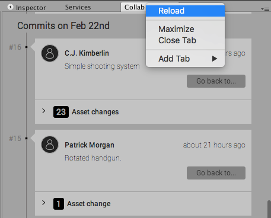
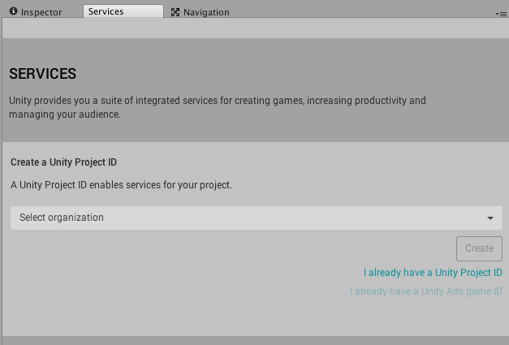

Collaborate 故障排除技巧
=================================

本页面详细介绍使用 Unity Collaborate 时可能出现的最常见问题的一些简单故障排除技巧。如需更多帮助，请访问 [Unity 论坛的 Collaborate 部分](http://forum.unity3d.com/forums/collaborate.98/)。

## Collab 历史记录信息已过时

**问题**：**Collab History** 窗口中的信息似乎已过时（例如，最新发布旁边的时间与推送最近更改的时间不匹配）。

**解决方法**：右键单击 **Collab History** 选项卡，然后选择 **Reload** 以检索最近更新的信息。

 

## 项目状态问题

**问题**：本地项目状态是您想要的状态，但您遇到与云端项目状态相冲突或其他问题。

**解决方法**：重新链接项目。打开 **Services** 选项卡，然后导航至 **Settings**。在此处，单击 **Unlink project**，然后用新的 ID 重新链接项目以提交全新版本。请单击 Services 面板中的 **Select organization**，然后按照步骤来分配或创建 ID。

 

**问题**：您遇到与本地项目状态的冲突或其他问题，并可将本地版本恢复为云端项目版本。

**解决方法**：按照[还原项目至以前的版本](UnityCollaborateRollback.html)中的说明还原为云端版本。

 
