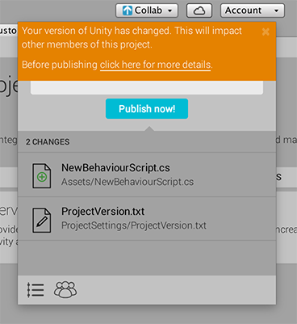

# 管理 Unity Editor 版本

Unity Collaborate 会验证即将用于发布更新的 Unity 版本是否与 Collab History 窗口中显示的最新更新在发布时所用的 Unity 版本相匹配。如果版本不匹配，Unity 会显示以下警告：

    Your version of Unity has changed.This will impact other members of this project.

 

为了确保在功能上没有冲突，所有团队成员应该使用相同版本的 Unity Editor。此外，团队成员在较新版本中打开 Unity 早期版本的项目时，Unity 会将项目文件更新为新版本。这些文件可能与 Unity 的早期版本不兼容。

Unity 发布新版本时，确保团队的所有成员都能够同时升级，这一点很重要。

 想了解更多关于升级 Unity 项目的影响，请参阅 Unity [升级指南](UpgradeGuides.html)。
