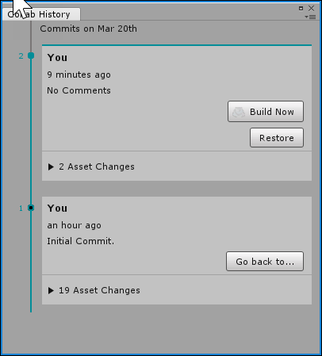

查看历史记录
================

您可以查看项目的整个历史记录以及所有更改。

查看协作 (Collaboration) 历史记录的步骤如下：

1.在 Unity Editor 工具栏上，单击 **Collab** 按钮。
2.单击 **History** 按钮（如下所示），或者选择 **Window** &gt; **Collab History**，打开 **Collab History** 面板。

在 Collab History 窗口中，您可以还原项目至以前的版本。想了解更多相关信息，请参阅[还原项目至以前的版本](UnityCollaborateRollback.html)。
