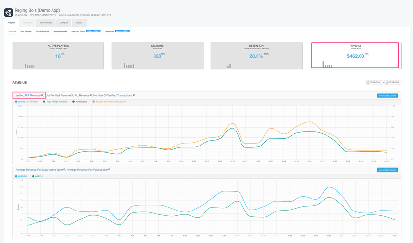

Unity IAP
===============

Unity IAP 让您可以在最主流的应用商店中轻松实现应用内购 (IAP)。

支持的平台包括：

* iOS App Store
* Mac App Store
* Google Play
* 通用 Windows 平台
* Amazon Appstore
* Samsung Galaxy Apps
* Tizen Store
* CloudMoolah Store
* Facebook Gameroom
* Xiaomi Mi Game Pay

您可以通过下图的 [Unity Analytics Dashboard](http://analytics.unity3d.com) 来查看 IAP 收入。

---

* 2017-09-01  Page published with [editorial review](DocumentationEditorialReview.html)
 
* 更新了 Unity 2017.1 中的 IAP 支持平台列表
