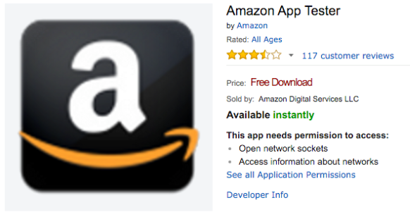
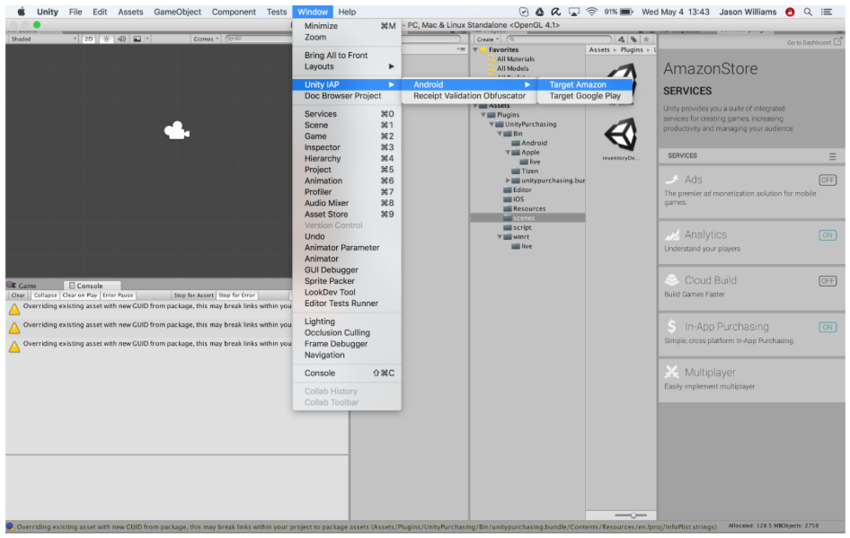

# Amazon Appstore 的配置

##简介

本指南介绍如何设置 Amazon Appstore 与 Unity 应用内购 (IAP) 系统配合使用。此设置过程包括建立数字记录和关系；与 Unity IAP API 进行交互、设置 Amazon 开发者帐户以及测试和发布 Unity IAP 应用程序都需要用到这些记录和关系。

与其他平台一样，Amazon 应用商店允许购买虚拟商品和所管理的商品。这些数字商品的标识包括一个字符串标识符和一个额外用于定义耐用性的类型，其中的类型选项包括订阅（可以订阅）、消耗品（可以多次购买）以及非消耗品（可以购买一次）。

##跨店实现 IAP

使用共享的 Android Bundle ID 同时发布到多个 Android IAP 商店（例如 Amazon 和 Google）时，会出现跨店安装问题。请参阅有关 [Android 应用内购 (IAP) 商店的跨店安装问题](UnityIAPCrossStoreInstallationIssues.html)的页面以了解更多信息。

##Amazon Appstore

###准备开始

1.在 [Amazon Developer Portal](https://developer.amazon.com/) 中设立 Amazon 开发者帐户。
1.编写一个游戏并实现 Unity IAP API。如需参考资料，请参阅有关 [Unity IAP 初始化](UnityIAPInitialization.html)和[在游戏中集成 Unity IAP (Integrating Unity IAP in your game)](https://unity3d.com/learn/tutorials/topics/analytics/integrating-unity-iap-your-game) 的指南。Amazon Appstore 适合用于对 IAP 商品没有限制的应用程序。

###设备设置

1.对于非 FireOS 的 Android 设备，下载并安装 [Amazon Appstore](https://www.amazon.com/appstore_android_app)。
1.在 FireOS 设备上，应该会预装 Amazon Appstore。
1.安装 Amazon Appstore 后，应安装 [Amazon App Tester](http://www.amazon.com/Amazon-App-Tester/dp/B00BN3YZM2/)。

     
1.设置 Android SDK
    1.要安装并查看 Android 调试日志，请确保已安装 [Android SDK](https://developer.android.com/studio/install.html)。从 Android SDK 安装页面下载相关命令行工具包，然后将其解压缩到您的计算机。
    1.确认 SDK 能通过命令行 adb 工具识别连接的 Android 设备。例如：
    
````
|[11:07:01] user@laptop:/Applications | $ adb devices
List of devices attached
00DA0807526300W5	device
````

###Unity 应用程序设置

为了使用 Unity 的 IAP，需要执行几个设置步骤。

1.导入 Unity IAP 插件。请参阅[设置 Unity IAP](UnityIAPSettingUp.html) 以了解更多信息（Unity 5.3 或更高版本）。
1.设置 IAP 目标商店。您应该已经设置好一个 Android 应用程序。请使用 __Unity IAP Window > Unity IAP > Android > Target Amazon__ 菜单项来设置目标商店。此菜单项用于在 Google、Amazon 和其他 Android 应用商店之间切换。

     

或者，请调用 API：

````
UnityPurchasingEditor.TargetAndroidStore(AndroidStore.AmazonAppStore)
````

###Amazon Appstore 设置

在准备使用 Amazon 应用商店时，无需下载 Amazon 的本机 IAP 插件，因为它提供的所有功能都已包含在 Unity 的 IAP 服务中。

1.添加您的应用程序。从 Amazon Developer Portal 中选择 __Add a New App__。

     

1.设置您的目录。使用您事先准备的商品描述，通过 Amazon Developer Portal 将商品添加到 Amazon 目录。导航至应用程序的页面，然后找到 __In-App Items__ 部分。使用 __Add a Consumable__、__Add an Entitlement__ 或 __Add a Subscription__ 按钮来设置您的目录。

     


