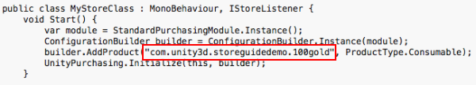
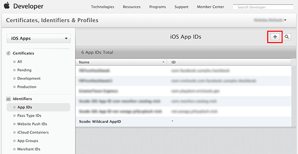
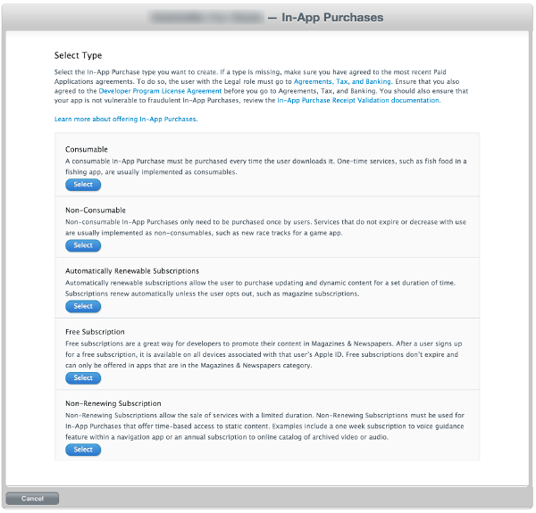
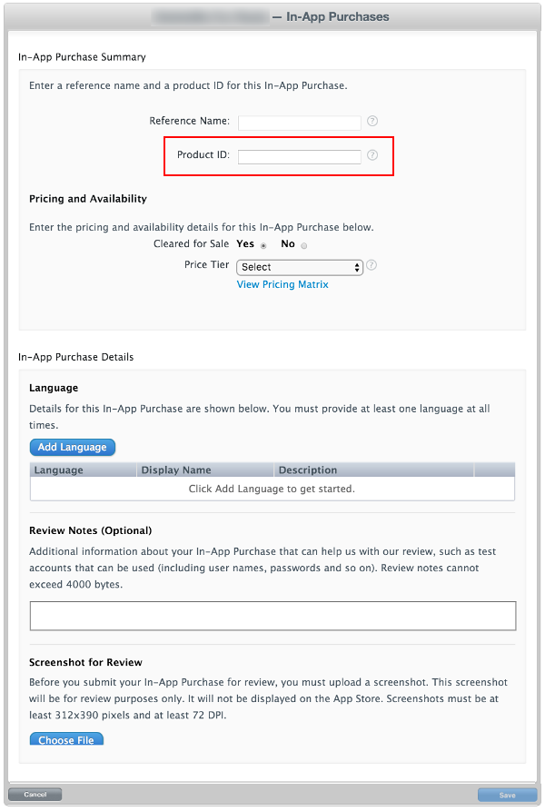
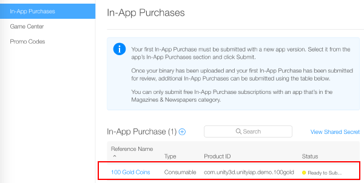
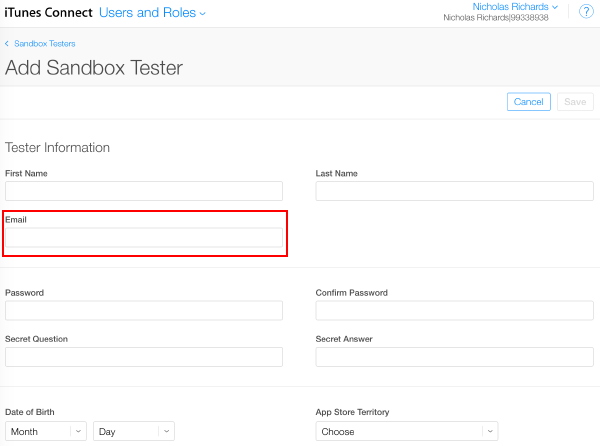
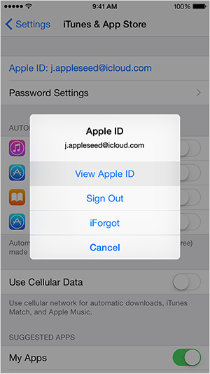

#针对 Apple App Store 和 Mac App Store 进行配置

## 简介

本指南介绍如何建立 Unity 游戏与应用内购 (IAP) 商店进行交互所需的数字记录和关系。本指南针对的是 [Unity IAP](UnityIAP.html) 购买 API。

应用内购 (IAP) 是通过资金交易购买数字商品的过程。一个平台的应用商店会允许购买代表数字商品的产品。这些商品有一个标识符（通常是字符串数据类型）。商品的类型可表示其耐用性：_订阅_、_消耗品_（可以多次购买）以及_非消耗品_（只能购买一次）是最常见的类型。

## Apple App Store

### 准备开始

1.编写一个游戏并实现 Unity IAP。请参阅 [Unity IAP 初始化](UnityIAPInitialization.html)和[将 Unity IAP 与您的游戏集成](https://unity3d.com/learn/tutorials/topics/analytics/integrating-unity-iap-your-game-beta)。

1.准备好游戏的商品标识符以便稍后在 iTunes Connect 中使用。

     

### 注册应用程序

1.在 [Apple Developer Center](https://developer.apple.com/account) 中，导航至相应的标识符 (Identifiers) 部分。

2.添加新的 App ID 以便向 Apple 创建基本应用程序实体。

    **注意：**使用显式 App ID。采用 IAP 的应用程序不能使用通用 App ID（Wildcard App IDs，即 com.example.*）。

    **注意：**在 Developer Center 中创建 App ID 后，即可在 iTunes Connect 中使用此 App ID。
  
     

3.导航至 [iTunes Connect](https://itunesconnect.apple.com)，然后创建一个应用程序，从而建立应用商店与您的游戏之间的关系。
  
     

4.将新创建的 App ID 用作该应用的 Bundle ID。

     

### 添加 IAP

1.选择 __Features__，然后使用加号 ("+") 按钮添加新的应用内购 (In-App Purchase)。

     

2.选择[商品类型](UnityIAPDefiningProducts.html)。

     

3.指定商品标识符 (Product Identifier)，并根据要求填写其他字段。

    **注意：**此处的 "Product ID" 是游戏源代码中使用的同一标识符，已通过 __AddProduct()__ 或 __AddProducts()__ 添加到 [Unity IAP ConfigurationBuilder](http://docs.unity3d.com/Documentation/ScriptReference/Purchasing.ConfigurationBuilder.html) 实例。
    
    **注意：**面向多个 Apple 设备组时（例如，同时在 iOS 和 Mac 上发布），Apple 要求对每个不同的设备组使用不同的唯一商品标识符。使用 [Unity IAP 的 Purchasing.IDs](http://docs.unity3d.com/ScriptReference/Purchasing.IDs-ctor.html) 类并将一对多映射的商品 ID 定义为特定于商店的标识符，然后在初始化 IAP 时传入该映射。

     

4.结果：

     

### 测试 IAP

1.使用 iTunes Connect 来创建 __Sandbox Testers__ 以便用于您的测试设备的 iTunes 帐户。为此，请导航至 __iTunes Connect &gt; Users and Roles__，然后选择加号 ("+") 按钮。您必须查阅 [Apple 的 Sandbox Tester（沙盒测试者帐户）文档](https://developer.apple.com/library/ios/documentation/LanguagesUtilities/Conceptual/iTunesConnect_Guide/Chapters/SettingUpUserAccounts.html#/apple_ref/doc/uid/TP40011225-CH25-SW9)，因为其中提供了一些其他的重要使用说明，而且您必须使用真实的电子邮件地址才能创建测试者帐户。

    **注意：**请参阅 [iOS 和 Mac App Store 指南](UnityIAPiOSMAS.html)以了解其他详情。
    
    **提示：**(*) 为了简化电子邮件地址的管理，请使用支持子地址 (emailaccount+subaddress@example.com) 的电子邮件服务，例如 Gmail、iCloud 和 Outlook.com。这样可以通过一个电子邮件帐户接收多个子地址的电子邮件。

     

2.完成用户创建向导。

     

3.使用 Unity 为您的游戏编译 Xcode 项目。

    **注意：**确保 Unity 中的 Bundle Identifier (Build Settings &gt; iOS &gt; Settings ...&gt; Other Settings &gt; Bundle Identifier) 与 iTunes Connect 中使用的标识符匹配。

4.然后，在游戏的 Xcode 项目中，确保 Team (Project Navigator &gt; 您的游戏目标平台 &gt; General &gt; Identity &gt; Team) 设置为您的 Apple 开发者帐户的团队。

     

#### 对于 iOS

1.使用目标 iOS 设备来注销任何现有的 Apple ID 帐户。稍后仅在应用程序提示时再以沙盒测试者 (Sandbox Tester) 身份登录。任何后续购买都通过 Apple 沙盒 (Apple Sandbox) 而不是生产商店 (Production Store) 进行。

     

2.在您的 iOS 设备上编译并运行游戏。如果一切均已正确配置，则 `UnityPurchasing.Initialize()` 会成功。请参阅 [Unity Purchasing 初始化](http://docs.unity3d.com/ScriptReference/Purchasing.UnityPurchasing.Initialize.html)

3.在设备上通过游戏内进行购买来测试 IAP 是否成功。此过程会显示一个经过修改的购买对话框，其中说明正在沙盒环境中进行此购买。系统提示您购买时，请使用 Sandbox User Tester 密码。

    警告：如果该指示信息不存在，则会向帐户收取该商品的真实资金。
  
     

#### 对于 Mac

1.发布到 Mac 台式机时，请在 Unity 的 Mac Player Settings 中选择 __Mac App Store Validation__。

2.完成应用程序的编译后，请使用您的 Bundle ID 和版本字符串来更新应用程序的 `info.plist` 文件。右键单击 .app 文件，然后单击 __Show Package Contents__，找到 `info.plist` 文件，并将 `CFBundleIdentifier` 字符串更新为应用程序的 Bundle ID。

3.对应用程序进行签名、打包和安装操作。从 OSX 终端运行以下命令（填写相应的 "your.app" 和 "your.pkg"）。

    **提示：**要对捆绑包签名，您可能首先需要删除 Contents.meta 文件（如果存在）：`your.app/Contents/Plugins/unitypurchasing.bundle/Contents.meta`
  
    1.`codesign -f --deep -s "3rd Party Mac Developer Application: " your.app/Contents/Plugins/unitypurchasing.bundle`
  
    1.`codesign -f --deep -s "3rd Party Mac Developer Application: " your.app`
  
    1.`productbuild --component your.app /Applications --sign "3rd Party Mac Developer Installer: " your.pkg`

4.要正确安装应用包，请删除未打包的 .app 文件，然后再运行和安装新创建的程序包。

5.从 _Applications_ 文件夹启动该应用程序。首次启动应用程序时，系统会提示输入您的 iTunes 帐户详细信息（稍后可以使用该帐户在沙盒环境中进行购买测试）。

请参阅有关 [iOS 和 Mac 扩展功能](UnityIAPiOSMAS.html)和[向 Apple Mac Store 提交应用程序](HOWTO-PortToAppleMacStore.html)的页面以了解关于 Apple App Store 测试和签名的其他详细信息。
