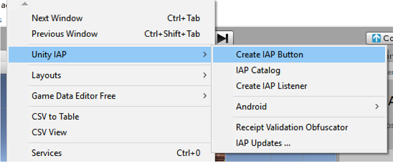
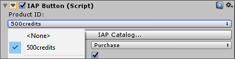
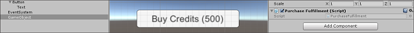

# Codeless IAP

__Codeless IAP__ 是在 Unity 应用程序中实现应用内购 (IAP) 的最简单方法。借助 Unity Editor 提供的一个接口，只需编写最少的脚本即可配置基本的 IAP 集成。

Codeless IAP 可处理实际的 IAP 交易而无需任何代码。在 Editor 中实现 Codeless IAP 的过程包括两个步骤：

1.[将 __IAP 按钮__添加到游戏中](#IAPButtons)。
2.[在 __IAP Catalog__ 中定义__商品__](#PopulatingProducts)。

__Unity 购买__系统 (Unity Purchasing System) 在运行时配置您在目录中填充的商品。玩家选择 __IAP 按钮__时，便会启动相关商品的购买流程。

**注意**：您仍然需要通过编写脚本来定义玩家如何访问其新购买的内容。有关更多信息，请参阅以下的[**执行购买**](#PurchaseFulfillment)部分。

## 实现 Codeless IAP
开始之前，请安装最新的 [**Unity IAP**](https://assetstore.unity.com/packages/add-ons/services/billing/unity-iap-68207) SDK。请参阅有关[**设置 Unity IAP**](https://docs.unity3d.com/2018.1/Documentation/Manual/UnityIAPSettingUp.html) 的文档以了解更多信息。

<a name="IAPButtons"></a> 
### 将 IAP 按钮添加到场景
要将 __IAP 按钮__添加到场景，请在 Unity Editor 中选择 __Window &gt; Unity IAP &gt; Create IAP Button__。




<a name="PopulatingProducts"></a> 
### 在 IAP Catalog 中填充商品
按以下两种方式之一打开 __IAP Catalog__ GUI：
 
* 选择 __Window &gt; Unity IAP &gt; IAP Catalog__。
* 或者，选中 __IAP Button __后，在 Inspector 中找到其 __IAP Button (Script)__ 组件，然后单击 __IAP Catalog…__。


下一步，使用该 GUI 为目录中的每个商品定义以下属性。

* __Product ID__（商品 ID）：通过此 ID 与应用商店通信（请注意，可通过 __Advanced__ 选项使用特定于商店的唯一 ID 来覆盖此 ID）。
* __Product Type（商品类型）__：包括 __Consumable__（消耗品）、__Non-Consumable__（非消耗品）或 __Subscription__（订阅）。


**注意**：__IAP Catalog__ GUI 还提供可用于配置商品的其他工具。在[导出目录](#Exporting)以便上传到各自商店之前，还必须填写描述和定价信息。有关这些设置的详细信息，请参阅有关[**定义商品**](https://docs.unity3d.com/2018.1/Documentation/Manual/UnityIAPDefiningProducts.html)的文档以了解。

### 自动初始化 `UnityPurchasing`
必须初始化 IAP SDK 才能正常使用 IAP。在运行时加载 Codeless __IAP 按钮__或 [__IAP 监听器__](#IAPListeners)的第一个实例时，自动进行此操作。但是，您可能需要在 IAP 按钮或 IAP 监听器出现在游戏中之前初始化 SDK（例如，在应用程序启动后提供[**内购推荐 (IAP Promo)**](https://docs.unity3d.com/2018.1/Documentation/Manual/IAPPromo.html) ）。在此类情况下，请选中 __IAP Catalog__ 窗口底部的 __Automatically initialize UnityPurchasing (recommended)__。这样可以确保在应用程序启动时 [```UnityPurchasing```](https://docs.unity3d.com/2018.1/Documentation/ScriptReference/Purchasing.UnityPurchasing.html) 立即初始化，并消除对无码实例生命周期的依赖。


目录必须至少包含一个商品才能运行。

**注意**：您可以将自动初始化功能与 IAP 按钮或监听器结合使用。在此情况下，SDK 会在游戏启动时初始化，而不是在场景中加载 IAP 按钮或监听器的第一个实例时初始化。但是，如果同时需要在脚本中手动初始化，则不应启用自动初始化，因为这可能导致错误。

<a name="PurchaseFulfillment"></a> 
### 执行购买
商品目录至少包含一个商品时，您可以定义在购买完成或失败时的 __IAP 按钮__行为。

1.在场景视图中选择 __IAP 按钮__，然后在 Inspector 中找到其 __IAP Button (Script)__ 组件。
2.从 __Product ID__ 下拉列表中选择要链接到 __IAP 按钮__的商品。
   
3.创建自己的函数来执行购买，或者导入资源来实现此目的（请参阅以下代码示例）。
4.将购买执行脚本作为组件应用于游戏对象。
   
5.返回到 Inspector 中的 __IAP Button (Script)__ 组件，然后单击加号 (__+__) 按钮，从而将函数添加到 __On Purchase Complete (Product)__ 列表。
6.将附带购买执行脚本的游戏对象拖到 __On Purchase Complete (Product)__ 事件字段（如下图所示），然后从下拉菜单中选择您的函数。
   

**购买执行脚本代码示例**：

```
public void GrantCredits (int credits){
    userCredits = userCredits + credits;
    Debug.Log(“You received “ + credits “ Credits!”);
}
```

运行游戏来测试 __IAP 按钮__。

## 扩展功能

<a name="Exporting"></a> 
### 导出到应用商店
为了使购买功能正常运行，必须在相应的应用商店中配置商品目录。为此，可将商品目录以 CSV 文件格式导出到 Google Play，或者以 XML 文件格式通过 Apple 的 Application Loader 导出到 iTunes Store。

#### Google Play
要将商品目录导出到 Google Play：

1.在 __IAP Catalog__ 窗口 (__Window &gt; Unity IAP &gt; IAP Catalog__) 中，确保每个商品已定义以下字段：<br/>* __ID__ <br/>* __Type__ <br/>* __Title__ 和 __Description__ <br/>* __Price__ 或 __Pricing Template__ ID
2.向下滚动，然后选择 __App Store Export__。
3.选择 __Google Play CSV__。
4.选择要保存 CSV 文件的位置。

如需将导出的目录上传到 Google Play 的完整指南，请参阅 [Android 开发者 (Android Developers) 网站](https://developer.android.com)上的 [Google 应用内计费 (Google in-app billing)](https://developer.android.com/google/play/billing/billing_admin.html#billing-list-setup) 文档。

#### Apple iTunes
要将商品目录导出到 Apple iTunes：

1.在 **IAP Catalog** 窗口 (**Window** &gt; **Unity IAP** &gt; **IAP Catalog**) 中，确保每个商品已定义以下字段：<br/>* **ID** <br/>* **Type** <br/>* **Title** 和 **Description** <br/>* **Price Tier** 和 **Screenshot path** <br/>* 
**Apple SKU**（可在 [iTunes Connect](https://itunesconnect.apple.com) 中找到）<br/>* **Apple Team ID**（可在 [Apple 开发者网站](https://developer.apple.com)中找到）
2.向下滚动，然后选择 **App Store Export**。
3.选择 **Apple XML Delivery**。
4.选择要保存 XML 文件的位置。

如需有关通过 Apple Application Loader 进行导入的完整指南，请参阅 [iTunes Connect 网站](https://itunesconnect.apple.com)上的 [Application Loader](https://itunesconnect.apple.com/docs/UsingApplicationLoader.pdf) 文档。

### Restore 按钮
包括 iTunes 在内的一些应用商店要求应用程序具有 __Restore__ 按钮。Codeless IAP 提供了一种在应用程序中实现 Restore 按钮的简单方法。

要添加 __Restore__ 按钮：

1.将 __IAP 按钮__添加到场景 (**Window** &gt; **Unity IAP** &gt; **Create IAP Button**)。
2.选择 __IAP 按钮__后，在 Inspector 中找到其 **IAP Button (Script)** 组件，然后从 **Button Type** 下拉菜单中选择 **Restore**（该组件的大部分其他字段将从 Inspector 视图中消失）。
   

用户在运行时选择此按钮时，该按钮会为当前商店调用购买恢复 API。此功能对 iOS App Store、Mac App Store、Windows 应用商店、Samsung Apps 和 Cloud Moolah 应用程序商店有效。在其他平台上，您可能希望隐藏 __Restore__ 按钮。

如果恢复成功，Unity IAP 会在与该商品关联的 __IAP 按钮__上调用 __On Purchase Complete (Product)__ 函数。

有关更多信息，请参阅有关[**恢复购买**](https://docs.unity3d.com/2018.1/Documentation/Manual/UnityIAPRestoringTransactions.html)的文档。

<a name="IAPListeners"></a> 
### IAP 监听器
Codeless IAP 将成功和失败的购买事件分发给层级视图中处于活动状态的 __IAP 按钮__ (IAP Button) 组件。但是，在处理成功的购买时，有时可能会很难有或不希望有处于活动状态的 __IAP 按钮__。例如，如果购买在完成前中断，Unity IAP 会在下次初始化时再次尝试处理该购买。您可能希望在应用程序启动后立即执行此操作，在这种情况下，__IAP 按钮__不合逻辑。Codeless IAP 正好包含适合这些情况的 __IAP 监听器__ (IAP Listener) 组件。场景层级视图中处于活动状态的 __IAP 监听器__可接收无法分发给 __IAP 按钮__的任何购买事件。

添加 __IAP 监听器__：

1.在 Unity Editor 中，选择 __Window &gt; Unity IAP &gt; Create IAP Listener__。
2.按照关于[编写购买执行脚本作为游戏对象组件](#PurchaseFulfillment)的步骤执行操作。
3.在场景中选择 __IAP Listener__，并在 Inspector 中找到 **IAP Listener (Script)** 组件，然后单击加号 (**+**) 按钮，从而将函数添加到 **On Purchase Complete (Product)** 列表。
4.将附带购买执行脚本的游戏对象拖到该组件的 Inspector 中的事件字段，然后从下拉菜单中选择您的函数。
   

### 访问 Unity IAP 的扩展功能
Codeless IAP 功能未展示 Unity IAP 的大多数[扩展功能](https://docs.unity3d.com/2018.1/Documentation/Manual/UnityIAPStoreExtensions.html)。但是，Codeless IAP 是基于现有脚本 API 实现的，因此可在 _IAPButton.cs_ 脚本 (_Assets/Plugins/UnityPurchasing/script/IAPButton.cs_) 中修改其诸多功能以满足您的需求。

要使用 Unity IAP 的扩展功能，请访问由 [```IStoreListener.OnInitialize```](https://docs.unity3d.com/2018.1/Documentation/ScriptReference/Purchasing.IStoreListener.OnInitialized.html) 返回的 Unity IAP [```IStoreController```](https://docs.unity3d.com/2018.1/Documentation/ScriptReference/Purchasing.IStoreController.html) 和 [```IExtensionProvider```](https://docs.unity3d.com/2018.1/Documentation/ScriptReference/Purchasing.IExtensionProvider.html) 实例。

----
* <span class="page-edit">2018-05-30 Page amended with [editorial review](DocumentationEditorialReview.html)
</span>
