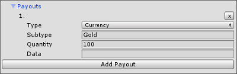

# 定义商品

为了使用应用内购 (IAP)，您的应用必须提供销售的商品列表。通过脚本或使用 [**Codeless IAP Catalog**](UnityIAPCodelessIAP.html) (__Window__ &gt; __Unity IAP__ &gt; __IAP Catalog__) 可达此目的。无论使用哪种实现方式，都必须为每种商品定义相应属性。本页面将详细介绍这些属性。


## Product ID
输入一个跨平台的唯一标识符来充当与应用商店通信时的商品默认 ID。

**重要信息**：该 ID 只能包含小写字母、数字、下划线或句点。

## Product Type
每个商品必须属于以下类型之一：

| **类型** | **描述** | **示例** |
|:---|:---|:---|
|__Consumable__| 用户可以反复购买此类商品。无法恢复可消耗商品 (Consumable Products)。 | * 虚拟货币 <br/> * 生命药水 <br/> * 临时能量块 (power-up)。 |
|__Non-Consumable__| 用户只能购买此类商品一次。非消耗商品 (Non-Consumable Products) 是可以恢复的。 | * 武器或盔甲 <br/> * 额外内容的访问权限|
|__Subscription__|用户可以在有限时段内访问该商品。订阅商品 (Subscription Products) 是可以恢复的。 | * 网络游戏的月卡 <br/> * 每日发放奖励的 VIP 身份 <br/> * 免费试用权 |

**注意**：有关订阅类型支持的更多信息，请参阅有关[**订阅商品支持**](UnityIAPSubscriptionProducts.html)的部分。

## Advanced
此部分定义与商品相关的元数据以便用于游戏内的商店。

### Descriptions
使用以下字段为商品添加描述性文字：

| **字段** | **数据类型** | **描述** | **示例** |
|:---|:---|:---|:---|
| __Product Locale__ | Enum | 确定您所在地区可用的应用商店。 | **English (U.S.)** (Google Play, Apple) |
| __Product Title__ | String | 显示在应用商店中的商品名称。 | “Health Potion” |
| __Product Description__ | String | 商品出现在应用商店中时的描述性文字，通常是对商品的说明。 | “Restores 50 HP.” | 

单击加号 (__+__) 图标并选择其他语言设置，即可为 __Title__ 和 __Description__ 字段添加 __Translations__。可根据需要添加任意数量的翻译。


### Payouts
使用此部分可以针对售出给购买者的内容添加本地固定定义。售出交易 (Payouts) 有助于更方便地管理游戏内的钱包或库存。通过为商品添加名称和数量，开发者可以在购买时快速调整某些商品类型（例如，硬币或宝石）在游戏内的计数。

**注意**：此功能仅在 Unity 2017.2 或更高版本中可用。

| **字段** | **数据类型** | **描述** | **示例** |
|:---|:---|:---|:---|
| __Payout Type__ | Enum | 定义购买者收到的内容类别。有四种可能的类型。 | * Currency <br/> * Item<br/> * Resource <br/> * Other|
| __Payout Subtype__ | String | 提供内容类别的细粒度。 |* __Currency__类型的“Gold”和“Silver”子类型 <br/> * __Item__类型的“Potion”和“Boost”子类型 |
| __Quantity__ | Int | 指定购买者在售出交易中收到的商品、货币等的数量。 | * 1 <br/> * &gt;25<br/>* 100|
| __Data__ | | 根据需要将此字段用作要在代码中引用的属性。 | * UI 元素标志<br/> * 商品稀有性 |  



**注意**：可为单个商品添加多个售出交易。

有关 PayoutDefinition 类的更多信息，请参阅[脚本参考](../ScriptReference/Purchasing.PayoutDefinition.html)。始终可以使用此类为商品添加售出交易信息。例如：

```
using UnityEngine.Purchasing;

new PayoutDefinition (PayoutType.Currency, "Gold", 100)
```

请注意，IAP Catalog 充当商品目录字典，而不是库存管理器。您仍需实现该代码来处理所购内容的交易。

### Store ID Overrides
默认情况下，Unity IAP 假定您的商品在所有应用商店中都具有相同的标识符（在上文的 **ID** 字段中指定）。Unity 建议尽可能这样做。然而，在某些情况下，无法做到这一点；例如，在发布到 iOS 和 Mac 应用商店时，会禁止开发者在两个商店中使用同一商品 ID。

在此类情况下，应使用覆盖字段来指定商品的正确标识符（不同于跨平台 ID）。


此外也可通过编程方式实现此目的，如下所示：

````
using UnityEngine;
using UnityEngine.Purchasing;

public class MyIAPManager {
    public MyIAPManager () {
        var builder = ConfigurationBuilder.Instance(StandardPurchasingModule.Instance());
        builder.AddProduct("100_gold_coins", ProductType.Consumable, new IDs
        {
            {"100_gold_coins_google", GooglePlay.Name},
            {"100_gold_coins_mac", MacAppStore.Name}
        });
        // 初始化 Unity IAP...
    }
}
````

在此示例中，商品在 Google Play 中标识为 "100_gold_coins_google"，而在 Apple App Store 中标识为 "100_gold_coins_mac"。

**注意**：覆盖仅更改 Unity IAP 在与应用商店通信时使用的标识符。在进行 API 调用时，仍然应使用商品的跨平台标识符。

**重要信息**：该 ID 只能包含小写字母、数字、下划线或句点。

### Google Configuration（导出到 Google Play 时需要用到）
为 Google Play 中创建的[定价模板 (Pricing Template)](https://support.google.com/googleplay/android-developer/answer/6334373) 提供商品价格或 ID。


### Apple Configuration（导出到 Apple 时需要用到）
从下拉菜单中选择一个 **Pricing Tier**（定价等级）。Unity 支持预定义的 Apple 价格点，但不支持任意值。

使用 __Select a screenshot__ 选择要上传的截屏。

有关截屏规格的信息，请参阅 Apple 的发布者支持文档。


### Xiaomi Configuration（导出到小米时需要用到）
从下拉菜单中选择定价等级（人民币）。Unity 支持预定义的小米价格点，但不支持任意值。有关将 IAP Catalog 发布到小米的更多信息，请参阅有关**[小米集成](UnityIAPXiaomi.html)**的文档。

## 在脚本中定义商品
此外还可使用 [Purchasing Configuration Builder](../ScriptReference/Purchasing.ConfigurationBuilder.html) 以编程方式声明商品列表。必须为每个商品提供唯一的跨店 __Product ID__ 和 __Product Type__：

````
using UnityEngine;
using UnityEngine.Purchasing;

public class MyIAPManager {
    public MyIAPManager () {
        var builder = ConfigurationBuilder.Instance(StandardPurchasingModule.Instance());
        builder.AddProduct("100_gold_coins", ProductType.Consumable);
        // 初始化 Unity IAP...
    }
}
````

----
* <span class="page-edit">2018-05-30 Page amended with [editorial review](DocumentationEditorialReview.html)
</span>
