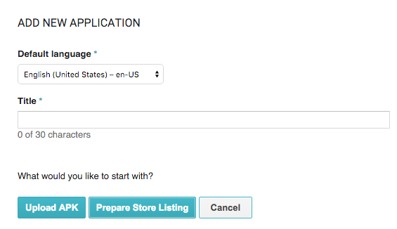
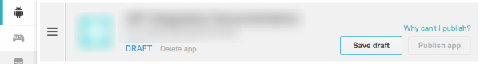
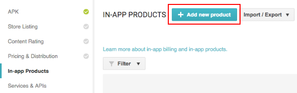
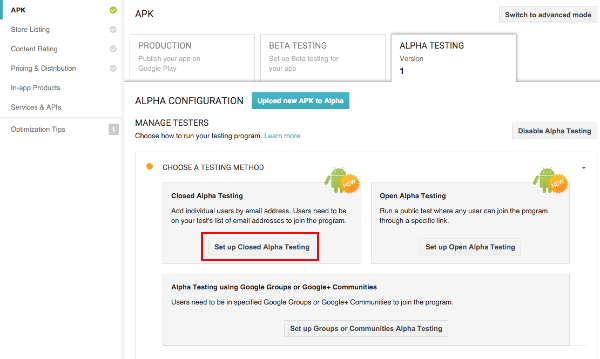
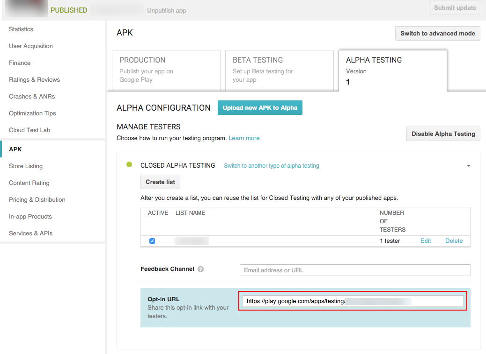

#针对 Google Play 应用商店进行配置

## 简介

本指南介绍如何建立 Unity 游戏与应用内购 (IAP) 商店进行交互所需的数字记录和关系。本指南针对的是 [Unity IAP](UnityIAP.html) 购买 API。

应用内购 (IAP) 是通过资金交易购买数字商品的过程。一个平台的应用商店会允许购买代表数字商品的产品。这些商品有一个标识符（通常是字符串数据类型）。商品的类型 (Types) 可表示其耐用性：_订阅_、_消耗品_（可以多次购买）以及_非消耗品_（可以购买一次）是最常见的类型。

## Google Play 应用商店

### 准备开始

1.编写一个游戏并实现 Unity IAP。请参阅 [Unity IAP 初始化](UnityIAPInitialization.html)和[将 Unity IAP 与您的游戏集成](https://unity3d.com/learn/tutorials/topics/analytics/integrating-unity-iap-your-game-beta)。

2.准备好游戏的商品标识符以便稍后在 [Google Play](UnityIAPGooglePlay.html) Developer Console（开发者控制台）中使用。

     

3.为您的游戏生成[经过签名的非开发版 Android APK](android-GettingStarted.html)。

    **提示：**务必妥善保存您的密钥库文件。始终需要原始密钥库来更新已发布的 Google Play 应用程序。

    **提示：**在本地测试期间，请复用您上次上传的 APK 的 Bundle Version Code 以便允许侧载 (side-loading)，无需先将已更改的 APK 上传到 Developer Console。请参阅 [Android 播放器设置 (Android Player Settings)](class-PlayerSettingsAndroid.html)。

### 注册应用程序

通过用于发布游戏的 Google 帐户，将 Android 应用程序注册到 [Google Play Developer Console](https://play.google.com/apps/publish)。

**注意：**本指南使用 [Google Play Alpha/Beta 测试方法](http://developer.android.com/google/play/billing/billing_testing.html)来测试应用内购 (IAP) 集成情况。

**注意：**由于 Google 支付方式不允许您购买自己的商品，因此不应使用发布者的 Google 帐户来进行测试。所以，您需要创建一个非发布者的 Google 帐户来进行测试。

1.选择 __Add new application__。

     

2.为应用程序指定一个 Title（名称）。为了配置应用程序计费，立即选择 "Upload APK"。我们将在稍后步骤中准备和填写商店列表 (Store Listing)。

     

3.导航至 __ALPHA TESTING__，然后选择 __Upload your first APK to Alpha__。选择并上传您的 APK。

     

4.首先解决 __Why can't I publish?__ 弹窗中列出的任何问题，然后单击 __Publish app__ 以发布您的 Alpha 应用程序。

    **提示**：发布的 Alpha 应用程序最长可能要等待 24 小时才能从 Google Play 应用商店中供下载。同样，对应用程序的 IAP 进行的更改在发布后也可能最长需要等待 24 小时才可用（请参阅下文）。

    **警告**：确保发布的应用程序是 Alpha 版本。如果发布生产 (Production) 版本，公众将能够访问未经过测试的应用程序。

     

### 添加 IAP

在 Developer Console 中，为游戏添加一个或多个 IAP。

1.导航至 __In-app Products__，然后选择 __Add new product__。
 
     

1.定义 __Product ID__，然后选择 __Continue__。

    您可以在 __Managed product__ 中指定消耗品或非消耗品商品类型。Unity IAP 也支持 __Subscription__（订阅）商品类型。

**注意**：此处的 "Product ID" 是游戏源代码中使用的同一标识符，已通过 `AddProduct()` 或 `AddProducts()` 添加到 [Unity IAP ConfigurationBuilder](../ScriptReference/Purchasing.ConfigurationBuilder.html) 实例。

 

1.填写 IAP 的 __Title__、__Description__ 和 __Default price__。然后将 __Inactive__ 按钮更改为 __Active__ 以启用 IAP。

     
  
    结果：
  
     

### 测试 IAP

按照以下说明分配"测试用户"以授予其特殊许可证测试权限，允许他们为此应用程序免费购买任何 IAP，然后将这些用户注册为 Alpha 测试者 (Alpha Testers)。

**注意**：我们在此处使用了[封闭式 Alpha 测试](https://support.google.com/googleplay/android-developer/answer/3131213)。也可以使用其他测试者分组方式。

1.通过 Developer Console 的 __Settings &gt; Account details &gt; LICENSE TESTING__ 部分，为您要授予许可证来免费购买 IAP 的测试者添加 Google 帐户电子邮件地址。

    注意：许可证测试设置可能会延迟 15 分钟才生效。
  
     

2.根据您的许可证测试用户列表，建立一个 Alpha 测试者 Google 帐户电子邮件地址列表。
  
     

    添加每个 Google 帐户电子邮件地址并为列表命名。
  
     

3.与 Alpha 测试者共享 **Opt-in URL**（当可用时，一般是从发布 APK 开始经过多个小时的延迟之后），然后让测试者从商店安装该应用程序。

    **注意**：为了测试更新，保留免费购买 IAP 的权限，测试者可以侧载 (side-load) 应用程序，更新应用商店下载的现有 APK 安装结果。

     

4.为了测试 IAP，请在使用 Alpha 测试者 Google 帐户登录的设备上进行购买。此过程会显示经过修改的购买对话框，其中指出本商品正在接受测试并且免费。

    **警告**：如果不显示此对话框，则会向 Alpha 测试者 Google 帐户收取该商品的真实资金。
  
     
