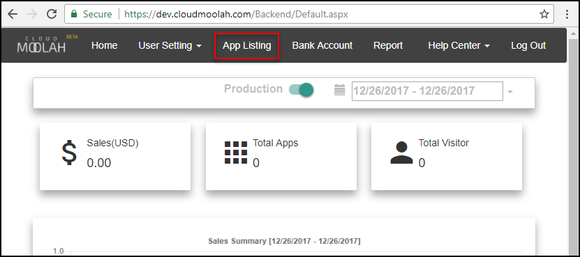
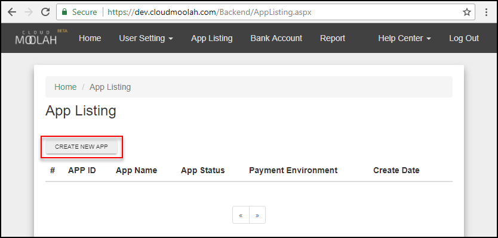
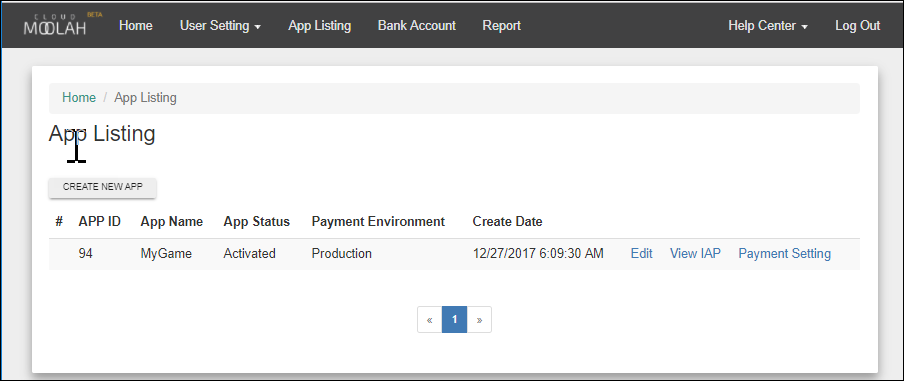
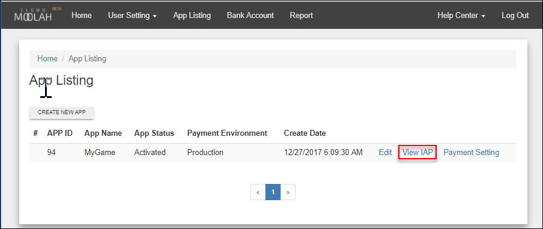
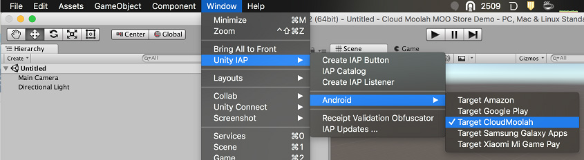

# CloudMoolah MOO Store

CloudMoolah MOO Store 是一种让用户可以购买和销售移动应用程序的商业服务。它还为通过该应用商店发布的应用程序提供应用内购 (IAP) 服务。本指南介绍开发者向一个已发布到 CloudMoolah MOO Store 的游戏添加 IAP 服务的端到端过程。

MOO Store 服务于包括菲律宾、马来西亚、越南、新加坡和泰国在内的亚洲市场。用户拥有数字钱包，并可通过各种支付服务提供商（如移动支付、银行和便利店预付卡）向数字钱包充值。

虽然与 Unity 兼容，但是 CloudMoolah MOO Store 并非 Unity 产品。有关更多信息，请参阅 CloudMoolah Developer Portal 网站（网址为 [dev.cloudmoolah.com](https://dev.cloudmoolah.com/)）。

将游戏发布到应用商店并将 IAP 添加到游戏中的一般工作流程如下所示：

* 将游戏注册为 CloudMoolah Store 中的应用程序
* 在应用商店中添加可以添加到游戏中供用户购买的商品
* 将 CloudMoolah Store 初始化代码添加到游戏中
* 测试集成结果
* 将游戏发布到 CloudMoolah Store

## 准备开始

您的游戏必须发布为 Android 应用程序。有关发布 Android 应用程序的信息，请参阅 [Android 开发入门 (Getting started with Android development)](android-GettingStarted.html)。

要将游戏注册为 CloudMoolah Store 中的应用程序：

1.登录 [CloudMoolah Developer Portal](https://dev.cloudmoolah.com/)。

2.单击 __App Listing__。



3.在 App Listing 页面上，单击 __CREATE NEW APP__ 按钮。



4.在 __App Detail__ 页面上，输入以下信息：

    1.在 __App Name__ 中，输入在 CloudMoolah Store 中用于标识游戏的名称。

    2.在 __BundelID__ 中，输入游戏在 Unity Editor 中使用的应用包名。

    3.在 __Currency Name__ 中，输入玩家用于完成 IAP 的货币名称。

    4.要创建您将在应用程序的初始化代码中使用的 HashKey，请单击 __HMAC/HashKey__ 字段旁的 __GENERATE__。

    5.在 __Notification HMAC__ 字段中，输入 App ID。在初始化期间将使用该值。

    6.单击 __Save__。



### 添加用户可以购买的商品

An in-app purchase is the transaction of exchanging money for digital goods inside an application. A platform’s store allows users to purchase products, which are digital goods. These products have an identifier, which is typically a string data type.

要在 CloudMoolah Developer Portal 中添加可购买的商品：

1.在 __App Listing__ 页面上，单击 __View IAP__。



2.在 __IAP Listing__ 页面上，单击 __CREATE NEW IAP__ 按钮。


3.在 __IAP Detail__ 页面上，输入以下信息：

    1.在 __ProductID __字段中，输入商品字符串标识符（您将在代码中使用此标识符以便在游戏内购买该商品）。

    2.在 __Amount__ 字段中，使用您在注册游戏时指定的默认货币来输入商品的价格。

    3.在 __Product Name__ 字段中，输入商品的名称。

    4.在 __Product Description__ 中，输入商品的描述。


4.单击 __SAVE__。

该商品现在显示在 __IAP Listing__ 页面上，因此可以从游戏中引用它，从而将其提供给用户。

### 将 IAP 添加到游戏中

要在游戏中配置 IAP：

1.从 MOO Store Developer Portal 中检索应用程序商品的 appKey 和 hashKey，并保存好以便稍后使用。

An app targeting the CloudMoolah MOO Store must configure the CloudMoolah appKey and hashKey using the IMoolahConfiguration via the scripting API before initializing Unity IAP. Collect these variables’ values from the app’s CloudMoolah developer dashboard.

以下示例可配置并启动 Unity IAP 的初始化：

```
using UnityEngine.Purchasing;
public class MyStore : IStoreListener
{
    public void InitializeStore()
    {
        var module = StandardPurchasingModule.Instance();
        var builder = ConfigurationBuilder.Instance(module);

        // 配置 CloudMoolah
        builder.Configure<IMoolahConfiguration>().appKey = "d93f4564c41d463ed3d3cd207594ee1b";
        builder.Configure<IMoolahConfiguration>().hashKey = "cc";
        // 对于服务器之间的（也称为 "网络" 游戏）交易
        // 记录，请设置 IMoolahConfiguration.notificationURL。
        builder.Configure<IMoolahConfiguration>().notificationURL = "https://gameserver.example.com/callback";
        builder.Configure<IMoolahConfiguration>().SetMode(CloudMoolahMode.Production);
        //添加可购买的商品。必须事先在应用商店中定义该商品。
        //Unity IAP 提供了 *ProductType* 枚举来指定可购买商品的 
        // 耐用性。CloudMoolah 将商品类型限制为消耗品 (Consumable)。
        builder.AddProduct("100.gold.coins", ProductType.Consumable);

        // 启动异步 IAP 初始化。
        UnityPurchasing.Initialize(this, builder);
    }
}
```

1.在 Unity Editor 中，选择 __Window &gt; Unity IAP &gt; Android &gt; Target CloudMoolah__，从而将 Unity IAP Android 目标设置为 CloudMoolah。这样就会将 CloudMoolah 设置为游戏用于满足 IAP 请求的 Android 应用商店。



要在初始化代码中设置目标应用商店，请调用 UnityPurchasingEditor.TargetAndroidStore 函数：

UnityPurchasingEditor.TargetAndroidStore(AndroidStore.CloudMoolah);

1.为您的游戏生成经过签名的非开发版 Android APK。有关更多信息，请参阅 [Android 开发入门 (Getting started with Android development)](android-GettingStarted.html)。

**注意**：请采取特殊的预防措施来妥善保存密钥库文件。始终需要原始密钥库来更新已发布的应用程序。

有关设置和配置 IAP 的更多信息，请参阅[设置 Unity IAP](UnityIAPSettingUp.html)、[Unity IAP 初始化](UnityIAPInitialization.html)以及[将 Unity IAP 与您的游戏集成](https://unity3d.com/learn/tutorials/topics/analytics/integrating-unity-iap-your-game-beta)。

### 测试 IAP

CloudMoolah MOO Store 支持测试。要在 CloudMoolah MOO Store 中测试游戏，必须在购买之前调用 `IMoolahConfiguration.SetMode` 函数，从而在应用程序中启用开发者模式。

When you set the test mode in a build of your game, transactions are processed against a dummy offline store. This allows you to test the app’s purchasing logic without incurring real-world monetary costs related to the product.

To modify the game’s MOO Store test mode, create the ConfigurationBuilder instance and add the following line, then build and run the app to test its IAP logic:

```
// 测试：自动批准所有交易
builder.Configure<IMoolahConfiguration>().SetMode(CloudMoolahMode.AlwaysSucceed);
```

要测试错误处理情况，请配置测试模式使所有交易失败。为此，请使用 CloudMoolahMode.AlwaysFailed 枚举：

```
builder.Configure<IMoolahConfiguration>().SetMode(CloudMoolahMode.AlwaysFailed); // 测试：始终让所有交易失败
```

注意：完成测试后，请删除用于配置开发者模式的 SetMode 语句，或更改该参数以使用 CloudMoolahMode.Production 枚举值。这样可确保在用户使用应用程序时支付实际资金。

### 实现示例

Unity IAP 的默认集成中包括一个实现脚本示例，其中演示了如何使用必需的和一些可选的 CloudMoolah 脚本 API。

要查看特定于 CloudMoolah 的示例：

1.在您的开发计算机上，打开已启用 IAP 的应用程序的文件夹。

2.打开 *Assets/Plugins/UnityPurchasing/script* 文件夹。

3.在 script 文件夹中，打开 *IAPDemo.cs*。

该示例实现了 `Awake` 函数，而此函数调用 `IMoolahConfiguration` API 来设置 `appKey` 和 `hashKey`。这会将应用程序连接到 CloudMoolah Store 服务器。

*IAPDemo.cs* 文件还显示了如何调用可选 API 来配置测试模式，以及通过扩展功能来添加交易恢复功能。有关可选 API 的更多信息，请登录 CloudMoolah Developer Portal 网站（网址为 [dev.cloudmoolah.com](https://dev.cloudmoolah.com/)）。

---

<span class="page-edit"> 2018-03-07  Page amended with limited [editorial review](DocumentationEditorialReview.html)
</span>


