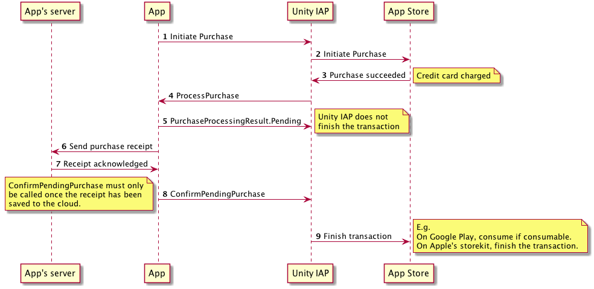

处理购买
====================

购买完成时会调用商店监听器的 `ProcessPurchase` 函数。无论用户购买任何物品，您的应用程序都应该履单；例如，解锁本地内容或将购买收据发送给服务器以更新服务器端游戏模型。

此过程会返回结果以指出应用程序是否已完成对购买的处理：

|结果|描述|
|:---|:---|
|__PurchaseProcessingResult.Complete__|应用程序已完成对购买的处理，不应再次向应用程序通知此事。|
|__PurchaseProcessingResult.Pending__|应用程序仍在处理购买，除非调用 `IStoreController` 的 `ConfirmPendingPurchase` 函数，否则将在下一次应用程序启动时再次调用 ProcessPurchase。|

请注意，在初始化成功后，随时可能调用 ProcessPurchase。如果应用程序在 ``ProcessPurchase`` 处理程序执行过程中崩溃，那么在 Unity IAP 下次初始化时会再次调用它，因此您可能希望实现自己的额外重复数据删除功能。

## 可靠性

Unity IAP 要求明确确认购买以确保在网络中断或应用程序崩溃的情况下可靠地完成购买。在应用程序离线时完成的任何购买都将在下次初始化时发送给应用程序。

### 立即完成购买

返回 `PurchaseProcessingResult.Complete` 时，Unity IAP 立即完成交易（如下图所示）。

如果您正在销售可消耗商品并从服务器履行订单（例如，在网络游戏中提供游戏币），那么您**不得**返回 `PurchaseProcessingResult.Complete`。

否则，如果在保存到云端之前卸载应用程序，则购买的消耗品将面临丢失的风险。

### 将购买保存到云端

如果要将消耗品购买交易保存到云端，您**必须**返回 `PurchaseProcessingResult.Pending`，并且仅在成功保存购买时才调用 `ConfirmPendingPurchase`。

返回 `Pending` 时，Unity IAP 会在底层商店中保持交易为未结 (open) 状态，直至确认为已处理为止，因此确保了即使在消耗品处于此待处理状态时用户重新安装您的应用程序，消耗品购买交易也不会丢失。

