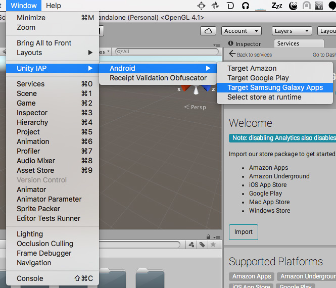
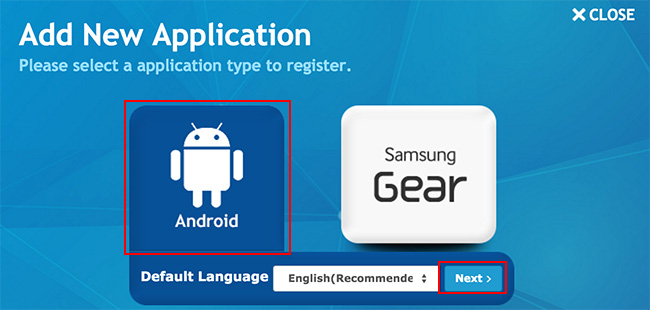
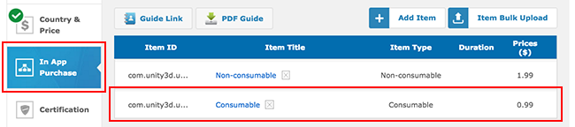
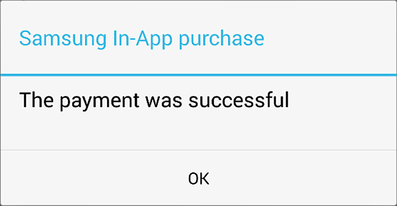

# Samsung Galaxy IAP 配置

本指南介绍如何建立 Unity 应用程序与应用内购 (IAP) 商店进行交互所需的数字记录和关系。本指南针对的是 [Unity IAP](UnityIAP.html) 购买 API。

应用内购 (IAP) 是通过资金交易购买数字商品的过程。一个平台的应用商店会允许购买代表数字商品的产品。这些商品有一个标识符（通常是字符串数据类型）。商品的类型可表示其耐用性：最常见的类型是订阅（可以订阅）、消耗品（可以多次购买）以及非消耗品（可以购买一次）。

### 跨店实现 IAP

请注意，使用共享的 Android Bundle ID 来同时发布到多个 Android IAP 商店（例如 Samsung 和 Google）时，会出现跨店安装问题。请参阅有关 [Android IAP 的跨店安装问题](UnityIAPCrossStoreInstallationIssues.html)的文档以了解更多信息。

## Samsung Galaxy Apps

### 准备开始

1.编写一个应用程序并实现 Unity IAP。请参阅 [Unity IAP 初始化](UnityIAPInitialization.html)和[将 Unity IAP 与您的应用程序集成](https://unity3d.com/learn/tutorials/topics/analytics/integrating-unity-iap-your-game)。

2.准备好应用程序的商品标识符以便稍后在 [Samsung Apps Seller Office](http://seller.samsungapps.com/) 中使用。

 

3.要在 Unity Editor 中设置 IAP 目标商店，请转至 __Window__ > __Unity IAP__ > __Android__ > __Target Samsung Galaxy Apps__。

 

或者，请调用 Editor API：

`UnityPurchasingEditor.TargetAndroidStore(AndroidStore.SamsungApps`

4.为应用程序生成经过签名的非开发版 Android APK。请参阅有关 [Android 开发入门 (Getting started with Android development)](android-GettingStarted.html) 的文档以了解更多信息。

**提示**：请采取特殊的预防措施来妥善保存密钥库文件。始终需要原始密钥库来更新已发布的应用程序。

### 注册应用程序

向 [Samsung Galaxy Apps Seller Office](http://seller.samsungapps.com/) 注册 Android 应用程序。

1.选择 __Add New Application__。

 

2.选择 __Android__ 选项，然后选择 __Default Language__。

 

3.要启用 IAP，请先注册一个二进制 APK。转至 __In App Purchase__，然后单击 __GO__。

 

在 App Store Developer Console 中，转至 __Binary__，然后选择 __Add binary__。

 

在 __Resolution(s)__ 和 __Google Mobile Service__ 中填写设备特征，在 __Binary upload__ 内上传您的 APK（在上文的"准备开始"部分中创建的 APK），然后单击 __Save__。

 

等待 APK 上传完成，然后单击 __Save__。

 

### 添加 IAP

在 Seller Office 中，为应用程序添加一个或多个 IAP。

1.转至 __In App Purchase__，然后选择 __Add Item__。

 

2.定义 __Item ID__。此处的 Item ID 是应用程序源代码中使用的同一标识符，已通过 `AddProduct()` 或 `AddProducts()` 添加到 Unity IAP [ConfigurationBuilder](../ScriptReference/Purchasing.ConfigurationBuilder.html) 实例。为了方便调试，最好是将 [reverse-DNS](https://en.wikipedia.org/wiki/Reverse_domain_name_notation) 用于 Item ID。单击 __Check__ 以确保 Item ID 有效且唯一，然后填写 __Item Type__ 和所有其他元素并单击 __Save__。

 

3.查看 __In App Purchase__ 中的结果：

 

### 测试 IAP 实现结果

Samsung Galaxy App Store 支持通过应用程序中的 __Developer mode__ 值进行测试后再进行购买。这种特殊的应用程序版本将连接到 Samsung 的计费服务器，并执行虚假购买。这样不会产生与商品相关的实际资金成本，并允许您测试该应用程序的购买逻辑。

1.在创建 `ConfigurationBuilder` 实例后添加以下行来修改应用程序的 Unity IAP 集成：
`builder.Configure<ISamsungAppsConfiguration>().SetMode(SamsungAppsMode.AlwaysSucceed); // 测试：Samsung 自动批准所有交易。`
这里也可以通过 `SamsungAppsMode.AlwaysFail` 枚举的配置使所有交易失败，从而测试所有错误代码。

2.编译并运行应用程序，同时测试其 IAP 逻辑。只要采用开发者模式，就不会产生实际的资金成本。

 

3.**重要信息**：测试完成后，务必删除 `SetMode` 行。这样可确保在用户使用应用程序时支付实际资金。

