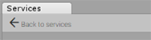

#设置 Unity IAP

[设置项目启用 Unity 服务](SettingUpProjectServices.html)之后，即可启用 Unity IAP 服务。

## 步骤 1. 启用应用内购 (IAP)

在 __Services__ 窗口中，选择 __In-App Purchasing__。

 

单击 __Enable__ 按钮以启用 IAP。

 

### 注意：常见的 Unity IAP 集成编译器错误
以下错误消息可能表示在 Unity Cloud Services 窗口中已禁用 Unity IAP，或者 Unity 已经与互联网断开连接：

* CS0246: The type or namespace name IPurchaseReceipt could not be found.（CS0246：找不到类型或命名空间名称 IPurchaseReceipt。）
* System.Reflection.ReflectionTypeLoadException
* UnityPurchasing/Bin/Stores.dll
* UnityEngine.Purchasing

要解决这些错误，请首先尝试重新加载 Services 窗口。执行此操作的快捷方法是将其关闭后重新打开。重新加载后，请确保已启用 Unity IAP。

如果这样做不起作用，请尝试断开再重新连接到互联网，然后重新登录到 Unity 服务并重新启用 Unity IAP。只有在已注册的组织中拥有 Unity 服务 "所有者" (owner) 或 "管理员" (manager) 角色的用户才能启用 Unity IAP 服务。

## 步骤 2. COPPA 合规性

儿童网络隐私保护法 (COPPA) 适用于在线收集 13 岁以下儿童的个人信息的情况。这些规则明确了您必须在隐私政策中包含的内容，何时以及如何寻求让父母提供可核实的同意书，以及您必须承担哪些责任来保护儿童的网络隐私和安全。如果尚未在 Analytics 设置中指定 COPPA 选项，则会出现一个对话窗口，询问应用程序用户的目标年龄以确保符合 COPPA 法案。选择相应答案，然后单击 __Save Changes__。

## 步骤 3. 添加 IAP 包

要将 Unity IAP 包导入到项目中，请单击 __Import__。

导入包时，会自动将名为 __Plugins__ 的新文件夹添加到项目。该文件夹包含使用 Unity IAP 所需的 UnityPurchasing 资源。

单击 __Back to services__ 以查看 Services 面板。

确保 Analytics 和 In-App Purchasing 都标记为 __ON__（如下所示）。

您现在可以开始将 Unity IAP 实施到项目中。
