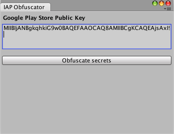

<!-- in Trello --> 

# 收据验证

收据验证有助于防止用户访问他们尚未购买的内容。

##验证点
最好的做法是在应用程序内容分发点验证收据。

* **本地验证：**对于客户端内容，其中所有内容都包含在应用程序中并且一旦购买就会启用，因此应在目标设备上进行验证，无需连接到远程服务器。Unity IAP 支持在应用程序内进行的本地验证。请参阅下面的__本地验证__以了解更多信息。
* **远程验证：**对于服务器端内容，一旦购买内容便会下载内容，因此应在内容发布之前在服务器上进行验证。Unity 不提供服务器端验证；但是，可采用第三方解决方案，例如 Nobuyori Takahashi 的 [IAP 项目](https://github.com/voltrue2/in-app-purchase)。

## 本地验证

如果用户购买的内容已存在于设备上，应用程序只需决定是否解锁该内容。

Unity IAP 提供了工具来帮助您隐藏内容以及通过 Google Play 和 Apple 商店验证和解析收据。

### 混淆处理加密密钥

收据验证是使用已知的加密密钥执行的。对于您的应用程序而言，这是一个加密的 Google Play 公钥和/或 Apple 根证书。

如果用户可以替换这些密钥，他们就能突破收据验证检查，因此必须让用户难以轻松找到和修改这些密钥，这一点很重要。

Unity IAP 提供了一个工具，可以帮助您在应用程序中混淆处理加密密钥。这个工具会混淆或模糊处理密钥，从而大大增加用户访问这些密钥的难度。在 Unity 菜单栏中，转至 __Window__ > __Unity IAP__ > __IAP Receipt Validation Obfuscator__。




此窗口将 Apple 的根证书（此证书与 Unity IAP 捆绑）和 Google Play 公钥（来自应用程序的 [Google Play Developer Console's Services &amp;amp; APIs](https://developer.android.com/google/play/licensing/setting-up.html) 页面）编码为两个不同的 C# 文件：__AppleTangle__ 和 __GooglePlayTangle__。这些文件需要添加到您的项目中以便在下一部分中使用。

请注意，如果您仅打算面向 Apple 商店，则不必提供 Google Play 公钥，反之亦然。

### 验证收据

使用 `CrossPlatformValidator` 类可跨 Google Play 和 Apple 商店进行验证。

必须向该类提供 Google Play 公钥或 Apple 根证书或者同时提供两者（如果您希望跨这两个平台进行验证）。

`CrossPlatformValidator` 执行两项检查：

* 通过签名验证来检查收据真实性。
* 收据上的应用 Bundle ID 与您的应用中的 Bundle ID 进行比较。如果两者不匹配，则抛出 **InvalidBundleId** 异常。

请注意，验证器仅验证在 Google Play 和 Apple 平台上生成的收据。任何其他平台上生成的收据（包括 Editor 中生成的虚假收据）都会抛出 __IAPSecurityException__。

如果在未提供平台的密钥的情况下尝试验证该平台的收据，则会抛出 __MissingStoreSecretException__。

````
public PurchaseProcessingResult ProcessPurchase (PurchaseEventArgs e)
{
    bool validPurchase = true; // 假设对没有收据验证的平台有效。

    //Unity IAP 的验证逻辑仅包含在这些平台上。
# if UNITY_ANDROID || UNITY_IOS || UNITY_STANDALONE_OSX
    //用我们在 Editor 混淆处理窗口中准备的密钥来
    // 准备验证器。
    var validator = new CrossPlatformValidator(GooglePlayTangle.Data(),
        AppleTangle.Data(), Application.bundleIdentifier);

    try {
        //在 Google Play 上，结果中仅有一个商品 ID。
        //在 Apple 商店中，收据包含多个商品。
        var result = validator.Validate(e.purchasedProduct.receipt);
        //为便于参考，我们将收据列出
        Debug.Log("Receipt is valid. Contents:");
        foreach (IPurchaseReceipt productReceipt in result) {
            Debug.Log(productReceipt.productID);
            Debug.Log(productReceipt.purchaseDate);
            Debug.Log(productReceipt.transactionID);
        }
    } catch (IAPSecurityException) {
        Debug.Log("Invalid receipt, not unlocking content");
        validPurchase = false;
    }
# endif

    if (validPurchase) {
        // 在此处解锁相应的内容。
    }

    return PurchaseProcessingResult.Complete;
}

````

不仅要检查收据是否有效，还要检查收据包含的信息，这一点很重要。用户在未购买的情况下尝试访问内容的常见方法是提供来自其他商品或应用程序的收据。这些收据是真实的，并能通过验证，因此您应该根据 __CrossPlatformValidator__ 所解析得到的商品 ID 来做决定。

### 特定于商店的详细信息

不同的商店在其购买收据中有不同的字段。要访问特定于商店的字段，`IPurchaseReceipt` 可向下转换为两个不同的子类型：`GooglePlayReceipt` 和 `AppleInAppPurchaseReceipt`。

````
var result = validator.Validate(e.purchasedProduct.receipt);
Debug.Log("Receipt is valid.Contents:");
foreach (IPurchaseReceipt productReceipt in result) {
	Debug.Log(productReceipt.productID);
	Debug.Log(productReceipt.purchaseDate);
    Debug.Log(productReceipt.transactionID);

	GooglePlayReceipt google = productReceipt as GooglePlayReceipt;
	if (null != google) {
		// 这是 Google 的订单 ID。
		//请注意，在沙盒中测试时此项为 null，
		// 因为 Google 的沙盒不提供订单 ID。
		Debug.Log(google.transactionID);
		Debug.Log(google.purchaseState);
		Debug.Log(google.purchaseToken);
	}

	AppleInAppPurchaseReceipt apple = productReceipt as AppleInAppPurchaseReceipt;
	if (null != apple) {
		Debug.Log(apple.originalTransactionIdentifier);
		Debug.Log(apple.subscriptionExpirationDate);
		Debug.Log(apple.cancellationDate);
		Debug.Log(apple.quantity);
	}
}
````

### 解析原始 Apple 收据

使用 `AppleValidator` 类可提取有关 Apple 收据的详细信息。请注意，此类仅适用于 7.0 版本以上的 iOS 应用程序收据，而不适用于 Apple 已弃用的交易收据。

````
# if UNITY_ANDROID || UNITY_IOS || UNITY_STANDALONE_OSX
var builder = ConfigurationBuilder.Instance(StandardPurchasingModule.Instance());
// 在 IAP 初始化期间获取对 IAppleConfiguration 的引用。
var appleConfig = builder.Configure<IAppleConfiguration>();
var receiptData = System.Convert.FromBase64String(appleConfig.appReceipt);
AppleReceipt receipt = new AppleValidator(AppleTangle.Data()).Validate(receiptData);

Debug.Log(receipt.bundleID);
Debug.Log(receipt.receiptCreationDate);
foreach (AppleInAppPurchaseReceipt productReceipt in receipt.inAppPurchaseReceipts) {
	Debug.Log(productReceipt.transactionIdentifier);
	Debug.Log(productReceipt.productIdentifier);
}
# endif
````

`AppleReceipt` 类型可对 Apple 的 ASN1 收据格式建模。请参阅 [Apple 的文档](https://developer.apple.com/library/ios/releasenotes/General/ValidateAppStoreReceipt/Chapters/ReceiptFields.html#/apple_ref/doc/uid/TP40010573-CH106-SW1)以了解其字段说明。
