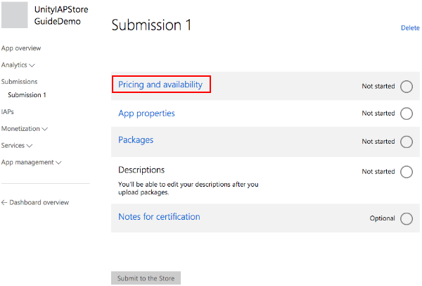
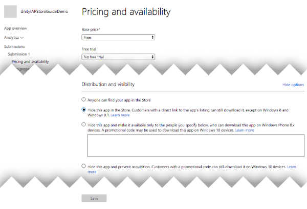
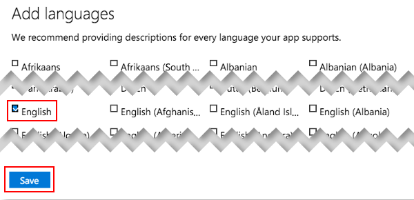
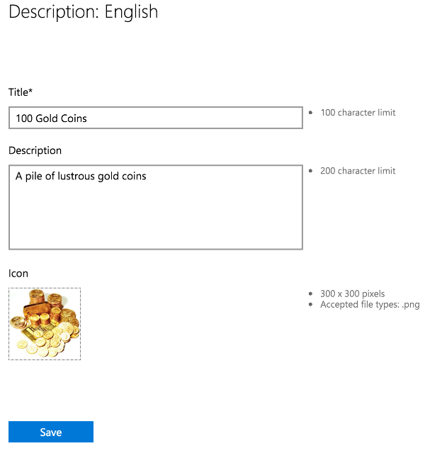

#针对 Windows 应用商店进行配置

## 简介

本指南介绍如何建立 Unity 游戏与应用内购 (IAP) 商店进行交互所需的数字记录和关系。本指南针对的是 [Unity IAP](UnityIAP.html) 购买 API。

应用内购 (IAP) 是通过资金交易购买数字商品的过程。一个平台的应用商店会允许购买代表数字商品的产品。这些商品有一个标识符（通常是字符串数据类型）。商品的类型 (Types) 可表示其耐用性：_订阅_、_消耗品_（可以多次购买）以及_非消耗品_（可以购买一次）是最常见的类型。

## Windows 应用商店

### 简介

Windows 应用程序开发可提供本地和远程 Windows 应用商店客户端/服务器 IAP 测试。

本页面介绍使用模拟器和模拟计费系统进行的本地测试，然后说明 Windows 应用商店测试（此测试将应用程序发布可见性限制到具有应用程序链接的用户）。

**注意**：本指南面向 Windows 10 Universal SDK。其他 Windows 目标也有相应的指南。

**注意**：Unity 5.6 以上的版本支持 IL2CPP Windows 编译项目。在装有早期 Unity 版本的 Windows 上对 IL2CPP 使用 Unity IAP 会生成编译错误。

### 准备开始

1.编写一个游戏并实现 Unity IAP。请参阅 [Unity IAP 初始化](UnityIAPInitialization.html)和[将 Unity IAP 与您的游戏集成](https://unity3d.com/learn/tutorials/topics/analytics/integrating-unity-iap-your-game-beta)。

1.准备好游戏的商品标识符，以便稍后在 Microsoft 的 Windows 开发人员中心控制面板中用于执行远程 Windows 应用商店测试。

   

### 在本地测试 IAP

Microsoft 提供了一个模拟计费系统，允许在本地测试 IAP。这样一来，无需在 Windows 开发人员中心内配置任何内容或通过应用程序与 Windows 应用商店进行通信，即可执行初始集成测试。

[配置本地测试](http://docs.unity3d.com/Manual/UnityIAPUniversalWindows.html)比配置远程商店测试要简单得多，不过需要对应用程序进行临时的代码更改，而且测试完成之后在应用程序发布前需要删除这些更改。

要在本地测试 IAP：

1.在使用 ConfigurationBuilder 实例对 Unity IAP 进行初始化的代码中启用模拟计费系统。

    **警告**：在测试后发布到应用商店之前，请删除这些代码更改；否则应用程序将不会通过 IAP 交易任何真实资金！

     

2.在 Unity 中将应用程序发布到__通用 Windows 平台__。

3.在 Visual Studio 中打开该应用程序，并运行适用于 x86 的本地计算机目标。

4.测试 IAP。

5.从代码中删除模拟计费系统。

### 在 Windows 应用商店中注册应用程序

一旦在本地测试了基本的 IAP 功能，您就可以更加自信地开始使用 Windows 应用商店。此测试可确认该应用程序已正确注册所有必要的 IAP 以允许购买。

为了测试 IAP 和发布，请使用 [Windows 开发人员中心](https://dev.windows.com/en-us/publish)，并为应用程序配置有限的可见性。这样可以将应用程序的可见性限制为拥有应用程序直接链接的用户。

**注意**：在应用商店中进行测试还需要认证，这可能成为测试的障碍。因此，在开始使用 Windows 应用商店进行测试之前，完成本地测试非常重要。

1.在开发人员中心内[创建新的应用程序](https://dev.windows.com/en-us/overview)。

     

2.保留好应用程序名称。

     

3.要使用 Windows 应用商店来测试 IAP，Windows 开发人员中心要求发布该应用程序。单击 __Pricing and availability__ 并限制应用程序在应用商店内的可见性，使该应用程序仅供拥有应用程序直接链接的用户使用。

     

4.在 "Distribution and visibility" 中查看应用商店提供的[发布行为](https://msdn.microsoft.com/en-us/library/windows/apps/mt148548.aspx#dist_vis)的列表。选择 __Hide this app in the Store__。

     

5.保存好直接链接。此链接将用于在 Windows 10 设备上安装应用程序以便进行[测试](https://msdn.microsoft.com/en-us/library/windows/apps/mt148561.aspx)。

     

6.提交应用程序以供认证。

    提交过程可能需要几个小时才能完成，并且 Microsoft 认证团队可能会提出一些屏蔽问题，您需要问答这些问题才能成功提交。

### 在应用商店中添加应用内商品

添加每个 IAP，将价格设置为 "free" 以便在测试期间不进行资金交易。测试完成后，将 IAP 重新配置为所需价格并重新发布。请参阅 [IAP 提交 (IAP Submissions)](https://msdn.microsoft.com/en-us/library/windows/apps/mt148551.aspx)。

1.在新应用程序的 "App overview" 页面中，单击 __Create a new IAP__。

     

2.输入商品 ID。

     

3.配置类型、价格和语言。

    **注意**：对于 **Pricing and availability**，出于测试目的请选择 **free**，以免产生不必要的费用。完成测试后，在准备向公众发布之前，请以所需价格更新并重新提交每个 IAP。

     

    选择 **Properties** 以设置类型。

     

    选择 **Pricing and availability** 以设置价格，并选择 **Free**（原因如上文所述）。

      

    选择 **Manage languages** 并声明所支持的语言。

     

    返回到 IAP 概览时选择所声明的语言。

     
 
    填写 Title、Description 和 Icon。

     

4.提交 IAP 以供认证。

    与应用程序一样，IAP 提交过程可能需要几个小时才能完成，并且 Microsoft 认证团队可能会提出一些屏蔽问题，您需要问答这些问题才能成功提交。

     

### 使用应用商店测试 IAP

以下步骤遵循 Windows 应用商店支持的 Beta 测试过程的一个分支。这涉及限制应用程序本身的可见性，禁止公众通过 "Search Store" 功能发现该应用程序。请参阅 Windows 开发人员中心有关 [Beta 测试](https://msdn.microsoft.com/en-us/library/windows/apps/xaml/mt188751.aspx)和[定向分发](https://msdn.microsoft.com/en-us/library/windows/apps/mt185377.aspx)的资源以了解更多信息。

1.确认应用程序和 IAP 均已完成认证。

2.通过前面生成的直接链接在 Windows 10 设备上安装应用程序。

3.测试 IAP。

4.通过测试后，以所需的公开定价更新 IAP，更新应用程序可见性设置以便共享给公众，然后提交这两种更改以供最终认证。

---

• 2017-05-16  Page amended with no [editorial review](DocumentationEditorialReview.html)
 
